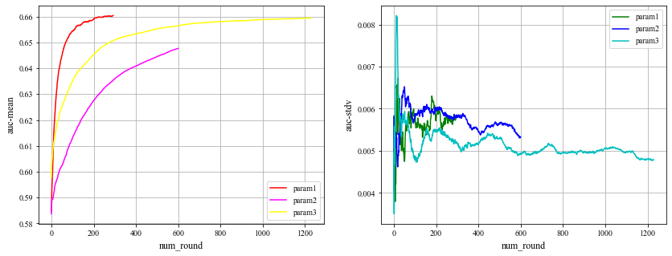
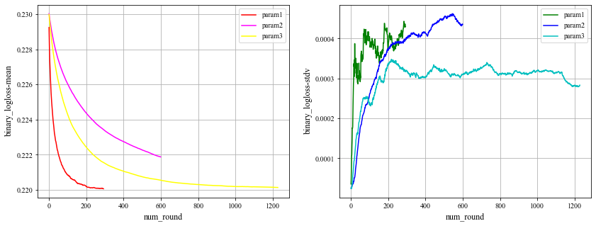

# 特征优化
目的：优化数据，接近模型上限


```python
from sklearn.impute import SimpleImputer
from sklearn.metrics import roc_auc_score as AUC
from sklearn.model_selection import cross_val_score
from sklearn.ensemble import RandomForestClassifier
```


```python
# 是否从本地读取数据
all_data_test = pd.read_csv("./data/all_data_test.csv")
```


```python
feature_columns = [c for c in all_data_test.columns if c not in ["label", "prob", "age_range", "gender"
                                                               , 'item_path', 'cat_path', 'seller_path'
                                                                 , 'brand_path', 'time_stamp_path','action_type_path']]
```


```python
train = all_data_test[~all_data_test.label.isna()][:10000]
```


```python
x_train = train[feature_columns]
y_train = train["label"].values
x_test = all_data_test[all_data_test.label.isna()][feature_columns]
```


```python
# 缺失数值为类别数据，采用众数填补
imputer = SimpleImputer(strategy="median")
imputer = imputer.fit(x_train)
train_imputer = imputer.transform(x_train)
test_imputer = imputer.transform(x_test)
```


```python
def select_feature(train, train_sel, target):
    
    clf = RandomForestClassifier(max_depth=2
                                 , random_state=2021
                                 , n_jobs=-1
                                )
    score1 = cross_val_score(clf, train, target, cv=5, scoring="roc_auc")
    score2 = cross_val_score(clf, train_sel, target, cv=5, scoring="roc_auc")
    print("No Select AUC: %0.3f (+/- %0.3f)"%(score1.mean(), score1.std()**2))
    print("Feature Select AUC: %0.3f (+/- %0.3f)"%(score2.mean(), score2.std()**2))
    print("特征选择前特征维度：", train_imputer.shape)
    print("特征选择后特征维度：", train_sel.shape)
```


```python
select_feature(x_train, train_imputer, target=y_train)
```

    No Select AUC: nan (+/- nan)
    Feature Select AUC: 0.572 (+/- 0.000)
    特征选择前特征维度： (10000, 60)
    特征选择后特征维度： (10000, 60)


## 方差分析法


```python
from sklearn.feature_selection import VarianceThreshold
```


```python
threshold_range = np.arange(0, 1, 0.1)
for i in threshold_range:
    print("Values is :", i)
    sel = VarianceThreshold(threshold=i)
    train_sel = sel.fit_transform(train_imputer)
    select_feature(train_imputer, train_sel, y_train)
```

    Values is : 0.0
    No Select AUC: 0.572 (+/- 0.000)
    Feature Select AUC: 0.576 (+/- 0.000)
    特征选择前特征维度： (10000, 60)
    特征选择后特征维度： (10000, 56)
    Values is : 0.1
    No Select AUC: 0.572 (+/- 0.000)
    Feature Select AUC: 0.577 (+/- 0.000)
    特征选择前特征维度： (10000, 60)
    特征选择后特征维度： (10000, 47)
    Values is : 0.2
    No Select AUC: 0.572 (+/- 0.000)
    Feature Select AUC: 0.578 (+/- 0.000)
    特征选择前特征维度： (10000, 60)
    特征选择后特征维度： (10000, 42)
    Values is : 0.30000000000000004
    No Select AUC: 0.572 (+/- 0.000)
    Feature Select AUC: 0.579 (+/- 0.000)
    特征选择前特征维度： (10000, 60)
    特征选择后特征维度： (10000, 39)
    Values is : 0.4
    No Select AUC: 0.572 (+/- 0.000)
    Feature Select AUC: 0.577 (+/- 0.000)
    特征选择前特征维度： (10000, 60)
    特征选择后特征维度： (10000, 38)
    Values is : 0.5
    No Select AUC: 0.572 (+/- 0.000)
    Feature Select AUC: 0.577 (+/- 0.000)
    特征选择前特征维度： (10000, 60)
    特征选择后特征维度： (10000, 38)
    Values is : 0.6000000000000001
    No Select AUC: 0.572 (+/- 0.000)
    Feature Select AUC: 0.577 (+/- 0.000)
    特征选择前特征维度： (10000, 60)
    特征选择后特征维度： (10000, 38)
    Values is : 0.7000000000000001
    No Select AUC: 0.572 (+/- 0.000)
    Feature Select AUC: 0.577 (+/- 0.000)
    特征选择前特征维度： (10000, 60)
    特征选择后特征维度： (10000, 38)
    Values is : 0.8
    No Select AUC: 0.572 (+/- 0.000)
    Feature Select AUC: 0.577 (+/- 0.000)
    特征选择前特征维度： (10000, 60)
    特征选择后特征维度： (10000, 38)
    Values is : 0.9
    No Select AUC: 0.572 (+/- 0.000)
    Feature Select AUC: 0.577 (+/- 0.000)
    特征选择前特征维度： (10000, 60)
    特征选择后特征维度： (10000, 38)


## 递归功能消除法


```python
from sklearn.feature_selection import RFECV

clf = RandomForestClassifier(max_depth=2
                             , random_state=2021
                             , n_jobs=-1
                            )

selector = RFECV(clf, step=1, cv=2)
selector = selector.fit(train_imputer, y_train)
```


## 使用模型选择特征
注意：模型必须coef_或feature_importance属性


```python
from sklearn.feature_selection import SelectFromModel
from sklearn.preprocessing import Normalizer
from sklearn.linear_model import LogisticRegression
```

### L1选择


```python
# 数据归一化
normalize = Normalizer()
normalize = normalize.fit(train_imputer)
train_norm = normalize.transform(train_imputer)
test_norm = normalize.transform(test_imputer)
```


```python
LR = LogisticRegression(penalty="l1", C = 5, solver="saga")
LR = LR.fit(train_norm, y_train)
model = SelectFromModel(LR, prefit=True)
train_sel = model.transform(train_norm)
test_sel = model.transform(test_norm)
```


```python
select_feature(train_imputer, train_sel, y_train)
```

    No Select AUC: 0.572 (+/- 0.000)
    Feature Select AUC: 0.552 (+/- 0.000)
    特征选择前特征维度： (10000, 60)
    特征选择后特征维度： (10000, 11)


### L2选择


```python
LR = LogisticRegression(penalty="l2", C = 5)
LR = LR.fit(train_norm, y_train)
model = SelectFromModel(LR, prefit=True)
train_sel = model.transform(train_norm)
test_sel = model.transform(test_norm)
```


```python
select_feature(train_imputer, train_sel, y_train)
```

    No Select AUC: 0.572 (+/- 0.000)
    Feature Select AUC: 0.550 (+/- 0.000)
    特征选择前特征维度： (10000, 60)
    特征选择后特征维度： (10000, 14)


# 建立模型


```python
from sklearn.model_selection import KFold
from scipy import sparse
import xgboost
import lightgbm as lgb
from sklearn.ensemble import RandomForestClassifier,AdaBoostClassifier,GradientBoostingClassifier
from sklearn.linear_model import LinearRegression,LogisticRegression
from sklearn.ensemble import BaggingClassifier
from sklearn.svm import LinearSVC,SVC
from sklearn.neighbors import KNeighborsClassifier
from sklearn.metrics import log_loss,mean_absolute_error,mean_squared_error
from sklearn.naive_bayes import MultinomialNB,GaussianNB
from sklearn.model_selection import train_test_split
from sklearn.preprocessing import StandardScaler
from sklearn.model_selection import StratifiedKFold
```

## 数据处理


```python
all_data_test = pd.read_csv("./data/all_data_test.csv")
```


```python
# 有用特征提取
feature_columns = [c for c in all_data_test.columns if c not in ["label", "prob", "gender", "age_range"
                                                               , 'item_path', 'cat_path', 'seller_path', 'brand_path', 'time_stamp_path','action_type_path']]
```


```python
x_train = all_data_test[~all_data_test.label.isna()][feature_columns]
y_train = all_data_test[~all_data_test.label.isna()]["label"].values
x_test = all_data_test[all_data_test.label.isna()][feature_columns]
```


```python
# 缺失值用中位数填补
imputer = SimpleImputer(strategy="median")
imputer = imputer.fit(x_train)
X = imputer.transform(x_train)
x_test = imputer.transform(x_test)
y = np.int_(y_train)
```


```python
# # 方差过滤优化特征
# vart = VarianceThreshold(0.3)
# vart = vart.fit(X=X)
# X = vart.transform(X)
# x_test = vart.transform(x_test)
```


```python
# 分层抽取样本(保证数据划分后的样本数目相同)
# 构造训练集和测试集
def trainData(train_df,label_df):
    skv = StratifiedKFold(n_splits=5, shuffle=True, random_state=620)
    trainX = pd.DataFrame()
    trainY = pd.DataFrame()
    testX = pd.DataFrame()
    testY = pd.DataFrame()
    for train_index, test_index in skv.split(X=train_df, y=label_df):
        train_x, train_y, test_x, test_y = train_df.iloc[train_index, :], label_df.iloc[train_index], \
                                           train_df.iloc[test_index, :], label_df.iloc[test_index]
        
        trainX = trainX.append(train_x)
        trainY = trainY.append(train_y)
        testX = testX.append(test_x)
        testY = testY.append(test_y)
        break
        
    return trainX,trainY,testX,testY
```


```python
trainNew, label = pd.DataFrame(X), pd.DataFrame(y)
X_train, y_train, X_val, y_val = trainData(trainNew,label)
```

## RandomForest


```python
# RF =RandomForestClassifier().fit(X_train, y_train)
```


```python
# RF.score(X_test, y_test)
```

## LightGBM


```python
# 数据准备
cv_train = lgb.Dataset(X, y)
data_train = lgb.Dataset(X_train, y_train)
data_val = lgb.Dataset(X_val, y_val)
```

### 网格搜索寻找参数范围（粗调）


```python
from sklearn.model_selection import GridSearchCV
from time import time
import datetime
import sklearn
import joblib
from sklearn.metrics import roc_curve
from sklearn.metrics import roc_auc_score as AUC
```


```python
class GridSearch:
    """回归模型网格搜索"""
    
    def __init__(self, model):
        self.model = model
    
    def grid_get(self, X, y, param_grid):
        """参数搜索"""
        
        grid_search = GridSearchCV(self.model
                                   , param_grid =param_grid, scoring="roc_auc"
                                   , cv = 5
                                   , n_jobs = -1
                                  )
        grid_search.fit(X, y)
        print("Best_params:", grid_search.best_params_, "best_score_:", (grid_search.best_score_))
        print(pd.DataFrame(grid_search.cv_results_)[["params", "mean_test_score", "std_test_score"]])
        
        return grid_search.best_estimator_
```


```python
[sklearn.metrics.SCORERS.keys()]
```


    [dict_keys(['explained_variance', 'r2', 'max_error', 'neg_median_absolute_error', 'neg_mean_absolute_error', 'neg_mean_absolute_percentage_error', 'neg_mean_squared_error', 'neg_mean_squared_log_error', 'neg_root_mean_squared_error', 'neg_mean_poisson_deviance', 'neg_mean_gamma_deviance', 'accuracy', 'top_k_accuracy', 'roc_auc', 'roc_auc_ovr', 'roc_auc_ovo', 'roc_auc_ovr_weighted', 'roc_auc_ovo_weighted', 'balanced_accuracy', 'average_precision', 'neg_log_loss', 'neg_brier_score', 'adjusted_rand_score', 'rand_score', 'homogeneity_score', 'completeness_score', 'v_measure_score', 'mutual_info_score', 'adjusted_mutual_info_score', 'normalized_mutual_info_score', 'fowlkes_mallows_score', 'precision', 'precision_macro', 'precision_micro', 'precision_samples', 'precision_weighted', 'recall', 'recall_macro', 'recall_micro', 'recall_samples', 'recall_weighted', 'f1', 'f1_macro', 'f1_micro', 'f1_samples', 'f1_weighted', 'jaccard', 'jaccard_macro', 'jaccard_micro', 'jaccard_samples', 'jaccard_weighted'])]


```python
param_grid = {
#      "num_leaves": np.arange(31, 82, 7)
#     , "max_depth": np.arange(5, 7, 8, 6)
    , "learning_rate": [0.1, 0.01, 0.03]
    , "n_estimators": [1000, 3000, 6000]
#     , "subsample":[0.8, 0.9, 1.0]
#     , "colsample_bytree":[0.8, 0.9, 1.0]
}
```


```python
t0 = time()
LGBC = lgb.LGBMClassifier(boosting_type="gbdt"
                          , device="gpu"
#                           , learning_rate=0.01
#                           , num_leaves=41
#                           , max_depth=6
                          
#                           , subsample=0.8
#                           , colsample_bytree=0.8
#                           , n_estimators=2000
                          , metric="auc"
                          , random_state=0
                          , silent=True
                         )
model = GridSearch(LGBC).grid_get(X=X_train,y=y_train, param_grid=param_grid)
print("处理时间：",datetime.datetime.fromtimestamp(time()-t0).strftime("%M:%S:%f"))
```

    Best_params: {'learning_rate': 0.1} best_score_: 0.6512223331632725
                       params  mean_test_score  std_test_score
    0  {'learning_rate': 0.1}         0.651222        0.001596
    处理时间： 02:20:432963

```python
model.score(X_val, y_val)
```


    0.9391387682085357


```python
probs = model.predict(X_val) 
area = AUC(y_val, probs)
area
```


    0.5000981728567914

### 默认参数（精调）


```python
# 参数设定为默认状态
params1 = {
      "boosting_type": "gbdt"
    , "objective": "binary" # 二分类任务
    , "metric": {"binary_logloss", "auc"}
    
    , "nthread": 16
    , "device": "gpu"
    , "gpu_device_id": 1
    , "num_gpu":1
    , "verbose": 0

    , "learning_rate": 0.1

    , "subsample": 1.0  # 数据采样
#     , "subsample_freq": 5
    , "colsample_bytree": 1.0  # 特征采样
    
    , "max_depth": 5
#     , "min_child_weight": 1.5
    , "num_leaves": 16  # 由于lightGBM是leaves_wise生长，官方说法是要小于2^max_depth
    , 'reg_alpha': 0.0  # L1
    , 'reg_lambda': 0.0  # L2
    , "seed": 2021
}
```


```python
cv_result1 = lgb.cv(params = params1, train_set = cv_train
                   , nfold = 5
                   , stratified = True
                   , shuffle = True
                   , num_boost_round = 600
                   , early_stopping_rounds = 100
                   , seed = 2021
                   )
```


### 参数调整完毕


```python
num_boost_round = 600
params2 = {
      "boosting_type": "gbdt"
    , "objective": "binary" # 二分类任务
    , "metric": {"binary_logloss", "auc"}
    
    , "nthread": 16
    , "device": "gpu"
    , "gpu_device_id": 1
    , "num_gpu":1
    , "verbose": 0

    , "learning_rate": 0.01
    
    , "subsample": 0.8  # 数据采样
#     , "subsample_freq": 5
    , "colsample_bytree": 0.8  # 特征采样
    
    , "max_depth": 5
#     , "min_child_weight": 1.5
    , "num_leaves": 15  # 由于lightGBM是leaves_wise生长，官方说法是要小于2^max_depth
    , 'reg_alpha': 0.0  # L1
    , 'reg_lambda': 0.0  # L2
    , "seed": 2021
}
```


```python
cv_result2 = lgb.cv(params = params2, train_set = cv_train
                   , num_boost_round = num_boost_round
                   , nfold = 5
                   , stratified = True
                   , shuffle = True
                   , early_stopping_rounds = 100
                   , seed=2021
                   )
```


```python
#  选择最佳的estimators
print("Best_n_estimators: %d\nBest_cv_score: %.2f" 
      % (np.array(list(cv_result2.values())).shape[1],
         max(np.array(list(cv_result2.values()))[0]))
     ) 
```

    Best_n_estimators: 600
    Best_cv_score: 0.23


### 调参状态


```python
params3 = {
      "boosting_type": "gbdt"
    , "objective": "binary" # 二分类任务
    , "metric": {"binary_logloss", "auc"}
    
    , "nthread": 16
    , "device": "gpu"
    , "gpu_device_id": 1
    , "num_gpu":1
    , "verbose": 0

    , "learning_rate": 0.01
    
    , "subsample": 1  # 数据采样
#     , "subsample_freq": 5
    , "colsample_bytree": 1  # 特征采样
    
    , "max_depth": 7
#     , "min_child_weight": 1.5
    , "num_leaves":80  # 由于lightGBM是leaves_wise生长，官方说法是要小于2^max_depth
    , 'reg_alpha': 0.0  # L1
    , 'reg_lambda': 0.0  # L2
    , "seed": 2021
}
```


```python
cv_result3 = lgb.cv(params=params3, train_set=cv_train
                   , num_boost_round=10000
                   , nfold=5
                   , stratified=True
                   , shuffle=True
                   , early_stopping_rounds=100
                   , seed=2021
                  )
```


### 可视化


```python
def plot_mertics(cv_result1, cv_result2, cv_result3, index1=0, index2=1, save = False):
    """绘制评估曲线"""
    
    fig, ax = plt.subplots(1, 2, figsize = (14,5))

    length1 = np.array(list(cv_result1.values())).shape[1]
    length2 = np.array(list(cv_result2.values())).shape[1]
    length3 = np.array(list(cv_result3.values())).shape[1]

    ax[0].plot(range(length1), cv_result1[list(cv_result1.keys())[index1]], label="param1", c="red")
    ax[1].plot(range(length1), cv_result1[list(cv_result1.keys())[index2]], label="param1", c="green")

    ax[0].plot(range(length2), cv_result2[list(cv_result2.keys())[index1]], label="param2", c="magenta")
    ax[1].plot(range(length2), cv_result2[list(cv_result2.keys())[index2]], label="param2", c="blue")

    ax[0].plot(range(length3), cv_result3[list(cv_result3.keys())[index1]], label="param3", c="yellow")
    ax[1].plot(range(length3), cv_result3[list(cv_result3.keys())[index2]], label="param3", c="c")

    ax[0].set_xlabel("num_round", fontsize=12)
    ax[1].set_xlabel("num_round", fontsize=12)
    ax[0].set_ylabel(list(cv_result1.keys())[index1], fontsize=12)
    ax[1].set_ylabel(list(cv_result1.keys())[index2], fontsize=12)
    ax[0].legend()
    ax[1].legend()
    ax[0].grid()
    ax[1].grid()
    if save:
        plt.savefig("./imgs/{}.svg".format(list(cv_result1.keys())[index1].split("-")[0]))
        
    plt.show()
```

#### AUC评估


```python
plot_mertics(cv_result1, cv_result2, cv_result3, index1=2, index2=3, save=True)
```


​    


####　Logloss评估


```python
plot_mertics(cv_result1, cv_result2, cv_result3, save=True)
```



​    


### 模型评估与保存


```python
"""
当使用验证集，并加入早停机制时，可以设置在多少步之内，若评估指标不在下降
，则提前终止训练模型，多个评估指标使用时，每一个评估指标都可作为终止的条件
"""
lgb_C = lgb.train(params=params2
                  , train_set=data_train
                  , valid_sets=data_val
                  , num_boost_round = 10000
                  , early_stopping_rounds=200
                  , valid_names="valid"
         )
```

```python
# AUC指标
probs = lgb_C.predict(X_val, num_iteration=lgb_C.best_iteration) 
FPR, recall, thresholds = roc_curve(y_val, probs, pos_label=1)
area = AUC(y_val, probs)
area
```


    0.6636913376062848


```python
plt.figure(figsize=(9, 5))
plt.plot(FPR, recall, color="red",
         label = "ROC Curve (auc=%0.3f)" % (area), alpha=0.8)
plt.plot([0, 1], [0, 1], c="black", linestyle = "--")
plt.xlim([-0.0, 1])
plt.ylim([-0.0, 1])
plt.fill_between(FPR, recall, [0.0]*len(recall), alpha=0.6, color="pink")
plt.xlabel('False Positivate Rate', fontsize=12)
plt.ylabel('True Positive Rate', fontsize=12)
plt.legend(loc="lower right")
plt.show()
```


​    

```python
# 提交格式
submission = pd.read_csv("data/sample_submission.csv")
submission["prob"] = lgb_C.predict(x_test)
submission.to_csv("submission.csv", index=False)
```


```python
!head -n 5 submission.csv
```

    user_id,merchant_id,prob
    163968,4605,0.09104269707689874
    360576,1581,0.06436875895976078
    98688,1964,0.06932283438396855
    98688,3645,0.04079761398133279

```python
#　模型保存
lgb_C.save_model("./checkpoint/model.txt")
```

## LightGBM+LR


```python
num_leaves = 15

#  训练集
y_pred = lgb_C.predict(X_train, num_iteration=lgb_C.best_iteration, pred_leaf=True)

print('Writing transformed training data')
transformed_training_matrix = np.zeros([len(y_pred), len(y_pred[0]) * num_leaves],
                                       dtype=np.int64)
for i in range(0, len(y_pred)):
    temp = np.arange(len(y_pred[0])) * num_leaves + np.array(y_pred[i])
    transformed_training_matrix[i][temp] += 1
print('X_train leaf', transformed_training_matrix.shape)

#  测试集
y_pred = lgb_C.predict(X_val, pred_leaf=True, num_iteration=lgb_C.best_iteration)

print('Writing transformed testing data')
transformed_testing_matrix = np.zeros([len(y_pred), len(y_pred[0]) * num_leaves], dtype=np.int64)
for i in range(0, len(y_pred)):
    temp = np.arange(len(y_pred[0])) * num_leaves + np.array(y_pred[i])
    transformed_testing_matrix[i][temp] += 1
    if i == 0:
        break
print('testing leaf shape', transformed_testing_matrix.shape)
```

```python
lm = LogisticRegression(penalty='l2',C=0.05) # logestic model construction
lm.fit(transformed_training_matrix,y_train)  # fitting the data
```


```python
probs = lm.predict(transformed_testing_matrix) 
FPR, recall, thresholds = roc_curve(y_val, probs, pos_label=1)
area = AUC(y_val, probs)
area
```

结论：时间复杂高，准确率低。

# 参考
[使用Python Pandas处理亿级数据](https://cloud.tencent.com/developer/article/1054025)  
[LightGBM官方文档](https://lightgbm.readthedocs.io/en/latest/index.html)

# 知识点

## KFold和StrartifiedFold的区别


```python
from sklearn.model_selection import KFold
X=np.array([[1,2],[3,4],[5,6],[7,8],[9,10],[11,12]])
y=np.array([1,2,3,4,5,6])

kf=KFold(n_splits=3, shuffle=True)    # 定义分成几个组

#for循环中的train_index与test_index是索引而并非我们的训练数据
for train_index,test_index in kf.split(X):
    print("Train Index:",train_index,",Test Index:",test_index)
    X_train,X_test=X[train_index],X[test_index]
    y_train,y_test=y[train_index],y[test_index]
```

    Train Index: [0 1 3 4] ,Test Index: [2 5]
    Train Index: [0 2 3 5] ,Test Index: [1 4]
    Train Index: [1 2 4 5] ,Test Index: [0 3]

```python
from sklearn.model_selection import StratifiedKFold

X=np.array([[1,2],[3,4],[5,6],[7,8],[9,10],[11,12]])
y=np.array([1,1,1,2,2,2])
# 类似于分层抽样保证拆分后的数据，正负样本比例保持一致
skf=StratifiedKFold(n_splits=3, shuffle=True, random_state=2021)

#for循环中的train_index与test_index是索引而并非我们的训练数据
for train_index,test_index in skf.split(X,y):
    
    print("Train Index:",train_index,",Test Index:",test_index)
    X_train,X_test=X[train_index],X[test_index]
    y_train,y_test=y[train_index],y[test_index]
```

    Train Index: [0 1 3 5] ,Test Index: [2 4]
    Train Index: [0 2 3 4] ,Test Index: [1 5]
    Train Index: [1 2 4 5] ,Test Index: [0 3]
