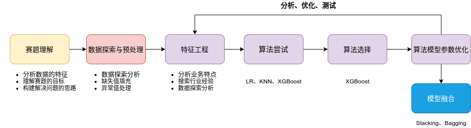
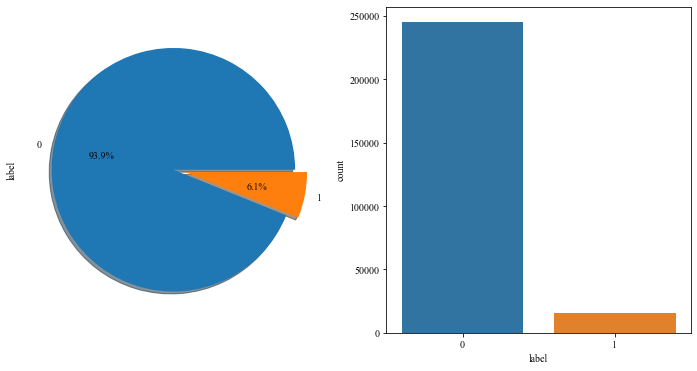
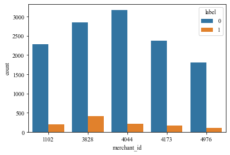
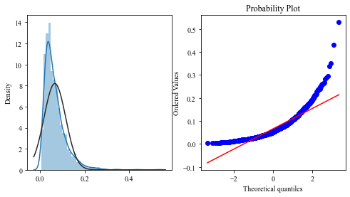
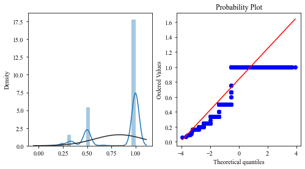
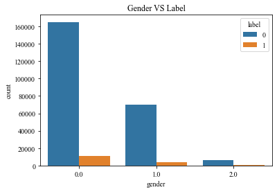
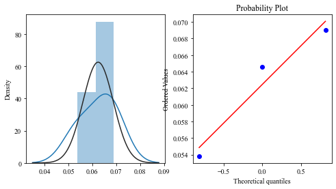
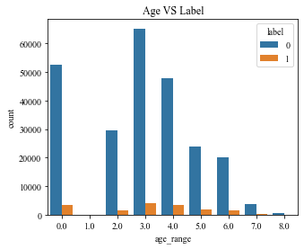
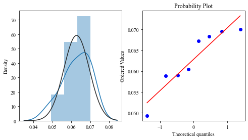

# 赛题理解
[赛题链接](https://tianchi.aliyun.com/competition/entrance/231576/introduction)  
**赛题背景**：  
商家有时会在特定日期，例如Boxing-day，黑色星期五或是双十一（11月11日）开展大型促销活动或者发放优惠券以吸引消费者，然而很多被吸引来的买家都是一次性消费者，这些促销活动可能对销售业绩的增长并没有长远帮助，因此为解决这个问题，商家需要识别出哪类消费者可以转化为重复购买者。通过对这些潜在的忠诚客户进行定位，商家可以大大降低促销成本，提高投资回报率（Return on Investment, ROI）。众所周知的是，在线投放广告时精准定位客户是件比较难的事情，尤其是针对新消费者的定位。不过，利用天猫长期积累的用户行为日志，我们或许可以解决这个问题。  
我们提供了一些商家信息，以及在“双十一”期间购买了对应产品的新消费者信息。你的任务是预测给定的商家中，哪些新消费者在未来会成为忠实客户，即需要预测这些新消费者在6个月内再次购买的概率。    
**数据说明**：  
数据集主要包括在”双十一“之前和之后的六个月内，匿名用户购买的行为日志数据，用户的画像数据，以及相关的指示标签，标明其是否为重复购买用户。  

- 用户行为日志

|  字段名称   |                             描述                             |
| :---------: | :----------------------------------------------------------: |
|   user_id   |                      购物者的唯一ID编码                      |
|   item_id   |                      购物者的唯一ID编码                      |
|   cat_id    |                    商品所属品类的唯一编码                    |
| merchant_id |                       商家的唯一ID编码                       |
|  brand_id   |                      商品品牌的唯一编码                      |
|  time_tamp  |                    购买时间（格式：mmdd）                    |
| action_type | 包含{0, 1, 2, 3}，0表示单击，1表示添加到购物车，2表示购买，3表示添加到收藏夹 |

- 用户画像

| 字段名称  |                             描述                             |
| :-------: | :----------------------------------------------------------: |
|  user_id  |                      购物者的唯一ID编码                      |
| age_range | 用户年龄范围。<18岁为1；[18,24]为2； [25,29]为3； [30,34]为4；[35,39]为5；[40,49]为6； > = 50时为7和8; 0和NULL表示未知 |
|  gender   |       用户性别。0表示女性，1表示男性，2和NULL表示未知        |

- 训练数据和测试数据

| 字段名称    |                             描述                             |
| ----------- | :----------------------------------------------------------: |
| user_id     |                      购物者的唯一ID编码                      |
| merchant_id |                       商家的唯一ID编码                       |
| label       | 包含{0, 1}，1表示重复买家，0表示非重复买家。测试集这一部分需要预测，因此为空。 |


**评价指标**：  
$$
AUC = \cfrac{\sum_{i\in{positive Class}}rank_{i} - \cfrac{M(1+M)}{2}}{M*N}
$$
其中，M表示正样本个数，N表示负样本个数，AUC反映了<font color = "red">模型对正负样本排序能力的强弱</font>，对Score的大小和精度没有要求。  
**解题思路：**  
  


# EDA


```python
import pandas as pd
import numpy as np
import matplotlib.pyplot as plt
import seaborn as sns
import time
import scipy
import gc
from collections import Counter
import warnings
from matplotlib import rcParams

config = {
    "font.family":'Times New Roman',  # 设置字体类型
}

rcParams.update(config)
warnings.filterwarnings(action="ignore")

%matplotlib inline
```


```python
# 数据存储情况
!tree data/data_format1/
```

    data/data_format1/
    ├── test_format1.csv
    ├── train_format1.csv
    ├── user_info_format1.csv
    └── user_log_format1.csv
    
    0 directories, 4 files

```python
# 问题：如何优化读入数据的内存占用情况？

# 解释内存
def reduce_mem(df):
    """对于数值类型的数据进行内存节省"""
    
    starttime = time.time()
    numerics = ['int16', 'int32', 'int64', 'float16', 'float32', 'float64']
    start_mem = df.memory_usage().sum() / 1024**2  # 统计内存使用情况
    
    for col in df.columns:
        col_type = df[col].dtypes
        if col_type in numerics:
            c_min = df[col].min()
            c_max = df[col].max()
            if pd.isnull(c_min) or pd.isnull(c_max):
                continue
            if str(col_type)[:3] == 'int':
                # 装换数据类型
                if c_min > np.iinfo(np.int8).min and c_max < np.iinfo(np.int8).max:
                    df[col] = df[col].astype(np.int8)
                elif c_min > np.iinfo(np.int16).min and c_max < np.iinfo(np.int16).max:
                    df[col] = df[col].astype(np.int16)
                elif c_min > np.iinfo(np.int32).min and c_max < np.iinfo(np.int32).max:
                    df[col] = df[col].astype(np.int32)
                elif c_min > np.iinfo(np.int64).min and c_max < np.iinfo(np.int64).max:
                    df[col] = df[col].astype(np.int64)
            else:
                if c_min > np.finfo(np.float16).min and c_max < np.finfo(np.float16).max:
                    df[col] = df[col].astype(np.float16)
                elif c_min > np.finfo(np.float32).min and c_max < np.finfo(np.float32).max:
                    df[col] = df[col].astype(np.float32)
                else:
                    df[col] = df[col].astype(np.float64)
                    
    end_mem = df.memory_usage().sum() / 1024**2
    print('-- Mem. usage decreased to {:5.2f} Mb ({:.1f}% reduction),time spend:{:2.2f} min'.format(end_mem,
                                                                                                           100*(start_mem-end_mem)/start_mem,
                                                                                                           (time.time()-starttime)/60))
    return df
```

## 训练集


```python
train_data = reduce_mem(pd.read_csv("./data/data_format1/train_format1.csv"))
train_data
```

    -- Mem. usage decreased to  1.74 Mb (70.8% reduction),time spend:0.00 min

<table border="1" class="dataframe">
  <thead>
    <tr style="text-align: right;">
      <th></th>
      <th>user_id</th>
      <th>merchant_id</th>
      <th>label</th>
    </tr>
  </thead>
  <tbody>
    <tr>
      <th>0</th>
      <td>34176</td>
      <td>3906</td>
      <td>0</td>
    </tr>
    <tr>
      <th>1</th>
      <td>34176</td>
      <td>121</td>
      <td>0</td>
    </tr>
    <tr>
      <th>2</th>
      <td>34176</td>
      <td>4356</td>
      <td>1</td>
    </tr>
    <tr>
      <th>3</th>
      <td>34176</td>
      <td>2217</td>
      <td>0</td>
    </tr>
    <tr>
      <th>4</th>
      <td>230784</td>
      <td>4818</td>
      <td>0</td>
    </tr>
    <tr>
      <th>...</th>
      <td>...</td>
      <td>...</td>
      <td>...</td>
    </tr>
    <tr>
      <th>260859</th>
      <td>359807</td>
      <td>4325</td>
      <td>0</td>
    </tr>
    <tr>
      <th>260860</th>
      <td>294527</td>
      <td>3971</td>
      <td>0</td>
    </tr>
    <tr>
      <th>260861</th>
      <td>294527</td>
      <td>152</td>
      <td>0</td>
    </tr>
    <tr>
      <th>260862</th>
      <td>294527</td>
      <td>2537</td>
      <td>0</td>
    </tr>
    <tr>
      <th>260863</th>
      <td>229247</td>
      <td>4140</td>
      <td>0</td>
    </tr>
  </tbody>
</table>
<p>260864 rows × 3 columns</p>

```python
train_data.info()
```

    <class 'pandas.core.frame.DataFrame'>
    RangeIndex: 260864 entries, 0 to 260863
    Data columns (total 3 columns):
     #   Column       Non-Null Count   Dtype
    ---  ------       --------------   -----
     0   user_id      260864 non-null  int32
     1   merchant_id  260864 non-null  int16
     2   label        260864 non-null  int8 
    dtypes: int16(1), int32(1), int8(1)
    memory usage: 1.7 MB

```python
train_data.nunique()
```


    user_id        212062
    merchant_id      1993
    label               2
    dtype: int64

## 用户信息表


```python
user_info = reduce_mem(pd.read_csv("./data/data_format1/user_info_format1.csv"))
user_info
```

    -- Mem. usage decreased to  3.24 Mb (66.7% reduction),time spend:0.00 min

<table border="1" class="dataframe">
  <thead>
    <tr style="text-align: right;">
      <th></th>
      <th>user_id</th>
      <th>age_range</th>
      <th>gender</th>
    </tr>
  </thead>
  <tbody>
    <tr>
      <th>0</th>
      <td>376517</td>
      <td>6.0</td>
      <td>1.0</td>
    </tr>
    <tr>
      <th>1</th>
      <td>234512</td>
      <td>5.0</td>
      <td>0.0</td>
    </tr>
    <tr>
      <th>2</th>
      <td>344532</td>
      <td>5.0</td>
      <td>0.0</td>
    </tr>
    <tr>
      <th>3</th>
      <td>186135</td>
      <td>5.0</td>
      <td>0.0</td>
    </tr>
    <tr>
      <th>4</th>
      <td>30230</td>
      <td>5.0</td>
      <td>0.0</td>
    </tr>
    <tr>
      <th>...</th>
      <td>...</td>
      <td>...</td>
      <td>...</td>
    </tr>
    <tr>
      <th>424165</th>
      <td>395814</td>
      <td>3.0</td>
      <td>1.0</td>
    </tr>
    <tr>
      <th>424166</th>
      <td>245950</td>
      <td>0.0</td>
      <td>1.0</td>
    </tr>
    <tr>
      <th>424167</th>
      <td>208016</td>
      <td>NaN</td>
      <td>NaN</td>
    </tr>
    <tr>
      <th>424168</th>
      <td>272535</td>
      <td>6.0</td>
      <td>1.0</td>
    </tr>
    <tr>
      <th>424169</th>
      <td>18031</td>
      <td>3.0</td>
      <td>1.0</td>
    </tr>
  </tbody>
</table>
<p>424170 rows × 3 columns</p>

```python
user_info.info()
```

    <class 'pandas.core.frame.DataFrame'>
    RangeIndex: 424170 entries, 0 to 424169
    Data columns (total 3 columns):
     #   Column     Non-Null Count   Dtype  
    ---  ------     --------------   -----  
     0   user_id    424170 non-null  int32  
     1   age_range  421953 non-null  float16
     2   gender     417734 non-null  float16
    dtypes: float16(2), int32(1)
    memory usage: 3.2 MB

```python
user_info.nunique()
```


    user_id      424170
    age_range         9
    gender            3
    dtype: int64

## 用户行为数据


```python
# 问题：如何在pandas读取大批量的数据?

# 数据量过大，采用迭代方法
reader = pd.read_csv("./data/data_format1/user_log_format1.csv", iterator=True)
# try:
#     df = reader.get_chunk(100000)
# except StopIteration:
#     print("Iteration is stopped.")
loop = True
chunkSize = 100000
chunks = []

while loop:
    try:
        chunk = reader.get_chunk(chunkSize)
        chunks.append(chunk)
    except StopIteration:
        loop = False
        print("Iteration is stopped.")
        
df = pd.concat(chunks, ignore_index=True)
```

```python
user_log = reduce_mem(df)
user_log
```

<table border="1" class="dataframe">
  <thead>
    <tr style="text-align: right;">
      <th></th>
      <th>user_id</th>
      <th>item_id</th>
      <th>cat_id</th>
      <th>seller_id</th>
      <th>brand_id</th>
      <th>time_stamp</th>
      <th>action_type</th>
    </tr>
  </thead>
  <tbody>
    <tr>
      <th>0</th>
      <td>328862</td>
      <td>323294</td>
      <td>833</td>
      <td>2882</td>
      <td>2660.0</td>
      <td>829</td>
      <td>0</td>
    </tr>
    <tr>
      <th>1</th>
      <td>328862</td>
      <td>844400</td>
      <td>1271</td>
      <td>2882</td>
      <td>2660.0</td>
      <td>829</td>
      <td>0</td>
    </tr>
    <tr>
      <th>2</th>
      <td>328862</td>
      <td>575153</td>
      <td>1271</td>
      <td>2882</td>
      <td>2660.0</td>
      <td>829</td>
      <td>0</td>
    </tr>
    <tr>
      <th>3</th>
      <td>328862</td>
      <td>996875</td>
      <td>1271</td>
      <td>2882</td>
      <td>2660.0</td>
      <td>829</td>
      <td>0</td>
    </tr>
    <tr>
      <th>4</th>
      <td>328862</td>
      <td>1086186</td>
      <td>1271</td>
      <td>1253</td>
      <td>1049.0</td>
      <td>829</td>
      <td>0</td>
    </tr>
    <tr>
      <th>...</th>
      <td>...</td>
      <td>...</td>
      <td>...</td>
      <td>...</td>
      <td>...</td>
      <td>...</td>
      <td>...</td>
    </tr>
    <tr>
      <th>54925325</th>
      <td>208016</td>
      <td>107662</td>
      <td>898</td>
      <td>1346</td>
      <td>7996.0</td>
      <td>1110</td>
      <td>0</td>
    </tr>
    <tr>
      <th>54925326</th>
      <td>208016</td>
      <td>1058313</td>
      <td>898</td>
      <td>1346</td>
      <td>7996.0</td>
      <td>1110</td>
      <td>0</td>
    </tr>
    <tr>
      <th>54925327</th>
      <td>208016</td>
      <td>449814</td>
      <td>898</td>
      <td>983</td>
      <td>7996.0</td>
      <td>1110</td>
      <td>0</td>
    </tr>
    <tr>
      <th>54925328</th>
      <td>208016</td>
      <td>634856</td>
      <td>898</td>
      <td>1346</td>
      <td>7996.0</td>
      <td>1110</td>
      <td>0</td>
    </tr>
    <tr>
      <th>54925329</th>
      <td>208016</td>
      <td>272094</td>
      <td>898</td>
      <td>1346</td>
      <td>7996.0</td>
      <td>1111</td>
      <td>0</td>
    </tr>
  </tbody>
</table>
<p>54925330 rows × 7 columns</p>

```python
user_log["user_id"].nunique()
```


    424170


```python
user_log.info()
```

    <class 'pandas.core.frame.DataFrame'>
    RangeIndex: 54925330 entries, 0 to 54925329
    Data columns (total 7 columns):
     #   Column       Dtype  
    ---  ------       -----  
     0   user_id      int32  
     1   item_id      int32  
     2   cat_id       int16  
     3   seller_id    int16  
     4   brand_id     float16
     5   time_stamp   int16  
     6   action_type  int8   
    dtypes: float16(1), int16(3), int32(2), int8(1)
    memory usage: 890.5 MB


## 测试集信息表


```python
test_data = reduce_mem(pd.read_csv("./data/data_format1/test_format1.csv"))
test_data
```

    -- Mem. usage decreased to  3.49 Mb (41.7% reduction),time spend:0.00 min

<table border="1" class="dataframe">
  <thead>
    <tr style="text-align: right;">
      <th></th>
      <th>user_id</th>
      <th>merchant_id</th>
      <th>prob</th>
    </tr>
  </thead>
  <tbody>
    <tr>
      <th>0</th>
      <td>163968</td>
      <td>4605</td>
      <td>NaN</td>
    </tr>
    <tr>
      <th>1</th>
      <td>360576</td>
      <td>1581</td>
      <td>NaN</td>
    </tr>
    <tr>
      <th>2</th>
      <td>98688</td>
      <td>1964</td>
      <td>NaN</td>
    </tr>
    <tr>
      <th>3</th>
      <td>98688</td>
      <td>3645</td>
      <td>NaN</td>
    </tr>
    <tr>
      <th>4</th>
      <td>295296</td>
      <td>3361</td>
      <td>NaN</td>
    </tr>
    <tr>
      <th>...</th>
      <td>...</td>
      <td>...</td>
      <td>...</td>
    </tr>
    <tr>
      <th>261472</th>
      <td>228479</td>
      <td>3111</td>
      <td>NaN</td>
    </tr>
    <tr>
      <th>261473</th>
      <td>97919</td>
      <td>2341</td>
      <td>NaN</td>
    </tr>
    <tr>
      <th>261474</th>
      <td>97919</td>
      <td>3971</td>
      <td>NaN</td>
    </tr>
    <tr>
      <th>261475</th>
      <td>32639</td>
      <td>3536</td>
      <td>NaN</td>
    </tr>
    <tr>
      <th>261476</th>
      <td>32639</td>
      <td>3319</td>
      <td>NaN</td>
    </tr>
  </tbody>
</table>
<p>261477 rows × 3 columns</p>


```python
test_data.info()
```

    <class 'pandas.core.frame.DataFrame'>
    RangeIndex: 261477 entries, 0 to 261476
    Data columns (total 3 columns):
     #   Column       Non-Null Count   Dtype  
    ---  ------       --------------   -----  
     0   user_id      261477 non-null  int32  
     1   merchant_id  261477 non-null  int16  
     2   prob         0 non-null       float64
    dtypes: float64(1), int16(1), int32(1)
    memory usage: 3.5 MB


## 缺失值


```python
# user_log 用户日志表
Total = user_log.isnull().sum().sort_values(ascending=False)
percent = (user_log.isnull().sum()/user_log.isnull().count()).sort_values(ascending=False)*100
missing_data = pd.concat([Total, percent], axis=1, keys=["Total", "Percent"])
missing_data
```


<div>
<style scoped>
    .dataframe tbody tr th:only-of-type {
        vertical-align: middle;
    }

    .dataframe tbody tr th {
        vertical-align: top;
    }
    
    .dataframe thead th {
        text-align: right;
    }
</style>
<table border="1" class="dataframe">
  <thead>
    <tr style="text-align: right;">
      <th></th>
      <th>Total</th>
      <th>Percent</th>
    </tr>
  </thead>
  <tbody>
    <tr>
      <th>brand_id</th>
      <td>91015</td>
      <td>0.165707</td>
    </tr>
    <tr>
      <th>user_id</th>
      <td>0</td>
      <td>0.000000</td>
    </tr>
    <tr>
      <th>item_id</th>
      <td>0</td>
      <td>0.000000</td>
    </tr>
    <tr>
      <th>cat_id</th>
      <td>0</td>
      <td>0.000000</td>
    </tr>
    <tr>
      <th>seller_id</th>
      <td>0</td>
      <td>0.000000</td>
    </tr>
    <tr>
      <th>time_stamp</th>
      <td>0</td>
      <td>0.000000</td>
    </tr>
    <tr>
      <th>action_type</th>
      <td>0</td>
      <td>0.000000</td>
    </tr>
  </tbody>
</table>
结论：用户日志表中的特征信息缺失比例较小，且只出现在品牌一栏中，可以删除。


```python
# user_info 用户信息表
Total = user_info.isnull().sum().sort_values(ascending=False)
percent = (user_info.isnull().sum()/user_info.isnull().count()).sort_values(ascending=False)*100
missing_data = pd.concat([Total, percent], axis=1, keys=["Total", "Percent"])
missing_data
```

<table border="1" class="dataframe">
  <thead>
    <tr style="text-align: right;">
      <th></th>
      <th>Total</th>
      <th>Percent</th>
    </tr>
  </thead>
  <tbody>
    <tr>
      <th>gender</th>
      <td>6436</td>
      <td>1.517316</td>
    </tr>
    <tr>
      <th>age_range</th>
      <td>2217</td>
      <td>0.522668</td>
    </tr>
    <tr>
      <th>user_id</th>
      <td>0</td>
      <td>0.000000</td>
    </tr>
  </tbody>
</table>
结论：用户信息表中，用户性别和年龄缺失，考虑此特征为类别特征，可以使用众数填补, 注意缺失值不止为NULL。

### 年龄缺失


```python
# 年龄字段数据取值情况
user_info["age_range"].unique()
```


    array([ 6.,  5.,  4.,  7.,  3.,  0.,  8.,  2., nan,  1.], dtype=float16)


```python
# 年龄为零或为空为缺失值，缺失条目为95131条
user_info[(user_info["age_range"] == 0) | (user_info["age_range"].isna())].count()
```


    user_id      95131
    age_range    92914
    gender       90664
    dtype: int64


```python
# 不同年龄段的缺失用户数量，不统计空值
user_info.groupby("age_range")[["user_id"]].count()
```

<table border="1" class="dataframe">
  <thead>
    <tr style="text-align: right;">
      <th></th>
      <th>user_id</th>
    </tr>
    <tr>
      <th>age_range</th>
      <th></th>
    </tr>
  </thead>
  <tbody>
    <tr>
      <th>0.0</th>
      <td>92914</td>
    </tr>
    <tr>
      <th>1.0</th>
      <td>24</td>
    </tr>
    <tr>
      <th>2.0</th>
      <td>52871</td>
    </tr>
    <tr>
      <th>3.0</th>
      <td>111654</td>
    </tr>
    <tr>
      <th>4.0</th>
      <td>79991</td>
    </tr>
    <tr>
      <th>5.0</th>
      <td>40777</td>
    </tr>
    <tr>
      <th>6.0</th>
      <td>35464</td>
    </tr>
    <tr>
      <th>7.0</th>
      <td>6992</td>
    </tr>
    <tr>
      <th>8.0</th>
      <td>1266</td>
    </tr>
  </tbody>
</table>
### 性别缺失


```python
# 查看性别取值范围
user_info["gender"].unique()
```


    array([ 1.,  0.,  2., nan], dtype=float16)


```python
# 统计性别缺失情况
user_info[(user_info["gender"].isna()) | (user_info["gender"] == 2)].count()
```


    user_id      16862
    age_range    14664
    gender       10426
    dtype: int64

### 统计用户只有一个缺失值


```python
# 注:count只统计非Nan的值，因此在user_id的数量能够表示真实的缺失数量
user_info[(user_info["gender"].isna()) | (user_info["gender"] == 2) | (user_info["age_range"] == 0) | (user_info["age_range"].isna())].count()
```


    user_id      106330
    age_range    104113
    gender        99894
    dtype: int64

## 正负样本统计


```python
label_gp = train_data.groupby("label")["user_id"].count()
label_gp
```


    label
    0    244912
    1     15952
    Name: user_id, dtype: int64


```python
fig, ax = plt.subplots(1, 2, figsize=(12, 6))
train_data["label"].value_counts().plot(kind="pie"
                                        , ax=ax[0]
                                        , shadow=True
                                        , explode=[0, 0.1]
                                        , autopct="%1.1f%%"
                                       )

sns.countplot(x="label", data=train_data, ax=ax[1])
```



​    


结论：样本极度不平衡，使用负采样或过采样技术调整数据不平衡的情况。  
[知识点: countplot](https://www.cnblogs.com/cymx66688/p/10536403.html)

## 探索影响复购的各种因素

### 分析不同店铺与复购的关系


```python
train_data_merchant = train_data.copy()
top5_idx = train_data_merchant.merchant_id.value_counts().head().index.tolist()
# 增加一列用于标记Top商户和非Top商户，便于统计其复购情况
train_data_merchant["Top5"] = train_data_merchant["merchant_id"].map(lambda x: 1 if x in top5_idx else 0)
train_data_merchant = train_data_merchant[train_data_merchant.Top5 == 1]

sns.countplot(x="merchant_id", hue="label", data=train_data_merchant)
```





结论：不同商铺复购情况大不相同，商铺复购率较低。

### 查看店铺的复购分布


```python
merchant_repeat_buy = [rate for rate in train_data.groupby("merchant_id")["label"].mean() if rate <= 1 and rate >0]
plt.figure(figsize=(8, 4))

ax1 = plt.subplot(1, 2, 1)
sns.distplot(merchant_repeat_buy, fit=scipy.stats.norm)

ax2 = plt.subplot(1, 2, 2)
res = scipy.stats.probplot(merchant_repeat_buy, plot=plt)
```



​    


结论：用户店铺复购率分布在0.15左右，用户复购率较低，且不同店铺具有不同的复购率。（数据分布属于右偏）

### 查看用户的复购分布


```python
user_repeat_buy = [rate for rate in train_data.groupby("user_id")["label"].mean() if rate <= 1 and rate >0]

plt.figure(figsize=(8, 4))
ax1 = plt.subplot(1, 2, 1)
sns.distplot(user_repeat_buy, fit=scipy.stats.norm)

ax2 = plt.subplot(1, 2, 2)
res = scipy.stats.probplot(user_repeat_buy, plot=plt)
```





结论：近六个月的用户主要集中在一次购买为主，较少出现重复购买的情况。

### 对用户性别的分析


```python
train_data_user_info = train_data.merge(user_info, on=["user_id"], how="left")

plt.figure(figsize=(6, 4))
plt.title("Gender VS Label")
ax = sns.countplot(x="gender", hue="label", data=train_data_user_info)
for p in ax.patches:
    hight = p.get_height()
```




```python
repeat_buy = [rate for rate in train_data_user_info.groupby("gender")["label"].mean() if rate <= 1 and rate >0]

plt.figure(figsize=(8, 4))
ax1 = plt.subplot(1, 2, 1)
sns.distplot(repeat_buy, fit=scipy.stats.norm)

ax2 = plt.subplot(1, 2, 2)
res = scipy.stats.probplot(repeat_buy, plot=plt)
```





结论：男女复购情况呈现差异性，女性购买情况远高于男性。

### 对用户年龄分析


```python
plt.figure(figsize=(5, 4))
plt.title("Age VS Label")
res = sns.countplot(x="age_range", hue="label", data=train_data_user_info)
```




```python
repeat_buy = [rate for rate in train_data_user_info.groupby("age_range")["label"].mean() if rate <= 1 and rate >0]

plt.figure(figsize=(8, 4))
ax1 = plt.subplot(1, 2, 1)
sns.distplot(repeat_buy, fit=scipy.stats.norm)

ax2 = plt.subplot(1, 2, 2)
res = scipy.stats.probplot(repeat_buy, plot=plt)
```





结论：用户在不同的年龄阶段复购情况有差异，年龄重点分布在25~34之间的用户。


## 隐含特征挖掘

### 嵌入特征


```python
# import gensim
```


```python
# sentences = all_data_test["seller_path"].apply(lambda x: x.split(" "))
# model = gensim.models.Word2Vec(sentences, size=100, window=5, min_count=5, workers=4)
```


```python
# # 求解每一个用户的喜欢商品的嵌入特征的平均值
# def mean_w2v_(x, model, size=100):
#     """加和求平均"""
    
#     try:
#         i = 0
#         for word in x.split(" "):
#             if word in model.wv.vocab:
#                 i += 1
#                 if i == 1:
#                     vec = np.zeros(size)
#                 vec += model.wv[word]
#         return vec/i
#     except:
#         return np.zeros(size)
    
# def get_mean_w2v(df_data, columns, model, size):
#     """获取所有用户的平均向量"""
    
#     data_array = []
#     for index, data in df_data.iterrows():
#         w2v = mean_w2v_(data[columns], model, size)
#         data_array.append(w2v)
        
#     return pd.DataFrame(data_array)
```


```python
# # 获取embedding向量
# df_emmbedding = get_mean_w2v(all_data_test, "seller_path", model, 100)
# df_emmbedding.columns = ["embedding_" + str(i) for i in df_emmbedding.columns]
# df_emmbedding
```


```python
# 合并嵌入特征
# all_data_test = pd.concat([all_data_test, df_emmbedding], axis=1)
```


```python
all_data_test.to_csv("./data/all_data_test.csv", index=False)
```


