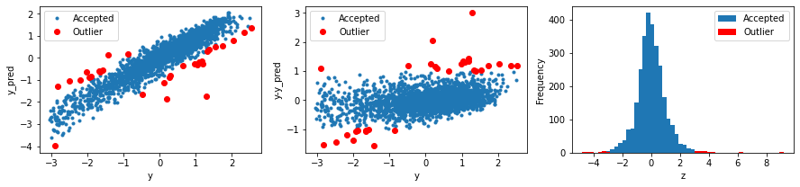
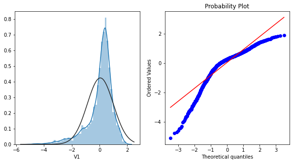
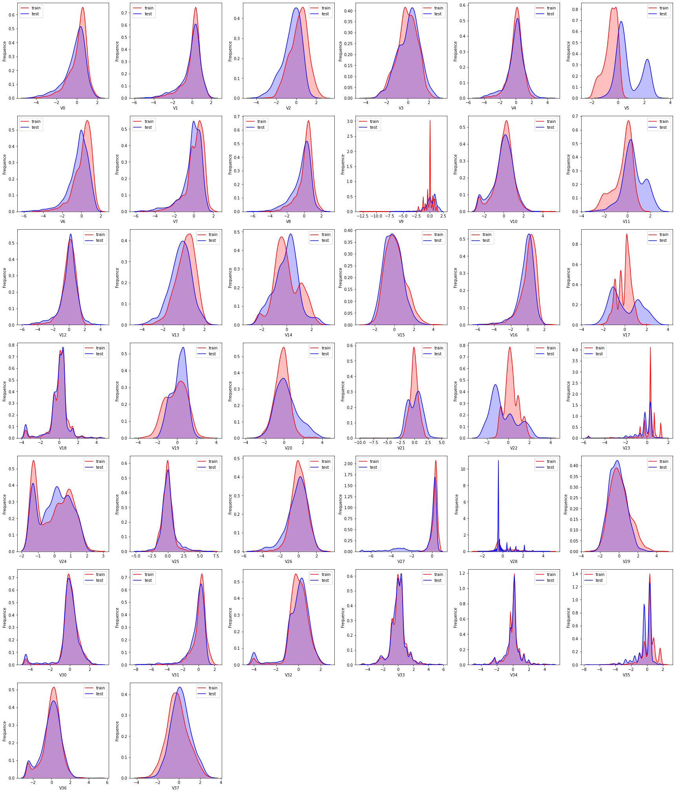
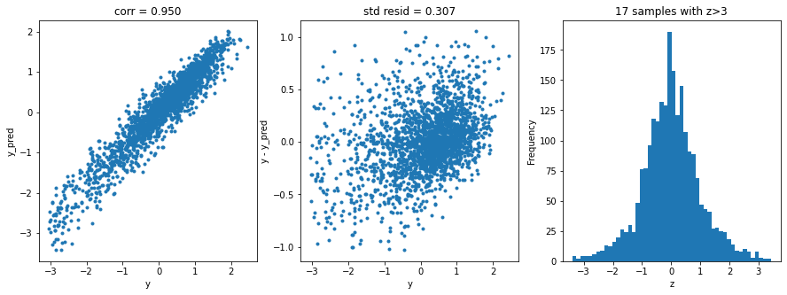

# 工业蒸汽预测

**赛题背景**  
火力发电的基本原理是：燃料在燃烧时加热水生成蒸汽，蒸汽压力推动汽轮机旋转，然后汽轮机带动发电机旋转，产生电能。在这一系列的能量转化中，影响发电效率的核心是锅炉的燃烧效率，即燃料燃烧加热水产生高温高压蒸汽。锅炉的燃烧效率的影响因素很多，包括锅炉的可调参数，如燃烧给量，一二次风，引风，返料风，给水水量；以及锅炉的工况，比如锅炉床温、床压，炉膛温度、压力，过热器的温度等。  
**赛题描述**  
经脱敏后的锅炉传感器采集的数据（采集频率是分钟级别），根据锅炉的工况，预测产生的蒸汽量(回归模型)。  
**数据说明**  
数据分成训练数据（train.txt）和测试数据（test.txt），其中字段”V0”-“V37”，这38个字段是作为特征变量，”target”作为目标变量。选手利用训练数据训练出模型，预测测试数据的目标变量，排名结果依据预测结果的MSE（mean square error）。  


```python
import pandas as pd
import numpy as np
import matplotlib.pyplot as plt
from scipy import stats
import seaborn as sns

import warnings
warnings.filterwarnings("ignore")
%matplotlib inline
# data path
train_data_file = "./data/zhengqi_train.txt"
test_data_file = "./data/zhengqi_test.txt"
```

# EDA阶段

## 基本数据探索


```python
train_data = pd.read_csv(train_data_file, sep="\t")
train_data.head()
```

<table border="1" class="dataframe">
  <thead>
    <tr style="text-align: right;">
      <th></th>
      <th>V0</th>
      <th>V1</th>
      <th>V2</th>
      <th>V3</th>
      <th>V4</th>
      <th>V5</th>
      <th>V6</th>
      <th>V7</th>
      <th>V8</th>
      <th>V9</th>
      <th>...</th>
      <th>V29</th>
      <th>V30</th>
      <th>V31</th>
      <th>V32</th>
      <th>V33</th>
      <th>V34</th>
      <th>V35</th>
      <th>V36</th>
      <th>V37</th>
      <th>target</th>
    </tr>
  </thead>
  <tbody>
    <tr>
      <th>0</th>
      <td>0.566</td>
      <td>0.016</td>
      <td>-0.143</td>
      <td>0.407</td>
      <td>0.452</td>
      <td>-0.901</td>
      <td>-1.812</td>
      <td>-2.360</td>
      <td>-0.436</td>
      <td>-2.114</td>
      <td>...</td>
      <td>0.136</td>
      <td>0.109</td>
      <td>-0.615</td>
      <td>0.327</td>
      <td>-4.627</td>
      <td>-4.789</td>
      <td>-5.101</td>
      <td>-2.608</td>
      <td>-3.508</td>
      <td>0.175</td>
    </tr>
    <tr>
      <th>1</th>
      <td>0.968</td>
      <td>0.437</td>
      <td>0.066</td>
      <td>0.566</td>
      <td>0.194</td>
      <td>-0.893</td>
      <td>-1.566</td>
      <td>-2.360</td>
      <td>0.332</td>
      <td>-2.114</td>
      <td>...</td>
      <td>-0.128</td>
      <td>0.124</td>
      <td>0.032</td>
      <td>0.600</td>
      <td>-0.843</td>
      <td>0.160</td>
      <td>0.364</td>
      <td>-0.335</td>
      <td>-0.730</td>
      <td>0.676</td>
    </tr>
    <tr>
      <th>2</th>
      <td>1.013</td>
      <td>0.568</td>
      <td>0.235</td>
      <td>0.370</td>
      <td>0.112</td>
      <td>-0.797</td>
      <td>-1.367</td>
      <td>-2.360</td>
      <td>0.396</td>
      <td>-2.114</td>
      <td>...</td>
      <td>-0.009</td>
      <td>0.361</td>
      <td>0.277</td>
      <td>-0.116</td>
      <td>-0.843</td>
      <td>0.160</td>
      <td>0.364</td>
      <td>0.765</td>
      <td>-0.589</td>
      <td>0.633</td>
    </tr>
    <tr>
      <th>3</th>
      <td>0.733</td>
      <td>0.368</td>
      <td>0.283</td>
      <td>0.165</td>
      <td>0.599</td>
      <td>-0.679</td>
      <td>-1.200</td>
      <td>-2.086</td>
      <td>0.403</td>
      <td>-2.114</td>
      <td>...</td>
      <td>0.015</td>
      <td>0.417</td>
      <td>0.279</td>
      <td>0.603</td>
      <td>-0.843</td>
      <td>-0.065</td>
      <td>0.364</td>
      <td>0.333</td>
      <td>-0.112</td>
      <td>0.206</td>
    </tr>
    <tr>
      <th>4</th>
      <td>0.684</td>
      <td>0.638</td>
      <td>0.260</td>
      <td>0.209</td>
      <td>0.337</td>
      <td>-0.454</td>
      <td>-1.073</td>
      <td>-2.086</td>
      <td>0.314</td>
      <td>-2.114</td>
      <td>...</td>
      <td>0.183</td>
      <td>1.078</td>
      <td>0.328</td>
      <td>0.418</td>
      <td>-0.843</td>
      <td>-0.215</td>
      <td>0.364</td>
      <td>-0.280</td>
      <td>-0.028</td>
      <td>0.384</td>
    </tr>
  </tbody>
</table>
<p>5 rows × 39 columns</p>

```python
# 无缺失值
train_data.info()
```

    <class 'pandas.core.frame.DataFrame'>
    RangeIndex: 2888 entries, 0 to 2887
    Data columns (total 39 columns):
     #   Column  Non-Null Count  Dtype  
    ---  ------  --------------  -----  
     0   V0      2888 non-null   float64
     1   V1      2888 non-null   float64
     2   V2      2888 non-null   float64
     3   V3      2888 non-null   float64
     4   V4      2888 non-null   float64
     5   V5      2888 non-null   float64
     6   V6      2888 non-null   float64
     7   V7      2888 non-null   float64
     8   V8      2888 non-null   float64
     9   V9      2888 non-null   float64
     10  V10     2888 non-null   float64
     11  V11     2888 non-null   float64
     12  V12     2888 non-null   float64
     13  V13     2888 non-null   float64
     14  V14     2888 non-null   float64
     15  V15     2888 non-null   float64
     16  V16     2888 non-null   float64
     17  V17     2888 non-null   float64
     18  V18     2888 non-null   float64
     19  V19     2888 non-null   float64
     20  V20     2888 non-null   float64
     21  V21     2888 non-null   float64
     22  V22     2888 non-null   float64
     23  V23     2888 non-null   float64
     24  V24     2888 non-null   float64
     25  V25     2888 non-null   float64
     26  V26     2888 non-null   float64
     27  V27     2888 non-null   float64
     28  V28     2888 non-null   float64
     29  V29     2888 non-null   float64
     30  V30     2888 non-null   float64
     31  V31     2888 non-null   float64
     32  V32     2888 non-null   float64
     33  V33     2888 non-null   float64
     34  V34     2888 non-null   float64
     35  V35     2888 non-null   float64
     36  V36     2888 non-null   float64
     37  V37     2888 non-null   float64
     38  target  2888 non-null   float64
    dtypes: float64(39)
    memory usage: 880.1 KB

```python
train_data.describe().T
```

<table border="1" class="dataframe">
  <thead>
    <tr style="text-align: right;">
      <th></th>
      <th>count</th>
      <th>mean</th>
      <th>std</th>
      <th>min</th>
      <th>25%</th>
      <th>50%</th>
      <th>75%</th>
      <th>max</th>
    </tr>
  </thead>
  <tbody>
    <tr>
      <th>V0</th>
      <td>2888.0</td>
      <td>0.123048</td>
      <td>0.928031</td>
      <td>-4.335</td>
      <td>-0.29700</td>
      <td>0.3590</td>
      <td>0.72600</td>
      <td>2.121</td>
    </tr>
    <tr>
      <th>V1</th>
      <td>2888.0</td>
      <td>0.056068</td>
      <td>0.941515</td>
      <td>-5.122</td>
      <td>-0.22625</td>
      <td>0.2725</td>
      <td>0.59900</td>
      <td>1.918</td>
    </tr>
    <tr>
      <th>V2</th>
      <td>2888.0</td>
      <td>0.289720</td>
      <td>0.911236</td>
      <td>-3.420</td>
      <td>-0.31300</td>
      <td>0.3860</td>
      <td>0.91825</td>
      <td>2.828</td>
    </tr>
    <tr>
      <th>V3</th>
      <td>2888.0</td>
      <td>-0.067790</td>
      <td>0.970298</td>
      <td>-3.956</td>
      <td>-0.65225</td>
      <td>-0.0445</td>
      <td>0.62400</td>
      <td>2.457</td>
    </tr>
    <tr>
      <th>V4</th>
      <td>2888.0</td>
      <td>0.012921</td>
      <td>0.888377</td>
      <td>-4.742</td>
      <td>-0.38500</td>
      <td>0.1100</td>
      <td>0.55025</td>
      <td>2.689</td>
    </tr>
    <tr>
      <th>V5</th>
      <td>2888.0</td>
      <td>-0.558565</td>
      <td>0.517957</td>
      <td>-2.182</td>
      <td>-0.85300</td>
      <td>-0.4660</td>
      <td>-0.15400</td>
      <td>0.489</td>
    </tr>
    <tr>
      <th>V6</th>
      <td>2888.0</td>
      <td>0.182892</td>
      <td>0.918054</td>
      <td>-4.576</td>
      <td>-0.31000</td>
      <td>0.3880</td>
      <td>0.83125</td>
      <td>1.895</td>
    </tr>
    <tr>
      <th>V7</th>
      <td>2888.0</td>
      <td>0.116155</td>
      <td>0.955116</td>
      <td>-5.048</td>
      <td>-0.29500</td>
      <td>0.3440</td>
      <td>0.78225</td>
      <td>1.918</td>
    </tr>
    <tr>
      <th>V8</th>
      <td>2888.0</td>
      <td>0.177856</td>
      <td>0.895444</td>
      <td>-4.692</td>
      <td>-0.15900</td>
      <td>0.3620</td>
      <td>0.72600</td>
      <td>2.245</td>
    </tr>
    <tr>
      <th>V9</th>
      <td>2888.0</td>
      <td>-0.169452</td>
      <td>0.953813</td>
      <td>-12.891</td>
      <td>-0.39000</td>
      <td>0.0420</td>
      <td>0.04200</td>
      <td>1.335</td>
    </tr>
    <tr>
      <th>V10</th>
      <td>2888.0</td>
      <td>0.034319</td>
      <td>0.968272</td>
      <td>-2.584</td>
      <td>-0.42050</td>
      <td>0.1570</td>
      <td>0.61925</td>
      <td>4.830</td>
    </tr>
    <tr>
      <th>V11</th>
      <td>2888.0</td>
      <td>-0.364465</td>
      <td>0.858504</td>
      <td>-3.160</td>
      <td>-0.80325</td>
      <td>-0.1120</td>
      <td>0.24700</td>
      <td>1.455</td>
    </tr>
    <tr>
      <th>V12</th>
      <td>2888.0</td>
      <td>0.023177</td>
      <td>0.894092</td>
      <td>-5.165</td>
      <td>-0.41900</td>
      <td>0.1230</td>
      <td>0.61600</td>
      <td>2.657</td>
    </tr>
    <tr>
      <th>V13</th>
      <td>2888.0</td>
      <td>0.195738</td>
      <td>0.922757</td>
      <td>-3.675</td>
      <td>-0.39800</td>
      <td>0.2895</td>
      <td>0.86425</td>
      <td>2.475</td>
    </tr>
    <tr>
      <th>V14</th>
      <td>2888.0</td>
      <td>0.016081</td>
      <td>1.015585</td>
      <td>-2.455</td>
      <td>-0.66800</td>
      <td>-0.1610</td>
      <td>0.82975</td>
      <td>2.558</td>
    </tr>
    <tr>
      <th>V15</th>
      <td>2888.0</td>
      <td>0.096146</td>
      <td>1.033048</td>
      <td>-2.903</td>
      <td>-0.66225</td>
      <td>-0.0005</td>
      <td>0.73000</td>
      <td>4.314</td>
    </tr>
    <tr>
      <th>V16</th>
      <td>2888.0</td>
      <td>0.113505</td>
      <td>0.983128</td>
      <td>-5.981</td>
      <td>-0.30000</td>
      <td>0.3060</td>
      <td>0.77425</td>
      <td>2.861</td>
    </tr>
    <tr>
      <th>V17</th>
      <td>2888.0</td>
      <td>-0.043458</td>
      <td>0.655857</td>
      <td>-2.224</td>
      <td>-0.36600</td>
      <td>0.1650</td>
      <td>0.43000</td>
      <td>2.023</td>
    </tr>
    <tr>
      <th>V18</th>
      <td>2888.0</td>
      <td>0.055034</td>
      <td>0.953466</td>
      <td>-3.582</td>
      <td>-0.36750</td>
      <td>0.0820</td>
      <td>0.51325</td>
      <td>4.441</td>
    </tr>
    <tr>
      <th>V19</th>
      <td>2888.0</td>
      <td>-0.114884</td>
      <td>1.108859</td>
      <td>-3.704</td>
      <td>-0.98750</td>
      <td>-0.0005</td>
      <td>0.73725</td>
      <td>3.431</td>
    </tr>
    <tr>
      <th>V20</th>
      <td>2888.0</td>
      <td>-0.186226</td>
      <td>0.788511</td>
      <td>-3.402</td>
      <td>-0.67550</td>
      <td>-0.1565</td>
      <td>0.30400</td>
      <td>3.525</td>
    </tr>
    <tr>
      <th>V21</th>
      <td>2888.0</td>
      <td>-0.056556</td>
      <td>0.781471</td>
      <td>-2.643</td>
      <td>-0.51700</td>
      <td>-0.0565</td>
      <td>0.43150</td>
      <td>2.259</td>
    </tr>
    <tr>
      <th>V22</th>
      <td>2888.0</td>
      <td>0.302893</td>
      <td>0.639186</td>
      <td>-1.375</td>
      <td>-0.06300</td>
      <td>0.2165</td>
      <td>0.87200</td>
      <td>2.018</td>
    </tr>
    <tr>
      <th>V23</th>
      <td>2888.0</td>
      <td>0.155978</td>
      <td>0.978757</td>
      <td>-5.542</td>
      <td>0.09725</td>
      <td>0.3380</td>
      <td>0.36825</td>
      <td>1.906</td>
    </tr>
    <tr>
      <th>V24</th>
      <td>2888.0</td>
      <td>-0.021813</td>
      <td>1.033403</td>
      <td>-1.344</td>
      <td>-1.19100</td>
      <td>0.0950</td>
      <td>0.93125</td>
      <td>2.423</td>
    </tr>
    <tr>
      <th>V25</th>
      <td>2888.0</td>
      <td>-0.051679</td>
      <td>0.915957</td>
      <td>-3.808</td>
      <td>-0.55725</td>
      <td>-0.0760</td>
      <td>0.35600</td>
      <td>7.284</td>
    </tr>
    <tr>
      <th>V26</th>
      <td>2888.0</td>
      <td>0.072092</td>
      <td>0.889771</td>
      <td>-5.131</td>
      <td>-0.45200</td>
      <td>0.0750</td>
      <td>0.64425</td>
      <td>2.980</td>
    </tr>
    <tr>
      <th>V27</th>
      <td>2888.0</td>
      <td>0.272407</td>
      <td>0.270374</td>
      <td>-1.164</td>
      <td>0.15775</td>
      <td>0.3250</td>
      <td>0.44200</td>
      <td>0.925</td>
    </tr>
    <tr>
      <th>V28</th>
      <td>2888.0</td>
      <td>0.137712</td>
      <td>0.929899</td>
      <td>-2.435</td>
      <td>-0.45500</td>
      <td>-0.4470</td>
      <td>0.73000</td>
      <td>4.671</td>
    </tr>
    <tr>
      <th>V29</th>
      <td>2888.0</td>
      <td>0.097648</td>
      <td>1.061200</td>
      <td>-2.912</td>
      <td>-0.66400</td>
      <td>-0.0230</td>
      <td>0.74525</td>
      <td>4.580</td>
    </tr>
    <tr>
      <th>V30</th>
      <td>2888.0</td>
      <td>0.055477</td>
      <td>0.901934</td>
      <td>-4.507</td>
      <td>-0.28300</td>
      <td>0.0535</td>
      <td>0.48800</td>
      <td>2.689</td>
    </tr>
    <tr>
      <th>V31</th>
      <td>2888.0</td>
      <td>0.127791</td>
      <td>0.873028</td>
      <td>-5.859</td>
      <td>-0.17025</td>
      <td>0.2995</td>
      <td>0.63500</td>
      <td>2.013</td>
    </tr>
    <tr>
      <th>V32</th>
      <td>2888.0</td>
      <td>0.020806</td>
      <td>0.902584</td>
      <td>-4.053</td>
      <td>-0.40725</td>
      <td>0.0390</td>
      <td>0.55700</td>
      <td>2.395</td>
    </tr>
    <tr>
      <th>V33</th>
      <td>2888.0</td>
      <td>0.007801</td>
      <td>1.006995</td>
      <td>-4.627</td>
      <td>-0.49900</td>
      <td>-0.0400</td>
      <td>0.46200</td>
      <td>5.465</td>
    </tr>
    <tr>
      <th>V34</th>
      <td>2888.0</td>
      <td>0.006715</td>
      <td>1.003291</td>
      <td>-4.789</td>
      <td>-0.29000</td>
      <td>0.1600</td>
      <td>0.27300</td>
      <td>5.110</td>
    </tr>
    <tr>
      <th>V35</th>
      <td>2888.0</td>
      <td>0.197764</td>
      <td>0.985675</td>
      <td>-5.695</td>
      <td>-0.20250</td>
      <td>0.3640</td>
      <td>0.60200</td>
      <td>2.324</td>
    </tr>
    <tr>
      <th>V36</th>
      <td>2888.0</td>
      <td>0.030658</td>
      <td>0.970812</td>
      <td>-2.608</td>
      <td>-0.41300</td>
      <td>0.1370</td>
      <td>0.64425</td>
      <td>5.238</td>
    </tr>
    <tr>
      <th>V37</th>
      <td>2888.0</td>
      <td>-0.130330</td>
      <td>1.017196</td>
      <td>-3.630</td>
      <td>-0.79825</td>
      <td>-0.1855</td>
      <td>0.49525</td>
      <td>3.000</td>
    </tr>
    <tr>
      <th>target</th>
      <td>2888.0</td>
      <td>0.126353</td>
      <td>0.983966</td>
      <td>-3.044</td>
      <td>-0.35025</td>
      <td>0.3130</td>
      <td>0.79325</td>
      <td>2.538</td>
    </tr>
  </tbody>
</table>

```python
test_data = pd.read_csv(test_data_file, sep="\t")
test_data.head()
```

<table border="1" class="dataframe">
  <thead>
    <tr style="text-align: right;">
      <th></th>
      <th>V0</th>
      <th>V1</th>
      <th>V2</th>
      <th>V3</th>
      <th>V4</th>
      <th>V5</th>
      <th>V6</th>
      <th>V7</th>
      <th>V8</th>
      <th>V9</th>
      <th>...</th>
      <th>V28</th>
      <th>V29</th>
      <th>V30</th>
      <th>V31</th>
      <th>V32</th>
      <th>V33</th>
      <th>V34</th>
      <th>V35</th>
      <th>V36</th>
      <th>V37</th>
    </tr>
  </thead>
  <tbody>
    <tr>
      <th>0</th>
      <td>0.368</td>
      <td>0.380</td>
      <td>-0.225</td>
      <td>-0.049</td>
      <td>0.379</td>
      <td>0.092</td>
      <td>0.550</td>
      <td>0.551</td>
      <td>0.244</td>
      <td>0.904</td>
      <td>...</td>
      <td>-0.449</td>
      <td>0.047</td>
      <td>0.057</td>
      <td>-0.042</td>
      <td>0.847</td>
      <td>0.534</td>
      <td>-0.009</td>
      <td>-0.190</td>
      <td>-0.567</td>
      <td>0.388</td>
    </tr>
    <tr>
      <th>1</th>
      <td>0.148</td>
      <td>0.489</td>
      <td>-0.247</td>
      <td>-0.049</td>
      <td>0.122</td>
      <td>-0.201</td>
      <td>0.487</td>
      <td>0.493</td>
      <td>-0.127</td>
      <td>0.904</td>
      <td>...</td>
      <td>-0.443</td>
      <td>0.047</td>
      <td>0.560</td>
      <td>0.176</td>
      <td>0.551</td>
      <td>0.046</td>
      <td>-0.220</td>
      <td>0.008</td>
      <td>-0.294</td>
      <td>0.104</td>
    </tr>
    <tr>
      <th>2</th>
      <td>-0.166</td>
      <td>-0.062</td>
      <td>-0.311</td>
      <td>0.046</td>
      <td>-0.055</td>
      <td>0.063</td>
      <td>0.485</td>
      <td>0.493</td>
      <td>-0.227</td>
      <td>0.904</td>
      <td>...</td>
      <td>-0.458</td>
      <td>-0.398</td>
      <td>0.101</td>
      <td>0.199</td>
      <td>0.634</td>
      <td>0.017</td>
      <td>-0.234</td>
      <td>0.008</td>
      <td>0.373</td>
      <td>0.569</td>
    </tr>
    <tr>
      <th>3</th>
      <td>0.102</td>
      <td>0.294</td>
      <td>-0.259</td>
      <td>0.051</td>
      <td>-0.183</td>
      <td>0.148</td>
      <td>0.474</td>
      <td>0.504</td>
      <td>0.010</td>
      <td>0.904</td>
      <td>...</td>
      <td>-0.456</td>
      <td>-0.398</td>
      <td>1.007</td>
      <td>0.137</td>
      <td>1.042</td>
      <td>-0.040</td>
      <td>-0.290</td>
      <td>0.008</td>
      <td>-0.666</td>
      <td>0.391</td>
    </tr>
    <tr>
      <th>4</th>
      <td>0.300</td>
      <td>0.428</td>
      <td>0.208</td>
      <td>0.051</td>
      <td>-0.033</td>
      <td>0.116</td>
      <td>0.408</td>
      <td>0.497</td>
      <td>0.155</td>
      <td>0.904</td>
      <td>...</td>
      <td>-0.458</td>
      <td>-0.776</td>
      <td>0.291</td>
      <td>0.370</td>
      <td>0.181</td>
      <td>-0.040</td>
      <td>-0.290</td>
      <td>0.008</td>
      <td>-0.140</td>
      <td>-0.497</td>
    </tr>
  </tbody>
</table>
<p>5 rows × 38 columns</p>

```python
# 无缺失值
test_data.info()
```

    <class 'pandas.core.frame.DataFrame'>
    RangeIndex: 1925 entries, 0 to 1924
    Data columns (total 38 columns):
     #   Column  Non-Null Count  Dtype  
    ---  ------  --------------  -----  
     0   V0      1925 non-null   float64
     1   V1      1925 non-null   float64
     2   V2      1925 non-null   float64
     3   V3      1925 non-null   float64
     4   V4      1925 non-null   float64
     5   V5      1925 non-null   float64
     6   V6      1925 non-null   float64
     7   V7      1925 non-null   float64
     8   V8      1925 non-null   float64
     9   V9      1925 non-null   float64
     10  V10     1925 non-null   float64
     11  V11     1925 non-null   float64
     12  V12     1925 non-null   float64
     13  V13     1925 non-null   float64
     14  V14     1925 non-null   float64
     15  V15     1925 non-null   float64
     16  V16     1925 non-null   float64
     17  V17     1925 non-null   float64
     18  V18     1925 non-null   float64
     19  V19     1925 non-null   float64
     20  V20     1925 non-null   float64
     21  V21     1925 non-null   float64
     22  V22     1925 non-null   float64
     23  V23     1925 non-null   float64
     24  V24     1925 non-null   float64
     25  V25     1925 non-null   float64
     26  V26     1925 non-null   float64
     27  V27     1925 non-null   float64
     28  V28     1925 non-null   float64
     29  V29     1925 non-null   float64
     30  V30     1925 non-null   float64
     31  V31     1925 non-null   float64
     32  V32     1925 non-null   float64
     33  V33     1925 non-null   float64
     34  V34     1925 non-null   float64
     35  V35     1925 non-null   float64
     36  V36     1925 non-null   float64
     37  V37     1925 non-null   float64
    dtypes: float64(38)
    memory usage: 571.6 KB

**说明**：训练集和测试集中的数据没有缺失值，特征字段经过脱敏处理，没有具体的特征含义，共38个特征。

## 可视化异常值以及查看数据分布情况


```python
# 箱图
fig = plt.figure(figsize=(80, 60))
feature_columns = train_data.columns.to_list()[:39]

for i, columns in enumerate(feature_columns):
    plt.subplot(7, 8, i+1) # 注：从1开始
    sns.boxplot(train_data[columns], orient="vertical", width=0.5)
    plt.ylabel(columns)
plt.show()
```


    

**结论**：大多数特征变量存在异常值，需要考虑对异常值的处理。

## 基于模型的异常值获取
基于模型的方法


```python
def find_outliers(model, X, y, sigma=3):
    """找出异常值并可视化"""
    
    try:
        y_pred = pd.Series(model.predict(X_train), index=y_train.index)
    except:
        model.fit(X, y)
        y_pred = pd.Series(model.predict(X_train), index=y_train.index)

    print("MSE:{}, R^2:{}".format(round(mean_squared_error(y, y_pred), 4), round(model.score(X, y), 4)))
    # 计算参统计量
    resid = y-y_pred
    resid_mean = resid.mean()
    resid_std = resid.std()
    print("resid_mean:{}, resid_std:{}".format(round(resid_mean, 4), round(resid_std, 4)))

    # 标准化(正态分布)
    z = (resid - resid_mean)/resid_std

    # 异常值位置(真实值和预测值偏离程度较大,大于三倍标准差)
    outliers = z[abs(z) > sigma].index
    print("outlier index:",outliers.tolist())
    # 可视化异常值（呈现正相关性越好）
    plt.figure(figsize=(15, 3))
    ax_131 = plt.subplot(1, 3, 1)
    plt.plot(y, y_pred, ".", label="Accepted")
    plt.plot(y.loc[outliers], y_pred[outliers], "ro", label="Outlier")
    plt.ylabel("y_pred")
    plt.xlabel("y")
    plt.legend()
    
    # 残差越靠近零值越好
    ax_132 = plt.subplot(1, 3, 2)
    plt.plot(y, y-y_pred, ".", label="Accepted")
    plt.plot(y.loc[outliers], y.loc[outliers ] - y_pred.loc[outliers], "ro", label="Outlier")
    plt.ylabel("y-y_pred")
    plt.xlabel("y")
    plt.legend()

    #　绘制直方图
    ax_133 = plt.subplot(1, 3, 3)
    z.plot.hist(bins=50, ax=ax_133)
    z.loc[outliers].plot.hist(bins=50, color="r", ax=ax_133)
    plt.legend(["Accepted", "Outlier"])
    plt.xlabel("z")
    
    plt.savefig("./imgs/Outlier.png")
    
    return outliers
```


```python
from sklearn.metrics import mean_squared_error
from sklearn.linear_model import Ridge

X_train = train_data.iloc[:, 0:-1]
y_train = train_data.iloc[:, -1]

# 岭回归
model = Ridge()
outliers = find_outliers(model, X_train, y_train)
```

    MSE:0.1073, R^2:0.8891
    resid_mean:0.0, resid_std:0.3277
    outlier index: [321, 348, 376, 777, 884, 1145, 1164, 1310, 1458, 1466, 1484, 1523, 1704, 1874, 1879, 1979, 2002, 2279, 2528, 2620, 2645, 2647, 2667, 2668, 2669, 2696, 2767, 2769, 2807, 2842, 2863]




## 直方图和Q-Q图


```python
# 如果数据服从正态分布，则所有的点都会落在直线上
plt.figure(figsize=(10, 5))

ax = plt.subplot(1, 2, 1)
sns.distplot(train_data["V1"], fit=stats.norm)

ax = plt.subplot(1, 2, 2)
res = stats.probplot(train_data["V1"], plot=plt)
```




```python
# 绘制全部数据
train_cols = 6
train_rows = len(train_data.columns)

plt.figure(figsize=(4*train_cols, 4*train_rows))

i = 0
for col in train_data.columns:
    i += 1
    ax = plt.subplot(train_rows, train_cols, i)
    sns.distplot(train_data[col], fit=stats.norm)
    
    i += 1
    ax = plt.subplot(train_rows, train_cols, i)
    res = stats.probplot(train_data[col], plot=plt)
plt.tight_layout()
```


​    

​    


结论：特征变量（如V1, V23, V24, V35）的数据分布不是正态分布。

## KDE分布
**目标**：查看训练集和测试集对应特征变量的分布情况,有助于发现两个数据中分布不一致的情况。


```python
# 核密度：直方图的平滑
plt.figure(figsize=(8, 4))

# 查看特征分布是否相同(train and test)
ax = sns.kdeplot(train_data["V1"], color="red", shade=True)
ax = sns.kdeplot(test_data["V1"], color="blue", shade=True)

ax.set_xlabel("V1")
ax.set_ylabel("Frequence")
ax.legend(["train", "test"])
```


```python
# 绘制全部数据
dist_cols = 6
dist_rows = len(test_data.columns)

plt.figure(figsize=(4*dist_cols, 4*dist_rows))

i = 1
for col in test_data.columns:
    ax = plt.subplot(dist_rows, dist_cols, i)
    ax = sns.kdeplot(train_data[col], color="red", shade=True)
    ax = sns.kdeplot(test_data[col], color="blue", shade=True)
    ax.set_xlabel(col)
    ax.set_ylabel("Frequence")
    ax.legend(["train", "test"])
    i += 1
    
plt.tight_layout()
```



    

**结论**：特征变量V5,V9,V11,V17,V22,V28在训练集和测试集中的数据分布不一致，会导致模型非泛化能力变差，需要删除此类特征。

## 线性回归关系图（定性分析）
**说明**：分析变量与目标之间的相关性。


```python
fcols = 2
frows = 1

plt.figure(figsize=(8, 4))

ax = plt.subplot(frows, fcols, 1)
sns.regplot(x="V0", y="target", data=train_data, ax=ax
            , scatter_kws={"marker":".", "s":3, "alpha":0.3}
            , line_kws={"color":"k", "alpha":0.7}
           )

ax = plt.subplot(frows, fcols, 2)
sns.distplot(train_data["V0"].dropna())

plt.show()
```


```python
fcols = 6
frows = len(test_data.columns)

plt.figure(figsize=(5*fcols, 4*frows))

index  = 0
for col in test_data.columns:
    index += 1
    ax = plt.subplot(frows, fcols, index)
    sns.regplot(x=col, y="target", data=train_data, ax=ax
                , scatter_kws={"marker":".", "s":3, "alpha":0.3}
                , line_kws={"color":"k", "alpha":0.7}
               )
    index += 1
    ax = plt.subplot(frows, fcols, index)
    sns.distplot(train_data[col].dropna())

plt.show()
```


## 计算特征变量之间的相关性（定量分析）


```python
# 删除不必要的数据
pd.set_option("display.max_columns", 10)
pd.set_option("display.max_rows", 10)
train_data1 = train_data.drop(columns=["V5", "V9", "V11", "V17", "V22", "V28"])
```


```python
# 计算协方差矩阵
train_corr = train_data1.corr()
train_corr
```

<table border="1" class="dataframe">
  <thead>
    <tr style="text-align: right;">
      <th></th>
      <th>V0</th>
      <th>V1</th>
      <th>V2</th>
      <th>V3</th>
      <th>V4</th>
      <th>...</th>
      <th>V34</th>
      <th>V35</th>
      <th>V36</th>
      <th>V37</th>
      <th>target</th>
    </tr>
  </thead>
  <tbody>
    <tr>
      <th>V0</th>
      <td>1.000000</td>
      <td>0.908607</td>
      <td>0.463643</td>
      <td>0.409576</td>
      <td>0.781212</td>
      <td>...</td>
      <td>-0.019342</td>
      <td>0.138933</td>
      <td>0.231417</td>
      <td>-0.494076</td>
      <td>0.873212</td>
    </tr>
    <tr>
      <th>V1</th>
      <td>0.908607</td>
      <td>1.000000</td>
      <td>0.506514</td>
      <td>0.383924</td>
      <td>0.657790</td>
      <td>...</td>
      <td>-0.029115</td>
      <td>0.146329</td>
      <td>0.235299</td>
      <td>-0.494043</td>
      <td>0.871846</td>
    </tr>
    <tr>
      <th>V2</th>
      <td>0.463643</td>
      <td>0.506514</td>
      <td>1.000000</td>
      <td>0.410148</td>
      <td>0.057697</td>
      <td>...</td>
      <td>-0.025620</td>
      <td>0.043648</td>
      <td>0.316462</td>
      <td>-0.734956</td>
      <td>0.638878</td>
    </tr>
    <tr>
      <th>V3</th>
      <td>0.409576</td>
      <td>0.383924</td>
      <td>0.410148</td>
      <td>1.000000</td>
      <td>0.315046</td>
      <td>...</td>
      <td>-0.031898</td>
      <td>0.080034</td>
      <td>0.324475</td>
      <td>-0.229613</td>
      <td>0.512074</td>
    </tr>
    <tr>
      <th>V4</th>
      <td>0.781212</td>
      <td>0.657790</td>
      <td>0.057697</td>
      <td>0.315046</td>
      <td>1.000000</td>
      <td>...</td>
      <td>0.028659</td>
      <td>0.100010</td>
      <td>0.113609</td>
      <td>-0.031054</td>
      <td>0.603984</td>
    </tr>
    <tr>
      <th>...</th>
      <td>...</td>
      <td>...</td>
      <td>...</td>
      <td>...</td>
      <td>...</td>
      <td>...</td>
      <td>...</td>
      <td>...</td>
      <td>...</td>
      <td>...</td>
      <td>...</td>
    </tr>
    <tr>
      <th>V34</th>
      <td>-0.019342</td>
      <td>-0.029115</td>
      <td>-0.025620</td>
      <td>-0.031898</td>
      <td>0.028659</td>
      <td>...</td>
      <td>1.000000</td>
      <td>0.233616</td>
      <td>-0.019032</td>
      <td>-0.006854</td>
      <td>-0.006034</td>
    </tr>
    <tr>
      <th>V35</th>
      <td>0.138933</td>
      <td>0.146329</td>
      <td>0.043648</td>
      <td>0.080034</td>
      <td>0.100010</td>
      <td>...</td>
      <td>0.233616</td>
      <td>1.000000</td>
      <td>0.025401</td>
      <td>-0.077991</td>
      <td>0.140294</td>
    </tr>
    <tr>
      <th>V36</th>
      <td>0.231417</td>
      <td>0.235299</td>
      <td>0.316462</td>
      <td>0.324475</td>
      <td>0.113609</td>
      <td>...</td>
      <td>-0.019032</td>
      <td>0.025401</td>
      <td>1.000000</td>
      <td>-0.039478</td>
      <td>0.319309</td>
    </tr>
    <tr>
      <th>V37</th>
      <td>-0.494076</td>
      <td>-0.494043</td>
      <td>-0.734956</td>
      <td>-0.229613</td>
      <td>-0.031054</td>
      <td>...</td>
      <td>-0.006854</td>
      <td>-0.077991</td>
      <td>-0.039478</td>
      <td>1.000000</td>
      <td>-0.565795</td>
    </tr>
    <tr>
      <th>target</th>
      <td>0.873212</td>
      <td>0.871846</td>
      <td>0.638878</td>
      <td>0.512074</td>
      <td>0.603984</td>
      <td>...</td>
      <td>-0.006034</td>
      <td>0.140294</td>
      <td>0.319309</td>
      <td>-0.565795</td>
      <td>1.000000</td>
    </tr>
  </tbody>
</table>
<p>33 rows × 33 columns</p>

```python
# 绘制热力图，便于分析变量之间的相关性和变量与目标之间的相关性
plt.figure(figsize=(20, 16))
sns.heatmap(train_corr, vmax=.8, square=True, annot=True)
```


## 统计与目标最相关的K-th个特征变量


```python
k = 10
nlargest_f = train_corr.nlargest(k, columns="target")["target"]
nlargest_f
```


    target    1.000000
    V0        0.873212
    V1        0.871846
    V8        0.831904
    V27       0.812585
    V31       0.750297
    V2        0.638878
    V4        0.603984
    V12       0.594189
    V16       0.536748
    Name: target, dtype: float64


```python
# n_largest corr
cols = nlargest_f.index
cm = np.corrcoef(train_data[cols].values.T)
hm = plt.figure(figsize=(10, 10))
sns.heatmap(train_data[cols].corr(), annot=True, square=True)
plt.show()
```


```python
# 增加变量,降低相关系数阈值
threshold = 0.5

corrmat = train_data.corr()
corr_cols = corrmat[corrmat["target"] > threshold]["target"].index
hm = plt.figure(figsize=(10, 10))
sns.heatmap(train_data[corr_cols].corr(), annot=True, square=True, cmap="RdYlGn")  # 配色：RdYlGn
plt.show()
```


```python
#　设置阈值，确定合适地特征变量
threshold = 0.5
corr_matrix = train_data1.corr().abs()
drop_cols  = corr_matrix[corr_matrix["target"] < 0.5].index
train_data1 = train_data1.drop(columns=drop_cols)
```

结论：与目标的相关系数越大，则可以认为这些特征变量对target变量的线性影响最大。

## Box_Cox变换
由于线性回归是基于正态分布的，因此在进行统计分析时，需要将数据转换使其符合正态分布, Box_Cox能使线性回归模型在满足线性、正态性、独立性以及方差齐性的同时，又不丢失信息。

### 全量数据


```python
drop_columns=["V5", "V9", "V11", "V17", "V22", "V28"]
train_x = train_data.drop(columns="target")

# 离线:合并训练集和测试集 线上：训练集
all_data = pd.concat([train_x, test_data])
all_data.drop(columns = drop_columns, inplace=True)
all_data.head()
```

<table border="1" class="dataframe">
  <thead>
    <tr style="text-align: right;">
      <th></th>
      <th>V0</th>
      <th>V1</th>
      <th>V2</th>
      <th>V3</th>
      <th>V4</th>
      <th>...</th>
      <th>V33</th>
      <th>V34</th>
      <th>V35</th>
      <th>V36</th>
      <th>V37</th>
    </tr>
  </thead>
  <tbody>
    <tr>
      <th>0</th>
      <td>0.566</td>
      <td>0.016</td>
      <td>-0.143</td>
      <td>0.407</td>
      <td>0.452</td>
      <td>...</td>
      <td>-4.627</td>
      <td>-4.789</td>
      <td>-5.101</td>
      <td>-2.608</td>
      <td>-3.508</td>
    </tr>
    <tr>
      <th>1</th>
      <td>0.968</td>
      <td>0.437</td>
      <td>0.066</td>
      <td>0.566</td>
      <td>0.194</td>
      <td>...</td>
      <td>-0.843</td>
      <td>0.160</td>
      <td>0.364</td>
      <td>-0.335</td>
      <td>-0.730</td>
    </tr>
    <tr>
      <th>2</th>
      <td>1.013</td>
      <td>0.568</td>
      <td>0.235</td>
      <td>0.370</td>
      <td>0.112</td>
      <td>...</td>
      <td>-0.843</td>
      <td>0.160</td>
      <td>0.364</td>
      <td>0.765</td>
      <td>-0.589</td>
    </tr>
    <tr>
      <th>3</th>
      <td>0.733</td>
      <td>0.368</td>
      <td>0.283</td>
      <td>0.165</td>
      <td>0.599</td>
      <td>...</td>
      <td>-0.843</td>
      <td>-0.065</td>
      <td>0.364</td>
      <td>0.333</td>
      <td>-0.112</td>
    </tr>
    <tr>
      <th>4</th>
      <td>0.684</td>
      <td>0.638</td>
      <td>0.260</td>
      <td>0.209</td>
      <td>0.337</td>
      <td>...</td>
      <td>-0.843</td>
      <td>-0.215</td>
      <td>0.364</td>
      <td>-0.280</td>
      <td>-0.028</td>
    </tr>
  </tbody>
</table>
<p>5 rows × 32 columns</p>

```python
# 预先进行归一化操作(全部数据，建议在数据量比较大的时候进行处理)
from sklearn.preprocessing import MinMaxScaler

mms = MinMaxScaler()
all_cols = all_data.columns.tolist()
all_data  = mms.fit_transform(all_data)

all_data  = pd.DataFrame(all_data, columns=all_cols)
```


```python
all_data.describe().T
```

<table border="1" class="dataframe">
  <thead>
    <tr style="text-align: right;">
      <th></th>
      <th>count</th>
      <th>mean</th>
      <th>std</th>
      <th>min</th>
      <th>25%</th>
      <th>50%</th>
      <th>75%</th>
      <th>max</th>
    </tr>
  </thead>
  <tbody>
    <tr>
      <th>V0</th>
      <td>4813.0</td>
      <td>0.694172</td>
      <td>0.144198</td>
      <td>0.0</td>
      <td>0.626676</td>
      <td>0.729488</td>
      <td>0.790195</td>
      <td>1.0</td>
    </tr>
    <tr>
      <th>V1</th>
      <td>4813.0</td>
      <td>0.721357</td>
      <td>0.131443</td>
      <td>0.0</td>
      <td>0.679416</td>
      <td>0.752497</td>
      <td>0.799553</td>
      <td>1.0</td>
    </tr>
    <tr>
      <th>V2</th>
      <td>4813.0</td>
      <td>0.602300</td>
      <td>0.140628</td>
      <td>0.0</td>
      <td>0.514414</td>
      <td>0.617072</td>
      <td>0.700464</td>
      <td>1.0</td>
    </tr>
    <tr>
      <th>V3</th>
      <td>4813.0</td>
      <td>0.603139</td>
      <td>0.152462</td>
      <td>0.0</td>
      <td>0.503888</td>
      <td>0.614270</td>
      <td>0.710474</td>
      <td>1.0</td>
    </tr>
    <tr>
      <th>V4</th>
      <td>4813.0</td>
      <td>0.523743</td>
      <td>0.106430</td>
      <td>0.0</td>
      <td>0.478182</td>
      <td>0.535866</td>
      <td>0.585036</td>
      <td>1.0</td>
    </tr>
    <tr>
      <th>...</th>
      <td>...</td>
      <td>...</td>
      <td>...</td>
      <td>...</td>
      <td>...</td>
      <td>...</td>
      <td>...</td>
      <td>...</td>
    </tr>
    <tr>
      <th>V33</th>
      <td>4813.0</td>
      <td>0.458493</td>
      <td>0.099095</td>
      <td>0.0</td>
      <td>0.409037</td>
      <td>0.454518</td>
      <td>0.500000</td>
      <td>1.0</td>
    </tr>
    <tr>
      <th>V34</th>
      <td>4813.0</td>
      <td>0.483790</td>
      <td>0.101020</td>
      <td>0.0</td>
      <td>0.454490</td>
      <td>0.499949</td>
      <td>0.511365</td>
      <td>1.0</td>
    </tr>
    <tr>
      <th>V35</th>
      <td>4813.0</td>
      <td>0.762873</td>
      <td>0.102037</td>
      <td>0.0</td>
      <td>0.727273</td>
      <td>0.800020</td>
      <td>0.800020</td>
      <td>1.0</td>
    </tr>
    <tr>
      <th>V36</th>
      <td>4813.0</td>
      <td>0.332385</td>
      <td>0.127456</td>
      <td>0.0</td>
      <td>0.270584</td>
      <td>0.347056</td>
      <td>0.414861</td>
      <td>1.0</td>
    </tr>
    <tr>
      <th>V37</th>
      <td>4813.0</td>
      <td>0.545795</td>
      <td>0.150356</td>
      <td>0.0</td>
      <td>0.445647</td>
      <td>0.539317</td>
      <td>0.643061</td>
      <td>1.0</td>
    </tr>
  </tbody>
</table>
<p>32 rows × 8 columns</p>
### 分开处理


```python
# 测试集和训练集分别处理
cols_numeric = test_data.columns
train_data_process = train_data[cols_numeric]
# 归一化后，并消除异常值
train_data_process = pd.DataFrame(mms.fit_transform(train_data_process), columns=cols_numeric)

test_data_process = test_data[cols_numeric]
test_data_process = pd.DataFrame(mms.fit_transform(test_data_process), columns=cols_numeric)
```


```python
# Box_Cox变换
cols_numeric_left = cols_numeric[:13]
cols_numeric_right = cols_numeric[13:]
train_data_process = pd.concat([train_data_process, train_data["target"]], axis=1)
```


```python
fcols = 6
frows = len(cols_numeric_left)

plt.figure(figsize=(4*fcols, 4*frows))

i = 0

for var in cols_numeric_left:
    dat =  train_data_process[[var, "target"]].dropna()
    i += 1
    plt.subplot(frows, fcols, i)
    sns.distplot(dat[var], fit=stats.norm)
    plt.title(var + " Original")
    plt.xlabel("")
    
    i += 1
    plt.subplot(frows, fcols, i)
    _ = stats.probplot(dat[var], plot=plt)
    plt.xlabel("")
    plt.ylabel("")
    plt.title("skew=" + "{:.4f}".format(stats.skew(dat[var])))
    
    # 相关性图
    i += 1
    plt.subplot(frows, fcols, i)
    plt.plot(dat[var], dat["target"], ".",alpha=0.8)
    plt.title("corr=" + "{:.2f}".format(np.corrcoef(dat[var], dat["target"])[0][1]))
    
    # 变换后(Box_Cox)
    i += 1
    plt.subplot(frows, fcols, i)
    trans_var, lambda_var = stats.boxcox(dat[var].dropna() + 1)  # 数值不能为负值
    trans_var = pd.DataFrame(mms.fit_transform(trans_var.reshape(-1, 1)))[0]
    
    plt.subplot(frows, fcols, i)
    sns.distplot(trans_var, fit=stats.norm)
    plt.title(var + "Transformed")
    plt.xlabel("")
    
    i += 1
    plt.subplot(frows, fcols, i)
    _ = stats.probplot(trans_var, plot=plt)
    plt.xlabel("")
    plt.ylabel("")
    plt.title("skew=" + "{:.4f}".format(stats.skew(trans_var)))
    
    # 相关性图
    i += 1
    plt.subplot(frows, fcols, i)
    plt.plot(trans_var, dat["target"], ".",alpha=0.8)
    plt.title("corr=" + "{:.2f}".format(np.corrcoef(trans_var, dat["target"])[0][1]))
```


    

**知识点**：  
偏度的衡量是相对于正态分布来说，正态分布的偏度为0，即若数据分布是对称的，偏度为0。若偏度大于0，则分布右偏，即分布有一条长尾在右；若偏度小于0，则分布为左偏，即分布有一条长尾在左；同时偏度的绝对值越大，说明分布的偏移程度越严重。(大０偏右，小０偏左，等０正态)<font color="red">【注意】</font>数据分布的左偏或右偏，指的是数值拖尾的方向，而不是峰的位置。

# 特征工程

## 异常值分析


```python
# 箱图
plt.figure(figsize=(18, 10))
plt.boxplot(train_data.values, labels=train_data.columns)
plt.hlines([-7.5, 7.5], 0, 40, "red")
plt.show()
```


​    

​    


```python
# 特征变量V9出现了明显的异常值, 删除
train_data = train_data[train_data["V9"] > -7.5]
test_data = test_data[test_data["V9"] > -7.5]
display(train_data.describe())
display(test_data.describe())
```

<table border="1" class="dataframe">
  <thead>
    <tr style="text-align: right;">
      <th></th>
      <th>V0</th>
      <th>V1</th>
      <th>V2</th>
      <th>V3</th>
      <th>V4</th>
      <th>...</th>
      <th>V34</th>
      <th>V35</th>
      <th>V36</th>
      <th>V37</th>
      <th>target</th>
    </tr>
  </thead>
  <tbody>
    <tr>
      <th>count</th>
      <td>2886.000000</td>
      <td>2886.000000</td>
      <td>2886.000000</td>
      <td>2886.000000</td>
      <td>2886.000000</td>
      <td>...</td>
      <td>2886.000000</td>
      <td>2886.000000</td>
      <td>2886.000000</td>
      <td>2886.000000</td>
      <td>2886.000000</td>
    </tr>
    <tr>
      <th>mean</th>
      <td>0.123725</td>
      <td>0.056856</td>
      <td>0.290340</td>
      <td>-0.068364</td>
      <td>0.012254</td>
      <td>...</td>
      <td>0.006959</td>
      <td>0.198513</td>
      <td>0.030099</td>
      <td>-0.131957</td>
      <td>0.127451</td>
    </tr>
    <tr>
      <th>std</th>
      <td>0.927984</td>
      <td>0.941269</td>
      <td>0.911231</td>
      <td>0.970357</td>
      <td>0.888037</td>
      <td>...</td>
      <td>1.003411</td>
      <td>0.985058</td>
      <td>0.970258</td>
      <td>1.015666</td>
      <td>0.983144</td>
    </tr>
    <tr>
      <th>min</th>
      <td>-4.335000</td>
      <td>-5.122000</td>
      <td>-3.420000</td>
      <td>-3.956000</td>
      <td>-4.742000</td>
      <td>...</td>
      <td>-4.789000</td>
      <td>-5.695000</td>
      <td>-2.608000</td>
      <td>-3.630000</td>
      <td>-3.044000</td>
    </tr>
    <tr>
      <th>25%</th>
      <td>-0.292000</td>
      <td>-0.224250</td>
      <td>-0.310000</td>
      <td>-0.652750</td>
      <td>-0.385000</td>
      <td>...</td>
      <td>-0.290000</td>
      <td>-0.199750</td>
      <td>-0.412750</td>
      <td>-0.798750</td>
      <td>-0.347500</td>
    </tr>
    <tr>
      <th>50%</th>
      <td>0.359500</td>
      <td>0.273000</td>
      <td>0.386000</td>
      <td>-0.045000</td>
      <td>0.109500</td>
      <td>...</td>
      <td>0.160000</td>
      <td>0.364000</td>
      <td>0.137000</td>
      <td>-0.186000</td>
      <td>0.314000</td>
    </tr>
    <tr>
      <th>75%</th>
      <td>0.726000</td>
      <td>0.599000</td>
      <td>0.918750</td>
      <td>0.623500</td>
      <td>0.550000</td>
      <td>...</td>
      <td>0.273000</td>
      <td>0.602000</td>
      <td>0.643750</td>
      <td>0.493000</td>
      <td>0.793750</td>
    </tr>
    <tr>
      <th>max</th>
      <td>2.121000</td>
      <td>1.918000</td>
      <td>2.828000</td>
      <td>2.457000</td>
      <td>2.689000</td>
      <td>...</td>
      <td>5.110000</td>
      <td>2.324000</td>
      <td>5.238000</td>
      <td>3.000000</td>
      <td>2.538000</td>
    </tr>
  </tbody>
</table>
<p>8 rows × 39 columns</p>
<table border="1" class="dataframe">
  <thead>
    <tr style="text-align: right;">
      <th></th>
      <th>V0</th>
      <th>V1</th>
      <th>V2</th>
      <th>V3</th>
      <th>V4</th>
      <th>...</th>
      <th>V33</th>
      <th>V34</th>
      <th>V35</th>
      <th>V36</th>
      <th>V37</th>
    </tr>
  </thead>
  <tbody>
    <tr>
      <th>count</th>
      <td>1925.000000</td>
      <td>1925.000000</td>
      <td>1925.000000</td>
      <td>1925.000000</td>
      <td>1925.000000</td>
      <td>...</td>
      <td>1925.000000</td>
      <td>1925.000000</td>
      <td>1925.000000</td>
      <td>1925.000000</td>
      <td>1925.000000</td>
    </tr>
    <tr>
      <th>mean</th>
      <td>-0.184404</td>
      <td>-0.083912</td>
      <td>-0.434762</td>
      <td>0.101671</td>
      <td>-0.019172</td>
      <td>...</td>
      <td>-0.011433</td>
      <td>-0.009985</td>
      <td>-0.296895</td>
      <td>-0.046270</td>
      <td>0.195735</td>
    </tr>
    <tr>
      <th>std</th>
      <td>1.073333</td>
      <td>1.076670</td>
      <td>0.969541</td>
      <td>1.034925</td>
      <td>1.147286</td>
      <td>...</td>
      <td>0.989732</td>
      <td>0.995213</td>
      <td>0.946896</td>
      <td>1.040854</td>
      <td>0.940599</td>
    </tr>
    <tr>
      <th>min</th>
      <td>-4.814000</td>
      <td>-5.488000</td>
      <td>-4.283000</td>
      <td>-3.276000</td>
      <td>-4.921000</td>
      <td>...</td>
      <td>-4.627000</td>
      <td>-4.789000</td>
      <td>-7.477000</td>
      <td>-2.608000</td>
      <td>-3.346000</td>
    </tr>
    <tr>
      <th>25%</th>
      <td>-0.664000</td>
      <td>-0.451000</td>
      <td>-0.978000</td>
      <td>-0.644000</td>
      <td>-0.497000</td>
      <td>...</td>
      <td>-0.460000</td>
      <td>-0.290000</td>
      <td>-0.349000</td>
      <td>-0.593000</td>
      <td>-0.432000</td>
    </tr>
    <tr>
      <th>50%</th>
      <td>0.065000</td>
      <td>0.195000</td>
      <td>-0.267000</td>
      <td>0.220000</td>
      <td>0.118000</td>
      <td>...</td>
      <td>-0.040000</td>
      <td>0.160000</td>
      <td>-0.270000</td>
      <td>0.083000</td>
      <td>0.152000</td>
    </tr>
    <tr>
      <th>75%</th>
      <td>0.549000</td>
      <td>0.589000</td>
      <td>0.278000</td>
      <td>0.793000</td>
      <td>0.610000</td>
      <td>...</td>
      <td>0.419000</td>
      <td>0.273000</td>
      <td>0.364000</td>
      <td>0.651000</td>
      <td>0.797000</td>
    </tr>
    <tr>
      <th>max</th>
      <td>2.100000</td>
      <td>2.120000</td>
      <td>1.946000</td>
      <td>2.603000</td>
      <td>4.475000</td>
      <td>...</td>
      <td>5.465000</td>
      <td>5.110000</td>
      <td>1.671000</td>
      <td>2.861000</td>
      <td>3.021000</td>
    </tr>
  </tbody>
</table>
<p>8 rows × 38 columns</p>

## 数据归一化


```python
# 归一化特征变量
feature_columns = test_data.columns.to_list()

mms = MinMaxScaler()
train_data_scalar = mms.fit_transform(train_data[feature_columns])
train_data_scalar = pd.DataFrame(train_data_scalar, columns=feature_columns)
train_data_scalar["target"] = train_data["target"]

test_data_scalar = mms.fit_transform(test_data[feature_columns])
test_data_scalar = pd.DataFrame(test_data_scalar, columns=feature_columns)
```


## 查看数据分布


```python
# 已经在EDA阶段探索出，"V5", "V9", "V11", "V17", "V22", "V28“等的变量数据分布差异性较大，故删除
drop_cols = 6
drop_rows = 1

plt.figure(figsize=(5*drop_cols, 5*drop_rows))

for i, col in enumerate(["V5", "V9", "V11", "V17", "V22", "V28"]):
    
    ax = plt.subplot(drop_rows, drop_cols, i+1)
    ax = sns.kdeplot(train_data[col], shade=True, color="Red")
    ax = sns.kdeplot(test_data[col], shade=True, color="Blue")
    ax.set_ylabel("Frequency")
    ax.set_xlabel(col)
    ax = ax.legend(["train", "test"])

plt.show()
```


## 特征相关性


```python
plt.figure(figsize=(20, 16))

columns = train_data_process.columns.to_list()
mcorr = train_data_scalar[columns].corr(method="spearman")
mask = np.zeros_like(mcorr, dtype=np.bool)
mask[np.triu_indices_from(mask)] = True

cmap = sns.diverging_palette(220, 10, as_cmap=True)
sns.heatmap(mcorr, mask=mask, cmap=cmap, square=True, annot=True, fmt="0.2f")

plt.show()
```


## 特征降维


```python
mcorr = mcorr.abs()
num_mcoor = mcorr[mcorr["target"] > 0.1]["target"]
index = num_mcoor.sort_values(ascending=False).index
index
```


    Index(['target', 'V0', 'V31', 'V1', 'V8', 'V27', 'V2', 'V16', 'V3', 'V4',
           'V12', 'V10', 'V36', 'V37', 'V24', 'V5', 'V6', 'V20', 'V11', 'V15',
           'V29', 'V7', 'V19', 'V18', 'V13', 'V17', 'V22', 'V30'],
          dtype='object')


```python
train_data_scalar[index].corr(method="spearman")
```

<table border="1" class="dataframe">
  <thead>
    <tr style="text-align: right;">
      <th></th>
      <th>target</th>
      <th>V0</th>
      <th>V31</th>
      <th>V1</th>
      <th>V8</th>
      <th>...</th>
      <th>V18</th>
      <th>V13</th>
      <th>V17</th>
      <th>V22</th>
      <th>V30</th>
    </tr>
  </thead>
  <tbody>
    <tr>
      <th>target</th>
      <td>1.000000</td>
      <td>0.712403</td>
      <td>0.711636</td>
      <td>0.682909</td>
      <td>0.679469</td>
      <td>...</td>
      <td>0.149741</td>
      <td>0.149199</td>
      <td>0.126262</td>
      <td>-0.112743</td>
      <td>0.101378</td>
    </tr>
    <tr>
      <th>V0</th>
      <td>0.712403</td>
      <td>1.000000</td>
      <td>0.739116</td>
      <td>0.894116</td>
      <td>0.832151</td>
      <td>...</td>
      <td>0.132143</td>
      <td>0.173861</td>
      <td>0.055024</td>
      <td>-0.076698</td>
      <td>0.099242</td>
    </tr>
    <tr>
      <th>V31</th>
      <td>0.711636</td>
      <td>0.739116</td>
      <td>1.000000</td>
      <td>0.807585</td>
      <td>0.841469</td>
      <td>...</td>
      <td>0.094678</td>
      <td>0.071517</td>
      <td>0.115056</td>
      <td>-0.106450</td>
      <td>0.131453</td>
    </tr>
    <tr>
      <th>V1</th>
      <td>0.682909</td>
      <td>0.894116</td>
      <td>0.807585</td>
      <td>1.000000</td>
      <td>0.849034</td>
      <td>...</td>
      <td>0.093688</td>
      <td>0.134595</td>
      <td>0.081446</td>
      <td>-0.072848</td>
      <td>0.109216</td>
    </tr>
    <tr>
      <th>V8</th>
      <td>0.679469</td>
      <td>0.832151</td>
      <td>0.841469</td>
      <td>0.849034</td>
      <td>1.000000</td>
      <td>...</td>
      <td>0.079592</td>
      <td>0.105380</td>
      <td>0.102544</td>
      <td>-0.078333</td>
      <td>0.165204</td>
    </tr>
    <tr>
      <th>...</th>
      <td>...</td>
      <td>...</td>
      <td>...</td>
      <td>...</td>
      <td>...</td>
      <td>...</td>
      <td>...</td>
      <td>...</td>
      <td>...</td>
      <td>...</td>
      <td>...</td>
    </tr>
    <tr>
      <th>V18</th>
      <td>0.149741</td>
      <td>0.132143</td>
      <td>0.094678</td>
      <td>0.093688</td>
      <td>0.079592</td>
      <td>...</td>
      <td>1.000000</td>
      <td>0.242008</td>
      <td>-0.073678</td>
      <td>0.016819</td>
      <td>0.133708</td>
    </tr>
    <tr>
      <th>V13</th>
      <td>0.149199</td>
      <td>0.173861</td>
      <td>0.071517</td>
      <td>0.134595</td>
      <td>0.105380</td>
      <td>...</td>
      <td>0.242008</td>
      <td>1.000000</td>
      <td>-0.108020</td>
      <td>0.348432</td>
      <td>-0.097178</td>
    </tr>
    <tr>
      <th>V17</th>
      <td>0.126262</td>
      <td>0.055024</td>
      <td>0.115056</td>
      <td>0.081446</td>
      <td>0.102544</td>
      <td>...</td>
      <td>-0.073678</td>
      <td>-0.108020</td>
      <td>1.000000</td>
      <td>0.363785</td>
      <td>0.057480</td>
    </tr>
    <tr>
      <th>V22</th>
      <td>-0.112743</td>
      <td>-0.076698</td>
      <td>-0.106450</td>
      <td>-0.072848</td>
      <td>-0.078333</td>
      <td>...</td>
      <td>0.016819</td>
      <td>0.348432</td>
      <td>0.363785</td>
      <td>1.000000</td>
      <td>-0.054570</td>
    </tr>
    <tr>
      <th>V30</th>
      <td>0.101378</td>
      <td>0.099242</td>
      <td>0.131453</td>
      <td>0.109216</td>
      <td>0.165204</td>
      <td>...</td>
      <td>0.133708</td>
      <td>-0.097178</td>
      <td>0.057480</td>
      <td>-0.054570</td>
      <td>1.000000</td>
    </tr>
  </tbody>
</table>
<p>28 rows × 28 columns</p>
## PCA降维

**目标**：消除多重共线性


```python
from sklearn.decomposition import PCA

pca = PCA(n_components=0.9)  # 保留%90的特征信息

# train 
train_data_pca_90 = pca.fit_transform(train_data_scalar.iloc[:, :-1])
train_data_pca_90 = pd.DataFrame(train_data_pca_90)
train_data_pca_90["target"] = train_data["target"]

# test
test_data_pca_90 = pca.fit_transform(test_data_scalar.iloc[:, :])
test_data_pca_90 = pd.DataFrame(test_data_pca_90)

display(train_data_pca_90)
display(test_data_pca_90)
```

<table border="1" class="dataframe">
  <thead>
    <tr style="text-align: right;">
      <th></th>
      <th>0</th>
      <th>1</th>
      <th>2</th>
      <th>3</th>
      <th>4</th>
      <th>...</th>
      <th>12</th>
      <th>13</th>
      <th>14</th>
      <th>15</th>
      <th>target</th>
    </tr>
  </thead>
  <tbody>
    <tr>
      <th>0</th>
      <td>0.183626</td>
      <td>0.075444</td>
      <td>0.076502</td>
      <td>0.613128</td>
      <td>0.609231</td>
      <td>...</td>
      <td>-0.042831</td>
      <td>0.015694</td>
      <td>-0.096437</td>
      <td>0.320443</td>
      <td>0.175</td>
    </tr>
    <tr>
      <th>1</th>
      <td>0.012796</td>
      <td>0.026542</td>
      <td>0.011350</td>
      <td>0.405590</td>
      <td>0.422800</td>
      <td>...</td>
      <td>0.136143</td>
      <td>0.043224</td>
      <td>0.066051</td>
      <td>0.177521</td>
      <td>0.676</td>
    </tr>
    <tr>
      <th>2</th>
      <td>0.034287</td>
      <td>-0.054796</td>
      <td>0.123225</td>
      <td>0.277690</td>
      <td>0.431320</td>
      <td>...</td>
      <td>0.181925</td>
      <td>0.042951</td>
      <td>0.160700</td>
      <td>0.148086</td>
      <td>0.633</td>
    </tr>
    <tr>
      <th>3</th>
      <td>0.141906</td>
      <td>-0.089136</td>
      <td>0.078565</td>
      <td>0.262941</td>
      <td>0.433194</td>
      <td>...</td>
      <td>0.176589</td>
      <td>0.031108</td>
      <td>0.077063</td>
      <td>0.067650</td>
      <td>0.206</td>
    </tr>
    <tr>
      <th>4</th>
      <td>0.143749</td>
      <td>0.009386</td>
      <td>0.246991</td>
      <td>0.171165</td>
      <td>0.327496</td>
      <td>...</td>
      <td>0.141855</td>
      <td>0.115849</td>
      <td>0.157205</td>
      <td>0.029145</td>
      <td>0.384</td>
    </tr>
    <tr>
      <th>...</th>
      <td>...</td>
      <td>...</td>
      <td>...</td>
      <td>...</td>
      <td>...</td>
      <td>...</td>
      <td>...</td>
      <td>...</td>
      <td>...</td>
      <td>...</td>
      <td>...</td>
    </tr>
    <tr>
      <th>2881</th>
      <td>-0.111495</td>
      <td>0.140241</td>
      <td>0.200300</td>
      <td>-0.283676</td>
      <td>-0.281734</td>
      <td>...</td>
      <td>-0.059668</td>
      <td>0.007330</td>
      <td>-0.003344</td>
      <td>0.115570</td>
      <td>0.892</td>
    </tr>
    <tr>
      <th>2882</th>
      <td>-0.189328</td>
      <td>0.113281</td>
      <td>0.247078</td>
      <td>-0.245414</td>
      <td>-0.226019</td>
      <td>...</td>
      <td>-0.155242</td>
      <td>0.075538</td>
      <td>0.045501</td>
      <td>0.065343</td>
      <td>0.812</td>
    </tr>
    <tr>
      <th>2883</th>
      <td>0.077546</td>
      <td>0.201220</td>
      <td>0.183691</td>
      <td>-0.277095</td>
      <td>-0.431218</td>
      <td>...</td>
      <td>-0.095667</td>
      <td>0.010671</td>
      <td>-0.038339</td>
      <td>0.068913</td>
      <td>0.235</td>
    </tr>
    <tr>
      <th>2884</th>
      <td>0.021993</td>
      <td>0.224493</td>
      <td>0.112763</td>
      <td>-0.199688</td>
      <td>-0.458057</td>
      <td>...</td>
      <td>-0.133675</td>
      <td>0.068059</td>
      <td>-0.007461</td>
      <td>-0.027665</td>
      <td>1.042</td>
    </tr>
    <tr>
      <th>2885</th>
      <td>-0.022576</td>
      <td>0.195085</td>
      <td>0.194000</td>
      <td>-0.306873</td>
      <td>-0.299947</td>
      <td>...</td>
      <td>-0.077414</td>
      <td>0.093005</td>
      <td>-0.009916</td>
      <td>-0.009609</td>
      <td>0.005</td>
    </tr>
  </tbody>
</table>
<p>2886 rows × 17 columns</p>
<table border="1" class="dataframe">
  <thead>
    <tr style="text-align: right;">
      <th></th>
      <th>0</th>
      <th>1</th>
      <th>2</th>
      <th>3</th>
      <th>4</th>
      <th>...</th>
      <th>9</th>
      <th>10</th>
      <th>11</th>
      <th>12</th>
      <th>13</th>
    </tr>
  </thead>
  <tbody>
    <tr>
      <th>0</th>
      <td>0.014675</td>
      <td>-0.348751</td>
      <td>0.237515</td>
      <td>-0.191205</td>
      <td>0.081670</td>
      <td>...</td>
      <td>-0.046190</td>
      <td>-0.013370</td>
      <td>0.038045</td>
      <td>0.099094</td>
      <td>-0.062470</td>
    </tr>
    <tr>
      <th>1</th>
      <td>-0.056760</td>
      <td>-0.357766</td>
      <td>0.259784</td>
      <td>-0.279175</td>
      <td>0.155516</td>
      <td>...</td>
      <td>-0.071004</td>
      <td>-0.024006</td>
      <td>0.047927</td>
      <td>0.174885</td>
      <td>-0.117769</td>
    </tr>
    <tr>
      <th>2</th>
      <td>-0.045538</td>
      <td>-0.334789</td>
      <td>0.183349</td>
      <td>-0.145120</td>
      <td>0.241489</td>
      <td>...</td>
      <td>-0.055299</td>
      <td>-0.018512</td>
      <td>0.024006</td>
      <td>0.133972</td>
      <td>-0.162479</td>
    </tr>
    <tr>
      <th>3</th>
      <td>-0.106663</td>
      <td>0.025139</td>
      <td>-0.011816</td>
      <td>-0.196600</td>
      <td>-0.031321</td>
      <td>...</td>
      <td>-0.140342</td>
      <td>-0.075948</td>
      <td>-0.068304</td>
      <td>0.119366</td>
      <td>0.032868</td>
    </tr>
    <tr>
      <th>4</th>
      <td>-0.179450</td>
      <td>-0.022747</td>
      <td>-0.127998</td>
      <td>-0.186130</td>
      <td>0.068751</td>
      <td>...</td>
      <td>-0.160952</td>
      <td>-0.043351</td>
      <td>0.019240</td>
      <td>0.141839</td>
      <td>-0.083498</td>
    </tr>
    <tr>
      <th>...</th>
      <td>...</td>
      <td>...</td>
      <td>...</td>
      <td>...</td>
      <td>...</td>
      <td>...</td>
      <td>...</td>
      <td>...</td>
      <td>...</td>
      <td>...</td>
      <td>...</td>
    </tr>
    <tr>
      <th>1920</th>
      <td>1.441162</td>
      <td>0.580629</td>
      <td>0.751858</td>
      <td>0.202756</td>
      <td>0.097667</td>
      <td>...</td>
      <td>-0.029617</td>
      <td>0.122375</td>
      <td>0.083911</td>
      <td>0.327381</td>
      <td>-0.380743</td>
    </tr>
    <tr>
      <th>1921</th>
      <td>1.420970</td>
      <td>0.803316</td>
      <td>0.922584</td>
      <td>-0.303722</td>
      <td>-0.108873</td>
      <td>...</td>
      <td>-0.110200</td>
      <td>0.023644</td>
      <td>0.040485</td>
      <td>0.172820</td>
      <td>-0.223728</td>
    </tr>
    <tr>
      <th>1922</th>
      <td>1.161142</td>
      <td>0.984069</td>
      <td>0.579733</td>
      <td>-0.370852</td>
      <td>-0.092587</td>
      <td>...</td>
      <td>-0.163546</td>
      <td>-0.037952</td>
      <td>-0.177113</td>
      <td>0.268723</td>
      <td>-0.001955</td>
    </tr>
    <tr>
      <th>1923</th>
      <td>1.117736</td>
      <td>0.956606</td>
      <td>0.529063</td>
      <td>-0.451184</td>
      <td>-0.031903</td>
      <td>...</td>
      <td>-0.129908</td>
      <td>-0.082961</td>
      <td>-0.153917</td>
      <td>0.265543</td>
      <td>-0.010352</td>
    </tr>
    <tr>
      <th>1924</th>
      <td>1.024624</td>
      <td>0.780777</td>
      <td>0.418843</td>
      <td>-0.280930</td>
      <td>0.135125</td>
      <td>...</td>
      <td>-0.254216</td>
      <td>-0.198561</td>
      <td>-0.094339</td>
      <td>0.373396</td>
      <td>-0.002877</td>
    </tr>
  </tbody>
</table>
<p>1925 rows × 14 columns</p>
```python
pca = PCA(n_components=16)  # 保留%90的特征信息

# train 
train_data_pca_16 = pca.fit_transform(train_data_scalar.iloc[:, :-1])
train_data_pca_16 = pd.DataFrame(train_data_pca_16)
train_data_pca_16["target"] = train_data["target"]

# test
test_data_pca_16 = pca.fit_transform(test_data_scalar.iloc[:, :])
test_data_pca_16 = pd.DataFrame(test_data_pca_16)

display(train_data_pca_16)
display(test_data_pca_16)
```

<table border="1" class="dataframe">
  <thead>
    <tr style="text-align: right;">
      <th></th>
      <th>0</th>
      <th>1</th>
      <th>2</th>
      <th>3</th>
      <th>4</th>
      <th>...</th>
      <th>12</th>
      <th>13</th>
      <th>14</th>
      <th>15</th>
      <th>target</th>
    </tr>
  </thead>
  <tbody>
    <tr>
      <th>0</th>
      <td>0.183626</td>
      <td>0.075444</td>
      <td>0.076502</td>
      <td>0.613128</td>
      <td>0.609231</td>
      <td>...</td>
      <td>-0.042772</td>
      <td>0.015610</td>
      <td>-0.096381</td>
      <td>0.320134</td>
      <td>0.175</td>
    </tr>
    <tr>
      <th>1</th>
      <td>0.012796</td>
      <td>0.026542</td>
      <td>0.011350</td>
      <td>0.405590</td>
      <td>0.422801</td>
      <td>...</td>
      <td>0.136205</td>
      <td>0.043196</td>
      <td>0.066037</td>
      <td>0.177566</td>
      <td>0.676</td>
    </tr>
    <tr>
      <th>2</th>
      <td>0.034287</td>
      <td>-0.054796</td>
      <td>0.123225</td>
      <td>0.277690</td>
      <td>0.431321</td>
      <td>...</td>
      <td>0.182013</td>
      <td>0.042931</td>
      <td>0.160648</td>
      <td>0.148254</td>
      <td>0.633</td>
    </tr>
    <tr>
      <th>3</th>
      <td>0.141906</td>
      <td>-0.089136</td>
      <td>0.078565</td>
      <td>0.262941</td>
      <td>0.433194</td>
      <td>...</td>
      <td>0.176641</td>
      <td>0.031099</td>
      <td>0.077031</td>
      <td>0.067781</td>
      <td>0.206</td>
    </tr>
    <tr>
      <th>4</th>
      <td>0.143749</td>
      <td>0.009386</td>
      <td>0.246991</td>
      <td>0.171165</td>
      <td>0.327496</td>
      <td>...</td>
      <td>0.141914</td>
      <td>0.115840</td>
      <td>0.157168</td>
      <td>0.029265</td>
      <td>0.384</td>
    </tr>
    <tr>
      <th>...</th>
      <td>...</td>
      <td>...</td>
      <td>...</td>
      <td>...</td>
      <td>...</td>
      <td>...</td>
      <td>...</td>
      <td>...</td>
      <td>...</td>
      <td>...</td>
      <td>...</td>
    </tr>
    <tr>
      <th>2881</th>
      <td>-0.111495</td>
      <td>0.140241</td>
      <td>0.200300</td>
      <td>-0.283676</td>
      <td>-0.281735</td>
      <td>...</td>
      <td>-0.059689</td>
      <td>0.007349</td>
      <td>-0.003350</td>
      <td>0.115581</td>
      <td>0.892</td>
    </tr>
    <tr>
      <th>2882</th>
      <td>-0.189328</td>
      <td>0.113281</td>
      <td>0.247078</td>
      <td>-0.245414</td>
      <td>-0.226019</td>
      <td>...</td>
      <td>-0.155245</td>
      <td>0.075528</td>
      <td>0.045521</td>
      <td>0.065244</td>
      <td>0.812</td>
    </tr>
    <tr>
      <th>2883</th>
      <td>0.077546</td>
      <td>0.201220</td>
      <td>0.183691</td>
      <td>-0.277095</td>
      <td>-0.431218</td>
      <td>...</td>
      <td>-0.095698</td>
      <td>0.010717</td>
      <td>-0.038380</td>
      <td>0.069067</td>
      <td>0.235</td>
    </tr>
    <tr>
      <th>2884</th>
      <td>0.021993</td>
      <td>0.224493</td>
      <td>0.112763</td>
      <td>-0.199688</td>
      <td>-0.458057</td>
      <td>...</td>
      <td>-0.133690</td>
      <td>0.068073</td>
      <td>-0.007463</td>
      <td>-0.027646</td>
      <td>1.042</td>
    </tr>
    <tr>
      <th>2885</th>
      <td>-0.022576</td>
      <td>0.195085</td>
      <td>0.194000</td>
      <td>-0.306873</td>
      <td>-0.299948</td>
      <td>...</td>
      <td>-0.077452</td>
      <td>0.092980</td>
      <td>-0.009841</td>
      <td>-0.009865</td>
      <td>0.005</td>
    </tr>
  </tbody>
</table>
<p>2886 rows × 17 columns</p>
<table border="1" class="dataframe">
  <thead>
    <tr style="text-align: right;">
      <th></th>
      <th>0</th>
      <th>1</th>
      <th>2</th>
      <th>3</th>
      <th>4</th>
      <th>...</th>
      <th>11</th>
      <th>12</th>
      <th>13</th>
      <th>14</th>
      <th>15</th>
    </tr>
  </thead>
  <tbody>
    <tr>
      <th>0</th>
      <td>0.014675</td>
      <td>-0.348751</td>
      <td>0.237515</td>
      <td>-0.191205</td>
      <td>0.081670</td>
      <td>...</td>
      <td>0.038041</td>
      <td>0.099076</td>
      <td>-0.062475</td>
      <td>-0.037478</td>
      <td>0.020527</td>
    </tr>
    <tr>
      <th>1</th>
      <td>-0.056760</td>
      <td>-0.357766</td>
      <td>0.259784</td>
      <td>-0.279175</td>
      <td>0.155516</td>
      <td>...</td>
      <td>0.047919</td>
      <td>0.174870</td>
      <td>-0.117767</td>
      <td>0.022700</td>
      <td>0.067367</td>
    </tr>
    <tr>
      <th>2</th>
      <td>-0.045538</td>
      <td>-0.334789</td>
      <td>0.183349</td>
      <td>-0.145120</td>
      <td>0.241489</td>
      <td>...</td>
      <td>0.023999</td>
      <td>0.133955</td>
      <td>-0.162481</td>
      <td>0.009253</td>
      <td>0.030535</td>
    </tr>
    <tr>
      <th>3</th>
      <td>-0.106663</td>
      <td>0.025139</td>
      <td>-0.011816</td>
      <td>-0.196600</td>
      <td>-0.031321</td>
      <td>...</td>
      <td>-0.068311</td>
      <td>0.119334</td>
      <td>0.032855</td>
      <td>0.021762</td>
      <td>0.029979</td>
    </tr>
    <tr>
      <th>4</th>
      <td>-0.179450</td>
      <td>-0.022747</td>
      <td>-0.127998</td>
      <td>-0.186130</td>
      <td>0.068751</td>
      <td>...</td>
      <td>0.019224</td>
      <td>0.141797</td>
      <td>-0.083502</td>
      <td>0.085901</td>
      <td>0.023559</td>
    </tr>
    <tr>
      <th>...</th>
      <td>...</td>
      <td>...</td>
      <td>...</td>
      <td>...</td>
      <td>...</td>
      <td>...</td>
      <td>...</td>
      <td>...</td>
      <td>...</td>
      <td>...</td>
      <td>...</td>
    </tr>
    <tr>
      <th>1920</th>
      <td>1.441162</td>
      <td>0.580629</td>
      <td>0.751858</td>
      <td>0.202756</td>
      <td>0.097667</td>
      <td>...</td>
      <td>0.083918</td>
      <td>0.327366</td>
      <td>-0.380766</td>
      <td>0.120560</td>
      <td>-0.132758</td>
    </tr>
    <tr>
      <th>1921</th>
      <td>1.420970</td>
      <td>0.803316</td>
      <td>0.922584</td>
      <td>-0.303722</td>
      <td>-0.108872</td>
      <td>...</td>
      <td>0.040494</td>
      <td>0.172788</td>
      <td>-0.223769</td>
      <td>0.217602</td>
      <td>0.020661</td>
    </tr>
    <tr>
      <th>1922</th>
      <td>1.161142</td>
      <td>0.984069</td>
      <td>0.579733</td>
      <td>-0.370852</td>
      <td>-0.092587</td>
      <td>...</td>
      <td>-0.177104</td>
      <td>0.268708</td>
      <td>-0.001985</td>
      <td>0.225366</td>
      <td>0.060666</td>
    </tr>
    <tr>
      <th>1923</th>
      <td>1.117736</td>
      <td>0.956606</td>
      <td>0.529063</td>
      <td>-0.451184</td>
      <td>-0.031903</td>
      <td>...</td>
      <td>-0.153905</td>
      <td>0.265535</td>
      <td>-0.010383</td>
      <td>0.188424</td>
      <td>0.016377</td>
    </tr>
    <tr>
      <th>1924</th>
      <td>1.024624</td>
      <td>0.780777</td>
      <td>0.418843</td>
      <td>-0.280930</td>
      <td>0.135125</td>
      <td>...</td>
      <td>-0.094318</td>
      <td>0.373406</td>
      <td>-0.002905</td>
      <td>0.082463</td>
      <td>-0.083753</td>
    </tr>
  </tbody>
</table>
<p>1925 rows × 16 columns</p>
# 模型验证

## 数据处理


```python
train_data = pd.read_csv(train_data_file, sep="\t")
test_data = pd.read_csv(test_data_file, sep="\t")

# 数据归一化
feature_columns = test_data.columns.to_list()

mms = MinMaxScaler()
train_data_scalar = mms.fit_transform(train_data[feature_columns])
train_data_scalar = pd.DataFrame(train_data_scalar, columns=feature_columns)
train_data_scalar["target"] = train_data["target"]

test_data_scalar = mms.fit_transform(test_data[feature_columns])
test_data_scalar = pd.DataFrame(test_data_scalar, columns=feature_columns)

# PCA数据降维
pca = PCA(n_components=16)  # 保留16的特征信息

# train 
train_data_pca_16 = pca.fit_transform(train_data_scalar.iloc[:, :-1])
train_data_pca_16 = pd.DataFrame(train_data_pca_16)
train_data_pca_16["target"] = train_data["target"]

# test
test_data_pca_16 = pca.fit_transform(test_data_scalar.iloc[:, :])
test_data_pca_16 = pd.DataFrame(test_data_pca_16)

# 数据划分
train_data_pca_16 = train_data_pca_16.fillna(0)
X = train_data_pca_16.iloc[:,:-1]
y = train_data_pca_16.iloc[:, -1]
X_train, X_val, y_train, y_val = train_test_split(X, y, test_size=0.2, random_state=0)
```

## 模型


```python
# L2正则
from sklearn.preprocessing import PolynomialFeatures
from sklearn.linear_model import SGDRegressor
poly = PolynomialFeatures(degree=3)

Poly_X_train = poly.fit_transform(X_train)
Poly_X_val = poly.fit_transform(X_val)

clf = SGDRegressor(max_iter=1000, tol=0.001, penalty="L2", alpha=0.00001)
clf.fit(Poly_X_train, y_train)
```


    SGDRegressor(alpha=1e-05, penalty='L2')


```python
print("Training mse:", MSE(y_train, clf.predict(Poly_X_train)))
print("Testing mse:", MSE(y_val, clf.predict(Poly_X_val)))
```

    Training mse: 0.13411813527459393
    Testing mse: 0.14244273147224495

```python
# L1正则
poly = PolynomialFeatures(degree=3)

Poly_X_train = poly.fit_transform(X_train)
Poly_X_val = poly.fit_transform(X_val)

clf = SGDRegressor(max_iter=1000, tol=0.001, penalty="L1", alpha=0.00001)
clf.fit(Poly_X_train, y_train)
```


    SGDRegressor(alpha=1e-05, penalty='L1')


```python
print("Training mse:", MSE(y_train, clf.predict(Poly_X_train)))
print("Testing mse:", MSE(y_val, clf.predict(Poly_X_val)))
```

    Training mse: 0.13443580962219054
    Testing mse: 0.14261036582932843


## LGB线下模型验证


```python
# 预读数据
train_data_2_f = train_data.copy()
test_data_2_f = test_data.copy()

train_data_2 = train_data_2_f[test_data_2_f.columns]
train_data_2_target = train_data_2_f.iloc[:, -1]
```


```python
# 5折交差验证
from sklearn.model_selection import KFold


Folds = 5
kf = KFold(n_splits=Folds, shuffle=True, random_state=2021)

# 记录训练和预测的MSE
MSE_DICT = {"train mse":[], "test mse":[]}

# 交叉验证
for i, (train_index, test_index) in enumerate(kf.split(train_data_2)):
    
    lgb_reg = lgb.LGBMRegressor(learning_rate=0.01
                            , max_depth=-1
                            , n_estimators=5000
                            , boosting_type="gbdt"
                            , random_state=2021
                            , objective="regression"
                           )
    
    X_train_KFold, X_test_KFold = train_data_2.iloc[train_index, :], train_data_2.iloc[test_index, :]
    Y_train_KFold, Y_test_KFold = train_data_2_target[train_index], train_data_2_target[test_index]
    
    # 训练模型
    lgb_reg.fit(X=X_train_KFold, y=Y_train_KFold
            , eval_set=[(X_train_KFold, Y_train_KFold), (X_test_KFold, Y_test_KFold)]
            , eval_names=["Train", "Test"]
            , eval_metric="MSE"
            , early_stopping_rounds=100
            , verbose=100
           )

    # 预测模型
    X_train_KFold_pred = MSE(Y_train_KFold, lgb_reg.predict(X_train_KFold, num_iteration=lgb_reg.best_iteration_))
    X_test_KFold_pred = MSE(Y_test_KFold, lgb_reg.predict(X_test_KFold, num_iteration=lgb_reg.best_iteration_))
    
    print("第{}折　训练和测试　训练MSE 预测MSE".format(i+1))
    print("-------\n训练MSE:{}".format(X_train_KFold_pred))
    print("测试MSE:{}\n-------\n".format(X_test_KFold_pred))
    
    # 求平均
    MSE_DICT["train mse"].append(X_train_KFold_pred)
    MSE_DICT["test mse"].append(X_test_KFold_pred)
    print("-------\nTrain数值:", MSE_DICT["train mse"])
    print("Test 数值:", MSE_DICT["test mse"])
    print("训练MSE(mean):{}".format(np.mean(MSE_DICT["train mse"])))
    print("测试MSE(mean):{}\n-------\n".format(np.mean(MSE_DICT["test mse"])))
```

## 学习曲线
说明：学习曲线是在训练集大小不同是，通过绘制模型训练集和交叉验证集上的准确率来观察模型在新数据上的表现，进而判断模型的方差和偏差是否过高，以及增大训练集是否可以减少过拟合。


```python
def plot_learning_curve(estimator, title, X, y, 
                        ylim = None,
                        cv=None,
                        n_jobs = None
                       ):
    train_size, train_scores, test_scores = learning_curve(estimator=estimator
                                                           ,X = X, y = y, cv = cv, n_jobs=n_jobs)
    
    train_scores_mean = np.mean(train_scores, axis=1)
    train_scores_std = np.std(train_scores, axis=1)
    
    test_scores_mean = np.mean(test_scores, axis=1)
    test_scores_std = np.std(test_scores, axis=1)
    
    plt.plot(train_size, train_scores_mean, "o-", label = "Training Score", color="r")
    plt.fill_between(train_size, train_scores_mean - train_scores_std, train_scores_mean + train_scores_std, color="r", alpha=0.1)
    
    plt.plot(train_size, test_scores_mean, "o-", label = "Cross_validation score", color="g")
    plt.fill_between(train_size, test_scores_mean - test_scores_std, test_scores_mean + test_scores_std, color="g", alpha=0.1)
    
    plt.title(title)
    if ylim is not None:
        plt.ylim(*ylim)
    plt.ylabel("Score")
    plt.xlabel("Training examples")
    plt.grid()
    plt.legend(loc="best")
```


```python
from sklearn.model_selection import ShuffleSplit
from sklearn.model_selection import learning_curve

cv = ShuffleSplit(n_splits=100, test_size=0.2, random_state=2021)
model = SGDRegressor()
plot_learning_curve(model, "LinerRegression", X, y, ylim=(0.7, 0.9), cv=cv, n_jobs=-1)
```


​    

​    

**结论**：当增加模型的训练数据时，可以有效的防止过拟合现象。

## 验证曲线
说明：用于评估某一个参数对模型的影响情况。


```python
from sklearn.model_selection import validation_curve

X = train_data_2.copy()
y = train_data_2_target.copy()

model = SGDRegressor(max_iter=1000, tol=1e-3, penalty="L2")
# 调整正则化系数
param_range = [0.1, 0.01, 0.001, 0.00001, 0.000001, 0.0000001]

train_scores, test_scores = validation_curve(model, X, y
                                             , param_name="alpha"
                                             , param_range=param_range
                                             , scoring="r2"
                                             , cv=10
                                             , n_jobs=-1
                                            )

train_scores_mean = np.mean(train_scores, axis=1)
train_scores_std = np.std(train_scores, axis=1)

test_scores_mean = np.mean(test_scores, axis=1)
test_scores_std = np.std(test_scores, axis=1)


plt.semilogx(param_range, train_scores_mean, "o-", label = "Training Score", color="r")
plt.fill_between(param_range, train_scores_mean - train_scores_std, train_scores_mean + train_scores_std, color="r", alpha=0.1)

plt.semilogx(param_range, test_scores_mean, "o-", label = "Cross-validation score", color="g")
plt.fill_between(param_range, test_scores_mean - test_scores_std, test_scores_mean + test_scores_std, color="g", alpha=0.1)

plt.title("Validation Curve with SGDRegressor")
plt.xlabel("alpha")
plt.ylabel("Score")
plt.ylim(0.6, 1.0)
plt.legend(loc="best")
plt.show()
```


# 模型融合

## 获取数据


```python
train_data = pd.read_csv(train_data_file, sep="\t")
test_data = pd.read_csv(test_data_file, sep="\t")
```


```python
# # 归一化数据
# feature_columns = test_data.columns.to_list()

# mms = MinMaxScaler()
# train_data_scalar = mms.fit_transform(train_data[feature_columns])
# train_data_scalar = pd.DataFrame(train_data_scalar, columns=feature_columns)

# test_data_scalar = mms.fit_transform(test_data[feature_columns])
# test_data_scalar = pd.DataFrame(test_data_scalar, columns=feature_columns)

# 消除测试集和训练集不一致的特征
# training
# train_data_scalar = train_data.drop(columns=["V5", "V9", "V11", "V17", "V22", "V28"])
corr_col = ['V0', 'V31', 'V1', 'V8', 'V27', 'V2', 'V16', 'V3', 'V4',
       'V12', 'V10', 'V36', 'V37', 'V24', 'V5', 'V6', 'V20', 'V11', 'V15',
       'V29', 'V7', 'V19', 'V18', 'V13', 'V17', 'V22', 'V30']
train_data_scalar = train_data[corr_col]
train_data_scalar["target"] = train_data["target"]

# testing
# test_data_scalar = test_data.drop(columns =["V5", "V9", "V11", "V17", "V22", "V28"] )
test_data_scalar = test_data[corr_col]
```


```python
train_data_scalar["origin"] = "train"
test_data_scalar["origin"] = "test"
data_all = pd.concat([train_data_scalar, test_data_scalar], axis=0, ignore_index=True)
```


```python
def get_training_data(all_data=None):
    """获取训练数据"""
    
    from sklearn.model_selection import train_test_split
    

    df_train = all_data[all_data["origin"] == "train"]
    df_train["label"] = all_data["target"]
    
    # 整理数据
    y = df_train["target"]
    X = df_train.drop(columns=["label", "target", "origin"])
    X_train, X_val, y_train, y_val = train_test_split(X, y
                                                        , test_size=0.2
                                                        , random_state=2021
                                                       )
    
    return X_train, X_val, y_train, y_val
```


```python
def get_test_data():
    """获取测试数据"""
    
    df_test = data_all[all_data["origin"] == "test"].reset_index(drop=True)
    
    return df_test.drop(columns=["origin"])
```

## 评价指标


```python
from sklearn.metrics import make_scorer

def rmse(y_true, y_pred):
    
    diff = y_pred - y_true
    sum_sq = sum(diff**2)
    n = len(y_pred)
    
    return np.sqrt(sum_sq/n)

def mse(y_true, y_pred):
    
    return mean_squared_error(y_true, y_pred)
```


```python
# 损失
rmse_scorer = make_scorer(rmse, greater_is_better=False)
mse_scorer = make_scorer(mse, greater_is_better=False)
```

## 数据准备


```python
# 使用模型消除异常值
from sklearn.linear_model import Ridge
model = Ridge()
X_train, X_val, y_train, y_val = get_training_data(data_all)
outliers = find_outliers(model, X_train, y_train)
```

    MSE:0.1111, R^2:0.8862
    resid_mean:0.0, resid_std:0.3335
    outlier index: [2620, 1310, 777, 1874, 2264, 2667, 2279, 348, 2767, 1905, 884, 1523, 2645, 2647, 2696, 1879, 2842, 1704, 2668, 1458, 2669]


    


```python
X_outliers=X_train.loc[outliers]
y_outliers=y_train.loc[outliers]
X_t=X_train.drop(index=outliers)
y_t=y_train.drop(index=outliers)
```


```python
def get_trainning_data_omitoutliers():

    y=y_t.copy()
    X=X_t.copy()
    
    return X,y
```

##　训练模型


```python
from sklearn.preprocessing import StandardScaler
from sklearn.model_selection import RepeatedKFold

def train_model(model, param_grid=[], X=[], y=[], 
                splits=5, repeats=5):

    # 获取数据
    if len(y)==0:
        X,y = get_trainning_data_omitoutliers()
        
    # 交叉验证
    rkfold = RepeatedKFold(n_splits=splits, n_repeats=repeats)
    
    # 网格搜索最佳参数
    if len(param_grid)>0:
        gsearch = GridSearchCV(model, param_grid, cv=rkfold,
                               scoring="neg_mean_squared_error",
                               verbose=1, return_train_score=True)

        # 训练
        gsearch.fit(X,y)

        # 最好的模型
        model = gsearch.best_estimator_        
        best_idx = gsearch.best_index_

        # 获取交叉验证评价指标
        grid_results = pd.DataFrame(gsearch.cv_results_)
        cv_mean = abs(grid_results.loc[best_idx,'mean_test_score'])
        cv_std = grid_results.loc[best_idx,'std_test_score']

    # 没有网格搜索  
    else:
        # 使用普通的交叉验证方法
        grid_results = []
        cv_results = cross_val_score(model, X, y, scoring="neg_mean_squared_error", cv=rkfold)
        cv_mean = abs(np.mean(cv_results))
        cv_std = np.std(cv_results)
    
    # 合并数据
    cv_score = pd.Series({'mean':cv_mean,'std':cv_std})

    # 预测
    y_pred = model.predict(X)
    
    # 模型性能的统计数据        
    print('----------------------')
    print(model)
    print('----------------------')
    print('score=',model.score(X, y))
    print('rmse=',rmse(y, y_pred))
    print('mse=',mse(y, y_pred))
    print('cross_val: mean=',cv_mean,', std=',cv_std)
    
    # 残差分析与可视化
    y_pred = pd.Series(y_pred, index=y.index)
    resid = y - y_pred
    mean_resid = resid.mean()
    std_resid = resid.std()
    z = (resid - mean_resid)/std_resid    
    n_outliers = sum(abs(z)>3)
    outliers = z[abs(z)>3].index
    
    plt.figure(figsize=(15, 5))
    ax_131 = plt.subplot(1, 3, 1)
    plt.plot(y,y_pred,'.')
#     plt.plot(y.loc[outliers], y_pred.loc[outliers], 'ro')
    plt.xlabel('y')
    plt.ylabel('y_pred');
    plt.title('corr = {:.3f}'.format(np.corrcoef(y,y_pred)[0][1]))
    
    ax_132=plt.subplot(1, 3, 2)
    plt.plot(y,y-y_pred,'.')
#     plt.plot(y.loc[outliers], y_pred.loc[outliers], 'ro')
    plt.xlabel('y')
    plt.ylabel('y - y_pred');
    plt.title('std resid = {:.3f}'.format(std_resid))
    
    ax_133=plt.subplot(1, 3, 3)
    z.plot.hist(bins=50, ax=ax_133)
#     z.loc[outliers].plot.hist(color='r', bins=50, ax=ax_133)
    plt.xlabel('z')
    plt.title('{:.0f} samples with z>3'.format(n_outliers))

    return model, cv_score, grid_results
```


```python
opt_models = dict()
score_models = pd.DataFrame(columns=["mean", "std"])
splits = 5
repeats = 5
```

## 单一模型

### Ridge（L2正则）


```python
model = "Ridge"

opt_models[model] = Ridge()

# 调整参数
alpha_range = np.arange(0.25, 6, 0.25)
param_grid = {"alpha": alpha_range}

opt_models[model], cv_score, grid_results = train_model(opt_models[model], param_grid, splits=splits, repeats=repeats)

cv_score.name = model
score_models = score_models.append(cv_score)

plt.figure()
plt.errorbar(alpha_range
             , abs(grid_results["mean_test_score"])
             , abs(grid_results["std_test_score"])/np.sqrt(splits*repeats)
            )
plt.xlabel("alpha")
plt.ylabel("score")
```


    ----------------------
    Ridge(alpha=0.5)
    ----------------------
    score= 0.9030109271008152
    rmse= 0.3043510385681425
    mse= 0.09262955467750701
    cross_val: mean= 0.0956725874884991 , std= 0.006621695786068565


​    


    


```python
mean_squared_error(y_val, opt_models["Ridge"].predict(X_val))
```


    0.10705413929393254

### Lasso（L1正则）


```python
from sklearn.linear_model import Lasso

model = "Lasso"

opt_models[model] = Lasso()

# 调整参数(对参数alpha非常敏感)
alpha_range = np.arange(1e-4, 1e-3, 4e-5)
param_grid = {"alpha": alpha_range}

opt_models[model], cv_score, grid_results = train_model(opt_models[model], param_grid, splits=splits, repeats=repeats)

cv_score.name = model
score_models = score_models.append(cv_score)


plt.figure()
plt.errorbar(alpha_range
             , abs(grid_results["mean_test_score"])
             , abs(grid_results["std_test_score"])/np.sqrt(splits*repeats)
            )

plt.xlabel("alpha")
plt.ylabel("score")
```


    ----------------------
    Lasso(alpha=0.00022000000000000003)
    ----------------------
    score= 0.9031250717142573
    rmse= 0.3046339142675125
    mse= 0.09280182172194627
    cross_val: mean= 0.09659329022777374 , std= 0.006394970336172911


​    


### ElasticNet回归


```python
from sklearn.linear_model import ElasticNet

model = "ElasticNet"

opt_models[model] = ElasticNet()

# 调整参数

param_grid = {"alpha": np.arange(1e-4, 1e-3, 1e-4), "l1_ratio": np.arange(0.1, 1.0, 0.1), "max_iter":[100000]}

opt_models[model], cv_score, grid_results = train_model(opt_models[model], param_grid, splits=splits, repeats=repeats)

cv_score.name = model
score_models = score_models.append(cv_score)
```


    ----------------------
    ElasticNet(alpha=0.00030000000000000003, l1_ratio=0.9, max_iter=100000)
    ----------------------
    score= 0.903108934683549
    rmse= 0.3046592855488974
    mse= 0.09281728027116438
    cross_val: mean= 0.09687683618331633 , std= 0.005227508188395059


### SVR回归


```python
from sklearn.svm import LinearSVR
model = "LinearSVR"

opt_models[model] = LinearSVR()

# 调整参数
c_range = np.arange(0.1, 1, 0.1)
param_grid = {"C": c_range
              , "max_iter":[1000]
             }
opt_models[model], cv_score, grid_results = train_model(opt_models[model], param_grid, splits=splits, repeats=repeats)

cv_score.name = model
score_models = score_models.append(cv_score)

plt.figure()
plt.errorbar(c_range
             , abs(grid_results["mean_test_score"])
             , abs(grid_results["std_test_score"])/np.sqrt(splits*repeats)
            )

plt.xlabel("C")
plt.ylabel("score")
```


    ----------------------
    LinearSVR(C=0.7000000000000001)
    ----------------------
    score= 0.9018854105633738
    rmse= 0.30657684406544794
    mse= 0.09398936131712997
    cross_val: mean= 0.0968415393834378 , std= 0.006284252976090882



​    


### K近邻


```python
from sklearn.neighbors import KNeighborsRegressor

model = "KNeighbors"

opt_models[model] = KNeighborsRegressor()

# 调整参数
k_range = np.arange(3, 11, 1)
param_grid = {"n_neighbors": k_range}

opt_models[model], cv_score, grid_results = train_model(opt_models[model], param_grid, splits=splits, repeats=1)

cv_score.name = model
score_models = score_models.append(cv_score)

plt.figure()
plt.errorbar(k_range
             , abs(grid_results["mean_test_score"])
             , abs(grid_results["std_test_score"])/np.sqrt(splits*repeats)
            )

plt.xlabel("n_neighbors")
plt.ylabel("score")
```


    ----------------------
    KNeighborsRegressor(n_neighbors=7)
    ----------------------
    score= 0.8671509432245664
    rmse= 0.35673998640960447
    mse= 0.12726341790352505
    cross_val: mean= 0.17977332255159276 , std= 0.015313175226783347


​    


## Boosting方法

### GBDT


```python
from sklearn.ensemble import GradientBoostingRegressor

model = "GBDT"

opt_models[model] = GradientBoostingRegressor()

# 调整参数
param_grid = {"n_estimators":[150, 250, 350]
              , "max_depth":[3, 4, 5, 6]
              , "subsample":[0.6, 0.7, 0.8]
              , "min_samples_split":[5, 6, 7]
             }

opt_models[model], cv_score, grid_results = train_model(opt_models[model], param_grid, splits=splits, repeats=1)

cv_score.name = model
score_models = score_models.append(cv_score)
```


    ----------------------
    GradientBoostingRegressor(max_depth=4, min_samples_split=5, n_estimators=350,
                              subsample=0.7)
    ----------------------
    score= 0.9908065332807071
    rmse= 0.09370290133201399
    mse= 0.008780233718037152
    cross_val: mean= 0.09280908808257234 , std= 0.0026463691062500556


```python
mean_squared_error(y_val, opt_models["GBDT"].predict(X_val))
```


    0.1144506129075825

### XGB


```python
from xgboost import XGBRegressor

model = "XGB"

opt_models[model] = XGBRegressor()

# 调整参数
param_grid = {"n_estimators":[100, 200, 300, 400, 500]
              , "max_depth":[1, 2, 3]
             }

opt_models[model], cv_score, grid_results = train_model(opt_models[model], param_grid, splits=splits, repeats=1)

cv_score.name = model
score_models = score_models.append(cv_score)
```


    ----------------------
    XGBRegressor(base_score=0.5, booster='gbtree', colsample_bylevel=1,
                 colsample_bynode=1, colsample_bytree=1, gamma=0, gpu_id=-1,
                 importance_type='gain', interaction_constraints='',
                 learning_rate=0.300000012, max_delta_step=0, max_depth=2,
                 min_child_weight=1, missing=nan, monotone_constraints='()',
                 n_estimators=200, n_jobs=4, num_parallel_tree=1, random_state=0,
                 reg_alpha=0, reg_lambda=1, scale_pos_weight=1, subsample=1,
                 tree_method='exact', validate_parameters=1, verbosity=None)
    ----------------------
    score= 0.9557014165347619
    rmse= 0.2060001199760511
    mse= 0.04243604943014754
    cross_val: mean= 0.10432026650623527 , std= 0.007917387050248647


### LightGBM

0. 确定任务类型(回归、分类、排序等)，以及基学习器的类型(dark, gbdt、RF)  
1. 首先选择较高的学习率，大概0.1附近，这样是为了加快收敛的速度。这对于调参是很有必要的。
2. 对决策树基本参数调参
3. 正则化参数调参
4. 最后降低学习率，这里是为了最后提高准确率


```python
from time import time
import lightgbm as lgb
import datetime
```


```python
data_train = lgb.Dataset(X_train, y_train)
data_val = lgb.Dataset(X_val, y_val)
```

#### 初始化状态(未调参)


```python
# 参数设定为默认状态
params1 = {
      "boosting_type": "gbdt"
    , "objective": "regression" # 二分类任务
    , "metric": {"mse", "rmse"}
    
    , "nthread": 4
#     , "device": "gpu"
#     , "gpu_device_id": 1
    , "verbose": 1

    , "learning_rate": 0.1
    
    , "max_depth": 5
    , "num_leaves": 31  # 由于lightGBM是leaves_wise生长，官方说法是要小于2^max_depth
    , "subsample": 1.0  # 数据采样
    , "colsample_bytree": 1.0  # 特征采样
    
    , 'reg_alpha': 0.0  # L1
    , 'reg_lambda': 0.0  # L2
}
```


```python
t0 = time()
cv_result1 = lgb.cv(params=params1, train_set=data_train
                    , early_stopping_rounds = 20
                    , nfold=5
                    , stratified=False
                    , shuffle=True
#                     , metrics="binary_logloss",
                    , seed=0
                      )
print("参数处理时间：",datetime.datetime.fromtimestamp(time()-t0).strftime("%M:%S:%f"))
```


#### 调整好的参数状态


```python
num_boost_round = 1000
params2 = {
      "boosting_type": "gbdt"
    , "objective": "regression" # 二分类任务
    , "metric": {"mse", "rmse"}
    , "silent": True
    , "nthread": 4
#     , "device": "gpu"
#     , "gpu_device_id": 1
    , "verbose": 1

    , "learning_rate": 0.01
    
    , "max_depth": 3
    , "num_leaves": 31  # 由于lightGBM是leaves_wise生长，官方说法是要小于2^max_depth
    , "subsample": 1.0  # 数据采样
    , "colsample_bytree": 1.0  # 特征采样
    
    , 'reg_alpha': 0.0  # L1
    , 'reg_lambda': 0.0  # L2
}
```


```python
t0 = time()
cv_result2 = lgb.cv(params=params1, train_set=data_train
                    , num_boost_round= num_boost_round
                    , early_stopping_rounds = 20
                    , nfold=5
                    , stratified=False
                    , shuffle=True
#                     , metrics="binary_logloss",
                    , seed=0
                      )
print("参数处理时间：",datetime.datetime.fromtimestamp(time()-t0).strftime("%M:%S:%f"))
```

```python
#  选择最佳的estimators
print("Best_n_estimators: %d\nBest_cv_score: %.4f" 
      % (np.array(list(cv_result2.values())).shape[1],
         min(np.array(list(cv_result2.values()))[0]))
     )  
```

    Best_n_estimators: 170
    Best_cv_score: 0.3413


#### 调参数状态


```python
params3 = {
      "boosting_type": "gbdt"
    , "objective": "regression" # 二分类任务
    , "metric": {"mse", "rmse"}
    
    , "nthread": 4
#     , "device": "gpu"
#     , "gpu_device_id": 1
    , "verbose": 0

    , "learning_rate": 0.01
    
    , "max_depth": 3
    , "num_leaves": 31  # 由于lightGBM是leaves_wise生长，官方说法是要小于2^max_depth
    , "subsample": 0.8  # 数据采样
    , "colsample_bytree": 0.8  # 特征采样
    
    , 'reg_alpha': 0.0  # L1
    , 'reg_lambda': 0.0  # L2
}
```


```python
t0 = time()
cv_result3 = lgb.cv(params=params1, train_set=data_train
                    , num_boost_round=num_boost_round 
                    , early_stopping_rounds = 20
                    , nfold=5
                    , stratified=False
                    , shuffle=True
#                     , metrics="binary_logloss",
                    , verbose_eval=True
                    , seed=0
                      )
print("处理时间：",datetime.datetime.fromtimestamp(time()-t0).strftime("%M:%S:%f"))
```


#### 可视化指标

#### rmse指标


```python
fig, ax = plt.subplots(1, 2, figsize = (14,5))

length1 = np.array(list(cv_result1.values())).shape[1]
length2 = np.array(list(cv_result2.values())).shape[1]
length3 = np.array(list(cv_result3.values())).shape[1]

ax[0].plot(range(length1), cv_result1[list(cv_result1.keys())[0]], label="param1", c="red")
ax[1].plot(range(length1), cv_result1[list(cv_result1.keys())[1]], label="param1", c="green")

ax[0].plot(range(length2), cv_result2[list(cv_result2.keys())[0]], label="param2", c="magenta")
ax[1].plot(range(length2), cv_result2[list(cv_result2.keys())[1]], label="param2", c="blue")

ax[0].plot(range(length3), cv_result3[list(cv_result3.keys())[0]], label="param3", c="yellow")
ax[1].plot(range(length3), cv_result3[list(cv_result3.keys())[1]], label="param3", c="c")

ax[0].set_xlabel("num_round", fontsize=12)
ax[1].set_xlabel("num_round", fontsize=12)
ax[0].set_ylabel(list(cv_result1.keys())[0], fontsize=12)
ax[1].set_ylabel(list(cv_result1.keys())[1], fontsize=12)
ax[0].set_ylim((0.09, 0.4))
ax[0].legend()
ax[1].legend()
plt.show()
```


#### mse指标


```python
fig, ax = plt.subplots(1, 2, figsize = (14,5))

length1 = np.array(list(cv_result1.values())).shape[1]
length2 = np.array(list(cv_result2.values())).shape[1]
length3 = np.array(list(cv_result3.values())).shape[1]

ax[0].plot(range(length1), cv_result1[list(cv_result1.keys())[2]], label="param1", c="red")
ax[1].plot(range(length1), cv_result1[list(cv_result1.keys())[3]], label="param1", c="green")

ax[0].plot(range(length2), cv_result2[list(cv_result2.keys())[2]], label="param2", c="magenta")
ax[1].plot(range(length2), cv_result2[list(cv_result2.keys())[3]], label="param2", c="blue")

ax[0].plot(range(length3), cv_result3[list(cv_result3.keys())[2]], label="param3", c="yellow")
ax[1].plot(range(length3), cv_result3[list(cv_result3.keys())[3]], label="param3", c="c")

ax[0].set_xlabel("num_round", fontsize=12)
ax[1].set_xlabel("num_round", fontsize=12)
ax[0].set_ylabel(list(cv_result1.keys())[2], fontsize=12)
ax[1].set_ylabel(list(cv_result1.keys())[3], fontsize=12)
ax[0].set_ylim((0.1, 0.13))
ax[0].legend()
ax[1].legend()
plt.show()
```


```python
rs  = lgb.train(params3, num_boost_round=num_boost_round, train_set=data_train, feval=data_val)
```

```python
mean_squared_error(y_val, rs.predict(X_val))
```


    0.10717527815511706

### 随机森林


```python
from sklearn.ensemble import RandomForestRegressor

model = "RandomForest"

opt_models[model] = RandomForestRegressor()

# 调整参数
param_grid = {"n_estimators":[100, 150, 200]
              , "max_features":[1, 2, 3]
#               , "max_depth": [2, 3, 4, 5]
              , "min_samples_split": [2, 4, 6]
             }
opt_models[model], cv_score, grid_results = train_model(opt_models[model], param_grid, splits=splits, repeats=1)

cv_score.name = model
score_models = score_models.append(cv_score)
```


    ----------------------
    RandomForestRegressor(max_features=3, min_samples_split=4, n_estimators=200)
    ----------------------
    score= 0.9796795029577018
    rmse= 0.13930944030785755
    mse= 0.01940712015888852
    cross_val: mean= 0.10995452070949858 , std= 0.012431532597183166


```python
mean_squared_error(y_val, opt_models["RandomForest"].predict(X_val))
```


    0.12410701776059764

## 多模型融合Bagging


```python
def model_predict(test_data, test_y = [], stack=True):
    """投票法voting"""
    
    i = 0
    y_predict_total = np.zeros((test_data.shape[0], ))
    
    for model in opt_models.keys():
        if model != "LinearSVR" and model != "KNeighbors" :
            y_predict = opt_models[model].predict(test_data)
            y_predict_total += y_predict
            i += 1
        if len(test_y) > 0:
            print("{}-mse: ".format(model), mean_squared_error(test_y, y_predict))
    
    y_predict_mean = np.round(y_predict_total/i, 3)
    
    if len(test_y)>0:
        print("mean_mse: ", mean_squared_error(test_y, y_predict_mean))
    else:
#         y_predict_mean = pd.Series(y_predict_mean)
        return y_predict_mean
    
model_predict(X_val, y_val)
```

## Stacking
模型的选择  
- 第一层的基模型最好是强模型，而第二层的基模型可以放一个简单的分类器，防止过拟合。
- 第一层基模型的个数不能太小，因为一层模型个数等于第二层分类器的特征维度。大家可以把勉强将其想象成神经网络的第一层神经元的个数，当然这个值也不是越多越好。
- 第一层的基模型必须准而不同"，如果有一个性能很差的模型出现在第一层，将会严重影响整个模型融合的效果

### 获取次级学习器数据


```python
from sklearn.model_selection import train_test_split
import pandas as pd
import numpy as np
from scipy import sparse
import xgboost
import lightgbm

from sklearn.ensemble import RandomForestRegressor,AdaBoostRegressor,GradientBoostingRegressor,ExtraTreesRegressor
from sklearn.linear_model import LinearRegression
from sklearn.metrics import mean_squared_error
```


```python
def stacking_reg(clf,train_x,train_y,test_x,clf_name,kf,label_split=None):
    train=np.zeros((train_x.shape[0],1))
    test=np.zeros((test_x.shape[0],1))
    test_pre=np.empty((folds,test_x.shape[0],1))
    cv_scores=[]
    for i,(train_index,test_index) in enumerate(kf.split(train_x,label_split)):       
        tr_x=train_x[train_index]
        tr_y=train_y[train_index]
        te_x=train_x[test_index]
        te_y = train_y[test_index]
        
        if clf_name in ["rf","ada","gb","et","lr","lsvc","knn"]:
            clf.fit(tr_x,tr_y)
            pre=clf.predict(te_x).reshape(-1,1)
            train[test_index]=pre
            test_pre[i,:]=clf.predict(test_x).reshape(-1,1)
            cv_scores.append(mean_squared_error(te_y, pre))
        elif clf_name in ["xgb"]:
            train_matrix = clf.DMatrix(tr_x, label=tr_y, missing=-1)
            test_matrix = clf.DMatrix(te_x, label=te_y, missing=-1)
            z = clf.DMatrix(test_x, label=te_y, missing=-1)
            params = {'booster': 'gbtree',
                      'eval_metric': 'rmse',
                      'gamma': 1,
                      'min_child_weight': 1.5,
                      'max_depth': 5,
                      'lambda': 10,
                      'subsample': 0.7,
                      'colsample_bytree': 0.7,
                      'colsample_bylevel': 0.7,
                      'eta': 0.03,
                      'tree_method': 'exact',
                      'seed': 2021,
                      'nthread': 12
                      }
            num_round = 10000
            early_stopping_rounds = 20
            watchlist = [(train_matrix, 'train'),
                         (test_matrix, 'eval')
                         ]
            if test_matrix:
                model = clf.train(params, train_matrix, num_boost_round=num_round,evals=watchlist,
                                  early_stopping_rounds=early_stopping_rounds
                                  )
                pre= model.predict(test_matrix,ntree_limit=model.best_ntree_limit).reshape(-1,1)
                train[test_index]=pre
                test_pre[i, :]= model.predict(z, ntree_limit=model.best_ntree_limit).reshape(-1,1)
                cv_scores.append(mean_squared_error(te_y, pre))

        elif clf_name in ["lgb"]:
            train_matrix = clf.Dataset(tr_x, label=tr_y)
            test_matrix = clf.Dataset(te_x, label=te_y)
            params = {
                      'boosting_type': 'gbdt',
                      'objective': 'regression_l2',
                      'metric': 'mse',
                      'min_child_weight': 1.5,
                      'num_leaves': 2**5,
                      'lambda_l2': 10,
                      'subsample': 0.7,
                      'colsample_bytree': 0.7,
                      'colsample_bylevel': 0.7,
                      'learning_rate': 0.03,
                      'tree_method': 'exact',
                      'seed': 2021,
                      'nthread': 12,
                      'silent': True,
                      }
            num_round = 10000
            early_stopping_rounds = 20
            if test_matrix:
                model = clf.train(params, train_matrix,num_round,valid_sets=test_matrix,
                                  early_stopping_rounds=early_stopping_rounds
                                  )
                pre= model.predict(te_x,num_iteration=model.best_iteration).reshape(-1,1)
                train[test_index]=pre
                test_pre[i, :]= model.predict(test_x, num_iteration=model.best_iteration).reshape(-1,1)
                cv_scores.append(mean_squared_error(te_y, pre))
        else:
            raise IOError("Please add new clf.")
        print("%s now score is:"%clf_name,cv_scores)
    test[:]=test_pre.mean(axis=0)
    print("%s_score_list:"%clf_name,cv_scores)
    print("%s_score_mean:"%clf_name,np.mean(cv_scores))
    return train.reshape(-1,1),test.reshape(-1,1)
```

### 建模学习器


```python
def rf_reg(x_train, y_train, x_valid, kf, label_split=None):
    randomforest = RandomForestRegressor(n_estimators=600, max_depth=20, n_jobs=-1, random_state=2021, max_features="auto",verbose=1)
    rf_train, rf_test = stacking_reg(randomforest, x_train, y_train, x_valid, "rf", kf, label_split=label_split)
    return rf_train, rf_test,"rf_reg"

def ada_reg(x_train, y_train, x_valid, kf, label_split=None):
    adaboost = AdaBoostRegressor(n_estimators=30, random_state=2021, learning_rate=0.01)
    ada_train, ada_test = stacking_reg(adaboost, x_train, y_train, x_valid, "ada", kf, label_split=label_split)
    return ada_train, ada_test,"ada_reg"

def gb_reg(x_train, y_train, x_valid, kf, label_split=None):
    gbdt = GradientBoostingRegressor(learning_rate=0.04, n_estimators=100, subsample=0.8, random_state=2021,max_depth=5,verbose=1)
    gbdt_train, gbdt_test = stacking_reg(gbdt, x_train, y_train, x_valid, "gb", kf, label_split=label_split)
    return gbdt_train, gbdt_test,"gb_reg"

def et_reg(x_train, y_train, x_valid, kf, label_split=None):
    extratree = ExtraTreesRegressor(n_estimators=600, max_depth=35, max_features="auto", n_jobs=-1, random_state=2021,verbose=1)
    et_train, et_test = stacking_reg(extratree, x_train, y_train, x_valid, "et", kf, label_split=label_split)
    return et_train, et_test,"et_reg"

def lr_reg(x_train, y_train, x_valid, kf, label_split=None):
    lr_reg=LinearRegression(n_jobs=-1)
    lr_train, lr_test = stacking_reg(lr_reg, x_train, y_train, x_valid, "lr", kf, label_split=label_split)
    return lr_train, lr_test, "lr_reg"

def xgb_reg(x_train, y_train, x_valid, kf, label_split=None):
    xgb_train, xgb_test = stacking_reg(xgboost, x_train, y_train, x_valid, "xgb", kf, label_split=label_split)
    return xgb_train, xgb_test,"xgb_reg"

def lgb_reg(x_train, y_train, x_valid, kf, label_split=None):
    lgb_train, lgb_test = stacking_reg(lightgbm, x_train, y_train, x_valid, "lgb", kf, label_split=label_split)
    return lgb_train, lgb_test,"lgb_reg"
```

### 预测


```python
def stacking_pred(x_train, y_train, x_valid, kf, clf_list, label_split=None, clf_fin="lgb", if_concat_origin=True):
    
    # 初级学习器
    for k, clf_list in enumerate(clf_list):
        clf_list = [clf_list]
        column_list = []
        train_data_list=[]
        test_data_list=[]
        for clf in clf_list:
            # 调用模型函数
            train_data,test_data,clf_name=clf(x_train, y_train, x_valid, kf, label_split=label_split)
            train_data_list.append(train_data)
            test_data_list.append(test_data)
            column_list.append("clf_%s" % (clf_name))
            
    #　组合次学习器的数据
    train = np.concatenate(train_data_list, axis=1)
    test = np.concatenate(test_data_list, axis=1)
    
    # 经验表明，将第一层模型的预测值和原始特征并入到第二层模型的训练中，可以得到更好的模型效果，并且可以防止过拟合
    if if_concat_origin:
        train = np.concatenate([x_train, train], axis=1)
        test = np.concatenate([x_valid, test], axis=1)
    print(x_train.shape)
    print(train.shape)
    print(clf_name)
    print(clf_name in ["lgb"])
    
    # 次级学习器
    if clf_fin in ["rf","ada","gb","et","lr","lsvc","knn"]:
        if clf_fin in ["rf"]:
            clf = RandomForestRegressor(n_estimators=600, max_depth=20, n_jobs=-1, random_state=2021, max_features="auto",verbose=1)
        elif clf_fin in ["ada"]:
            clf = AdaBoostRegressor(n_estimators=30, random_state=2021, learning_rate=0.01)
        elif clf_fin in ["gb"]:
            clf = GradientBoostingRegressor(learning_rate=0.04, n_estimators=100, subsample=0.8, random_state=2021,max_depth=5,verbose=1)
        elif clf_fin in ["et"]:
            clf = ExtraTreesRegressor(n_estimators=600, max_depth=35, max_features="auto", n_jobs=-1, random_state=2021,verbose=1)
        elif clf_fin in ["lr"]:
            clf = LinearRegression(n_jobs=-1)
            
        clf.fit(train, y_train)
        pred = clf.predict(test).reshape(-1,1)
        return pred
    
    elif clf_fin in ["xgb"]:
        clf = xgboost
        train_matrix = clf.DMatrix(train, label=y_train, missing=-1)
        test_matrix = clf.DMatrix(train, label=y_train, missing=-1)
        params = {'booster': 'gbtree',
                  'eval_metric': 'rmse',
                  'gamma': 1,
                  
                  'min_child_weight': 1.5,
                  'max_depth': 5,
                  'lambda': 10,
                  
                  'subsample': 0.7,
                  'colsample_bytree': 0.7,
                  'colsample_bylevel': 0.7,
                  'eta': 0.03,
                  'tree_method': 'exact',
                  'seed': 2021,
                  'nthread': 12
                  }
        num_round = 10000
        early_stopping_rounds = 20
        watchlist = [(train_matrix, 'train'),
                     (test_matrix, 'eval')
                     ]
        model = clf.train(params, train_matrix, num_boost_round=num_round,evals=watchlist,
                          early_stopping_rounds=early_stopping_rounds
                          )
        pre = model.predict(test,ntree_limit=model.best_ntree_limit).reshape(-1,1)
        return pre
    elif clf_fin in ["lgb"]:
        print(clf_name)
        clf = lightgbm
        train_matrix = clf.Dataset(train, label=y_train)
        test_matrix = clf.Dataset(train, label=y_train)
        params = {
                  'boosting_type': 'gbdt',
                  'objective': 'regression_l2',
                  'metric': 'mse',
                  'min_child_weight': 1.5,
                  'num_leaves': 2**5,
                  'lambda_l2': 10,
                  'subsample': 0.7,
                  'colsample_bytree': 0.7,
                  'colsample_bylevel': 0.7,
                  'learning_rate': 0.03,
                  'tree_method': 'exact',
                  'seed': 2021,
                  'nthread': 12,
                  'silent': True,
                  }
        num_round = 10000
        early_stopping_rounds = 20
        model = clf.train(params, train_matrix,num_round,valid_sets=test_matrix,
                          early_stopping_rounds=early_stopping_rounds
                          )
        print('pred')
        pre = model.predict(test,num_iteration=model.best_iteration).reshape(-1,1)
        print(pre)
        return pre
```


```python
# 加载数据
train_data = pd.read_csv(train_data_file, sep="\t")
test_data = pd.read_csv(test_data_file, sep="\t")
corr_col = ['V0', 'V31', 'V1', 'V8', 'V27', 'V2', 'V16', 'V3', 'V4',
       'V12', 'V10', 'V36', 'V37', 'V24', 'V5', 'V6', 'V20', 'V11', 'V15',
       'V29', 'V7', 'V19', 'V18', 'V13', 'V17', 'V22', 'V30']

train_data_scalar = train_data[corr_col]
train_data_scalar = pd.DataFrame(mms.fit_transform(train_data_scalar), columns=corr_col)
train_data_scalar["target"] = train_data["target"]
```


```python
test_data_scalar = test_data[corr_col]
test_data_scalar = pd.DataFrame(mms.fit_transform(test_data_scalar), columns=corr_col)
```


```python
folds = 5
seed = 1
kf = KFold(n_splits=folds, shuffle=True, random_state=2021)

x_train = train_data_scalar[corr_col].values
x_val = test_data_scalar.values
y_train = train_data_scalar["target"].values

clf_list = [lgb_reg, gb_reg, rf_reg]

pred = stacking_pred(x_train, y_train, x_val, kf, clf_list, label_split=None, clf_fin="xgb", if_concat_origin=True)
```


# 参考

[python scipy stats.probplot用法及代码示例](https://vimsky.com/examples/usage/python-scipy.stats.probplot.html)  
[distplot与kdeplot详解](https://www.cnblogs.com/gczr/p/10354491.html)  
[浅谈线性回归（1）--来点干货](https://zhuanlan.zhihu.com/p/23235316)  
[使用scipy.stats.boxcox完成BoxCox变换](https://blog.csdn.net/Jim_Sun_Jing/article/details/100665967)  
[偏度与峰度的正态性分布判断](https://zhuanlan.zhihu.com/p/53184516)  
[matplotlib基础绘图命令之errorbar的使用](https://www.jb51.net/article/193177.htm)