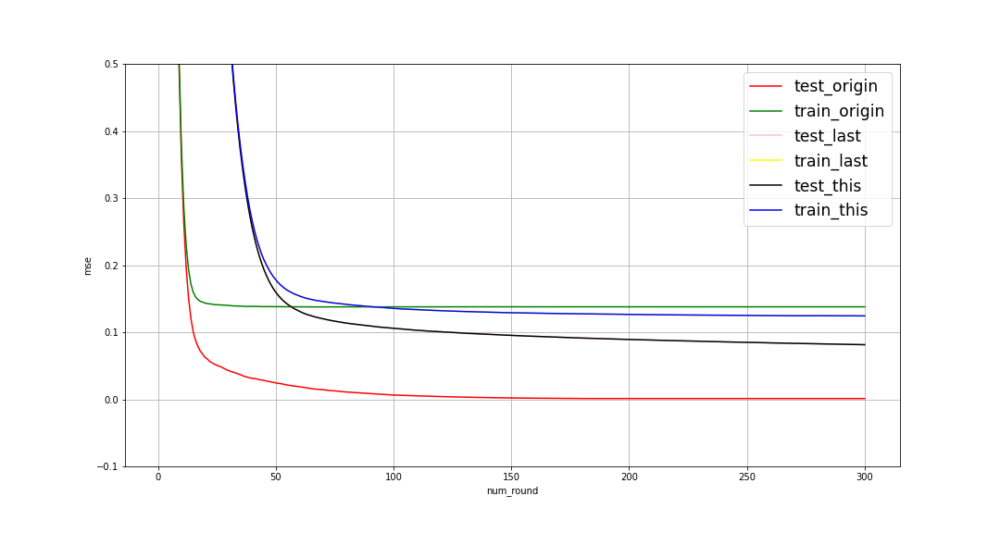
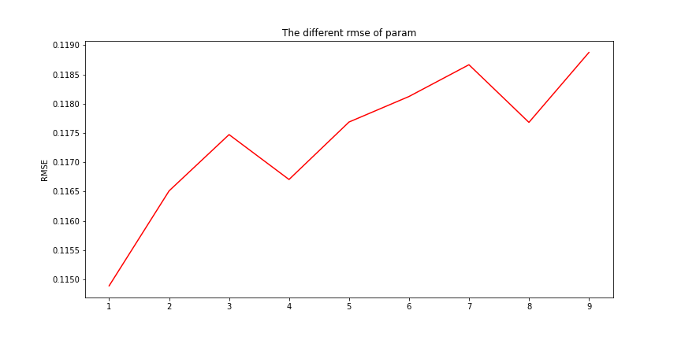

## Kaggle之房价预测建模

​		本文主要建模环节进行讨论，使用单模型或者模型融合对处理好的数据进行了预测，主要是对自己的思路的整理，话不多说，开始。:slightly_smiling_face:

###　单模型调差

#### 定义评判标准

​		由于模型最终使用均方根误差作为评判的标准，所以首先自定义了评价函数。如下

```python
def rmse(model, x, y):
    """定义均方根误差"""
    
    rmse = np.sqrt(-cross_val_score(model, x
                                    , y
                                    , scoring="neg_mean_squared_error"
                                    , cv=5))
    return rmse
```

#### 单个模型预测（未调整参数）

```python
LR = LinearRegression()
ridge = Ridge()
lasso = Lasso()
svr = SVR()
rf = RF()
dtr = DecisionTreeRegressor()
models = [LR, ridge, lasso, svr, rf, dtr]
names = ["LR", "Lasso", "Ridge", "SVR", "RF", "DtreeR"]
for name, model in zip(names, models):
    score = rmse(model, train, y_train)
    print("{}: mean: {:.6f}, std: {:.4f}".format(name
                      , score.mean()
                      , score.std()
                     ))
```

预测结果：

```python
LR: mean: 341918188.487745, std: 249252043.4450
Lasso: mean: 0.119083, std: 0.0101
Ridge: mean: 0.399471, std: 0.0158
SVR: mean: 0.143313, std: 0.0057
RF: mean: 0.137961, std: 0.0042
DtreeR: mean: 0.203167, std: 0.0131
```

​		从上述未经参数调整的模型预测的结果可以看出，对于线性模型来说，LR的预测结果很差，而对于Lasso和Ridge预测效果好了不少，所以，我们推测数据之间极大可能存在多重共线性，而对于支持向量机和天生过拟合的树模型来说，效果不如线性模型，所以，我们猜测数据更适合线性模型，但是，通过调整一定参数之后，支持向量的回归模型和树模型也可能有较大的潜力。所以下一步对当个模型直接进行参数调整，观察其潜力。

#### 定义网格搜索

​		网格搜索可以实现对模型给定参数进行选择，但是如果参数范围过大，使用网格搜索会消耗更多的算力，所以，可以先对模型进行大范围搜索（粗搜），确定最佳参数的取值范围，然后，在小范围内，使用较小的参数选择进行调整（精调）。

```python
class GridSearch:
    """回归模型网格搜索"""
    
    def __init__(self, model):
        self.model = model
    
    def grid_get(self, X, y, param_grid):
        """参数搜索"""
        
        grid_search = GridSearchCV(self.model
                                   , param_grid =param_grid, scoring="neg_mean_squared_error"
                                   ,cv=5
                                  )
        grid_search.fit(X, y)
        print(grid_search.best_params_, np.sqrt(-grid_search.best_score_))
        print(pd.DataFrame(grid_search.cv_results_)[["params", "mean_test_score", "std_test_score"]])
```

#### 岭回归模型

​		岭回归主要为了解决LR中多重共线性而存在，其主要在LR的目标函数上加入L2正则化，计算公式如公式1：
$$
Minimizes　the　objective　function::\\ 
||y - Xw||^2_2 + alpha * ||w||^2_2 \tag{公式1}
$$
所以，岭回归主要通过调节alpha来消除多重共线性。下面主要通过网格搜索和岭回归自带的交差验证模型来调整参数。

- 网络搜索

```python
ridge = Ridge()
param_gird = {"alpha":np.arange(1, 11, 1)}
t0 = time()
GridSearch(ridge).grid_get(train, y_train, param_gird)
print("处理时间：",datetime.datetime.fromtimestamp(time()-t0).strftime("%M:%S:%f"))
```

结果:

```python
{'alpha': 9} 0.11596369356530999
          params  mean_test_score  std_test_score
0   {'alpha': 1}        -0.014283        0.002476
1   {'alpha': 2}        -0.013906        0.002303
2   {'alpha': 3}        -0.013708        0.002187
3   {'alpha': 4}        -0.013593        0.002102
4   {'alpha': 5}        -0.013523        0.002036
5   {'alpha': 6}        -0.013481        0.001983
6   {'alpha': 7}        -0.013458        0.001938
7   {'alpha': 8}        -0.013448        0.001900
8   {'alpha': 9}        -0.013448        0.001866
9  {'alpha': 10}        -0.013455        0.001837
处理时间： 00:01:036783
```

- RidgeCV

```python
ridgcv = RidgeCV(alphas=(1, 10, 1)
                 , scoring="neg_mean_squared_error"
                 ,　store_cv_values=True
                )	

ridgcv.fit(train, y_train)
ridgcv.alpha_
```

结果：

```
10
```

#### Lasso模型

​		Lasso主要也是解决LR中多重共线性的问题，但是它无法解决多重共线性问题中的精确相关性的问题，Lasso是在LR目标函数中加入L1正则化，其计算公式如公式2：
$$
The　optimization 　objective　 for 　Lasso　 is::\\

    (1 / (2 * n_samples)) * ||y - Xw||^2_2 + alpha * ||w||_1 \tag{公式2}
$$
​		而Lasso中主要通过alpha来消除多重共线性（高度相关性），如果模型调整alpha预测效果无法提升可能是数据存在精确相关性，模型本身不适合该数据，应该更换模型。下面通过网格搜索和LassoCV来调整参数，注意由于Lasso中alpha值对于参数变化十分敏感，所以，alpha参数的选择非常小，且可以选取负数。

- 网格搜索

```python
lasso = Lasso()
param_gird = {"alpha":np.arange(0.00043, 0.0005, 0.00001)}
t0 = time()
GridSearch(lasso).grid_get(train, y_train, param_gird)
print("处理时间：",datetime.datetime.fromtimestamp(time()-t0).strftime("%M:%S:%f"))
```

结果：

```python
{'alpha': 0.00043} 0.11356475521449062
                              params  mean_test_score  std_test_score
0                 {'alpha': 0.00043}        -0.012897        0.001809
1                 {'alpha': 0.00044}        -0.012898        0.001806
2  {'alpha': 0.00045000000000000004}        -0.012900        0.001803
3  {'alpha': 0.00046000000000000007}        -0.012904        0.001800
4   {'alpha': 0.0004700000000000001}        -0.012909        0.001798
5   {'alpha': 0.0004800000000000001}        -0.012914        0.001795
6   {'alpha': 0.0004900000000000002}        -0.012919        0.001793
7   {'alpha': 0.0005000000000000002}        -0.012924        0.001790
处理时间： 00:03:878040
```

- LassoCV

```python
lassocv = LassoCV(eps=0.0001, n_alphas=200, normalize=True)		
lassocv.fit(train,y_train)
lassocv.alpha_
```

结果：

```python
0.00011631854612913162
```

#### SVR模型

​		支持向量的回归模型，主要针对调整核函数和正则化系数C，且调整C值之后模型的效果没有上升，所以只列出了核函数的调整过程，从最终选取效果，线性核的预测效果会更好一点。

```python
svr = SVR()
param_gird = {"kernel":["linear", "poly", "rbf", "sigmoid"]}
t0 = time()
GridSearch(svr).grid_get(train, y_train, param_gird)
print("处理时间：",datetime.datetime.fromtimestamp(time()-t0).strftime("%M:%S:%f"))
```

结果：

```python
{'kernel': 'linear'} 0.12593937449137022
                  params  mean_test_score  std_test_score
0   {'kernel': 'linear'}        -0.015861        0.002488
1     {'kernel': 'poly'}        -0.018048        0.001575
2      {'kernel': 'rbf'}        -0.020571        0.001644
3  {'kernel': 'sigmoid'}        -0.213117        0.030916
处理时间： 01:00:787610
```

#### 决策树回归模型

​		由于基于决策树的回归是天生过拟合的模型，所以，这里主要调整决策树的最大深度来减少模型的过拟合风险，此外，使用决策树模型可以作为模型融合阶段的基学习模型。

```python
dtr = DecisionTreeRegressor()
param_gird = {"max_depth":[2, 3, 4 , 5, 6, 7, 8, 9]}
GridSearch(dtr).grid_get(train, y_train, param_gird)
print("处理时间：",datetime.datetime.fromtimestamp(time()-t0).strftime("%M:%S:%f"))
```

结果：

```python
{'max_depth': 5} 0.1877548262482262
             params  mean_test_score  std_test_score
0  {'max_depth': 2}        -0.053527        0.003655
1  {'max_depth': 3}        -0.041673        0.005003
2  {'max_depth': 4}        -0.035743        0.002920
3  {'max_depth': 5}        -0.035252        0.003327
4  {'max_depth': 6}        -0.036394        0.002497
5  {'max_depth': 7}        -0.037796        0.003986
6  {'max_depth': 8}        -0.038124        0.004856
7  {'max_depth': 9}        -0.038827        0.006788
处理时间： 02:39:021160

```

#### 随机森林回归模型

​		随机森林为bagging模型，每一个子树为CART树，这里主要通过调整子树的数量来提升模型的准确率。其他参数尚未做搜索调整。

```python
rf = RF()
param_gird = {"n_estimators":np.arange(290, 310, 10)}
GridSearch(rf).grid_get(train, y_train, param_gird)
print("处理时间：",datetime.datetime.fromtimestamp(time()-t0).strftime("%M:%S:%f"))
```

结果：

```python
{'n_estimators': 299} 0.13703791548251104
                   params  mean_test_score  std_test_score
0   {'n_estimators': 290}        -0.019156        0.001099
1   {'n_estimators': 291}        -0.018878        0.001225
2   {'n_estimators': 292}        -0.018907        0.001042
3   {'n_estimators': 293}        -0.018964        0.001010
4   {'n_estimators': 294}        -0.018952        0.001255
5   {'n_estimators': 295}        -0.018957        0.000933
6   {'n_estimators': 296}        -0.019070        0.000879
7   {'n_estimators': 297}        -0.018839        0.001003
8   {'n_estimators': 298}        -0.018787        0.001170
9   {'n_estimators': 299}        -0.018779        0.001040
10  {'n_estimators': 300}        -0.018946        0.001169
11  {'n_estimators': 301}        -0.019052        0.001050
12  {'n_estimators': 302}        -0.019015        0.001268
13  {'n_estimators': 303}        -0.018953        0.001146
14  {'n_estimators': 304}        -0.018925        0.001136
15  {'n_estimators': 305}        -0.018981        0.001007
16  {'n_estimators': 306}        -0.019002        0.000926
17  {'n_estimators': 307}        -0.019002        0.001114
18  {'n_estimators': 308}        -0.018995        0.001090
19  {'n_estimators': 309}        -0.018995        0.000979
处理时间： 43:50:027710
```

#### XGBoost模型

​		由于XGBoost的强大，可以使用其模型实现分类、回归和排序，并且能够实现较高的性能。但是，由于其参数众多，所以，对于XGBoost的调参作为这次的重点，下面为主要的调参步骤：更加完整的调参数思路请观看此链接：[菜菜的机器学习sklearn课堂](https://study.163.com/course/introduction/1006536008.htm)，这里主要给出主要的思路过程：

１）确定模型的目标，objective:指定任务类型，默认为：`'reg:linear'`

- `'reg:linear'`： 线性回归模型。它的模型输出是连续值
- `'reg:logistic'`： 逻辑回归模型。它的模型输出是连续值，位于区间`[0,1]` 。
- `'binary:logistic'`： 二分类的逻辑回归模型，它的模型输出是连续值，位于区间`[0,1]` ，表示取正负类别的概率。

２）调节eta**和**num_round来控制收敛速度和最大建树,两者之间相互制约，需要同时调整参数，故可以使用网格搜索进行调整。

- eta:   xgboost在进行完一次迭代后，会将叶子节点的权重乘上该系数，主要是为了削弱每棵树的影响，让后面有更大的学习空间。实际应用中，一般把eta设置得小一点，然后迭代次数设置得大一点
- num_round:  建立弱分类器数量（也即迭代次数），其数量越大，模型的学习能力就会越强。但是，较大num_round会造成过拟合，且增加到一定程度之后，模型达到上限，不会在增加准确率。

３）gamma**或者**max_depth控制子树的复杂程度，减低模型复杂度（减少过拟合）

- max_depth:  默认值为6，通过控制输的深度从而控制树模型的复杂程度，来减少过拟合分风险。
- gamma:  树结点分裂的最低要求，能够减低过拟合

４）调节建立子树的数据和特征抽样比例，取值位于`[0,1]`

- subsample:  boostrap抽样，让模型变的轻量，有放回抽样，可以减少过拟合。
- colsample_bytree: 控制每棵树的特征抽取比例，减少过拟合的风险。

５）正则化系数：L1: alpha　L2: lambda，进一步控制过拟合风险。

- XGBoost接口

**(a) 转换数据类型（DMatrix类型）**

```python
dfull = xgb.DMatrix(train, y_train)
```

**(b) 未做参数调整**

```python
# 初始的调参结果(全部使用默认值)
param1 = {'silent':False #并非默认
        ,'obj':'reg:linear' #并非默认
          
#         ,"eta":0.01
          
#         ,"gamma":0
#         ,"max_depth":6

#         ,"subsample":1  # 横向抽样
#         ,"colsample_bytree":1  # 纵向抽样
#         ,"colsample_bylevel":1
#         ,"colsample_bynode":1

#         ,"lambda":1  # L2
#         ,"alpha":0  # L1
         }
num_round = 300
```

**(c) 参数调整**

```python
print("The time of param１:")
t0 = time()
cvresult = xgb.cv(params=param1, dtrain=dfull, num_boost_round=num_round)
print(datetime.datetime.fromtimestamp(time()-t0).strftime("%M:%S:%f"))

# 上一次的调参结果
param2 = {'silent':False
        ,'obj':'reg:linear' #并非默认
          
        ,"eta":0.1
          
#         ,"gamma":0.1
        ,"max_depth":2

#         ,"subsample":1  # 横向抽样
#         ,"colsample_bytree":0.5  # 纵向抽样:在建立树时对特征随机采样的比例。
#         ,"colsample_bylevel":1
#         ,"colsample_bynode":1

        ,"lambda":12  # L2
#         ,"alpha":0  # L1
         }

# 现在的调参结果
param3 = {'silent':False
        ,'obj':'reg:linear' #并非默认
          
        ,"eta":0.1
          
#         ,"gamma":0
        ,"max_depth":2

#         ,"subsample":1  # 横向抽样
#         ,"colsample_bytree":1  # 纵向抽样
#         ,"colsample_bylevel":1
#         ,"colsample_bynode":1

        ,"lambda":12  # L2
#         ,"alpha":0  # L1
         }

t0 = time()
print("The time of param2:")
cvresult2 = xgb.cv(params=param2, dtrain=dfull, num_boost_round=num_round)
print(datetime.datetime.fromtimestamp(time()-t0).strftime("%M:%S:%f"))

print("The time of param3:")
t0 = time()
cvresult3 = xgb.cv(params=param3, dtrain=dfull, num_boost_round=num_round)
print(datetime.datetime.fromtimestamp(time()-t0).strftime("%M:%S:%f"))
```

**(d) 参数调整可视化**

```python
#　调整参数后的效果
fig, ax = plt.subplots(1, figsize=(15, 8))
ax.grid()  # 制作网格，利于观察
end = num_round + 1

ax.plot(range(1, end), cvresult.iloc[:, 0], c="red", label="test_origin")
ax.plot(range(1, end), cvresult.iloc[:, 2], c="green", label="train_origin")

ax.plot(range(1, end), cvresult2.iloc[:, 0], c="pink", label="test_last")
ax.plot(range(1, end), cvresult2.iloc[:, 2], c="yellow", label="train_last")

ax.plot(range(1, end), cvresult3.iloc[:, 0], c="black", label="test_this")
ax.plot(range(1, end), cvresult3.iloc[:, 2], c="blue", label="train_this")

ax.legend(fontsize = "xx-large")
ax.set_ylim(bottom=-0.1, top=0.5)
plt.ylabel("mse")
plt.xlabel("num_round")
plt.show()
```

**结果**：



- Sklearn接口

  ​		XGBoost封装了sklearn，可以使用和sklearn中的网格搜索进行参数调整，参数调参思路如上，这里不在列出，需要主要其参数命名可能和原生XGBoost中参数的命名不相同，但实质相同。

**(a) 网格搜索**

```python
# param
xgb_model = xgb.XGBRegressor(learning_rate=0.06
                             , n_estimators=340
                             
                             , max_depth=4
                             
                             , subsample=0.6
                             , colsample_tree=0.5
                             , random_state = 100
                            )
param_gird = {}
t0 = time()
GridSearch(xgb_model).grid_get(train, y_train, param_gird)
print("处理时间：",datetime.datetime.fromtimestamp(time()-t0).strftime("%M:%S:%f"))
```

```python
# param
xgb_model = xgb.XGBRegressor(
                            )
param_gird = {"learning_rate": np.arange(0.05, 0.1, 0.01)
              , "n_estimators": np.arange(380, 410, 20)
             }
t0 = time()
GridSearch(xgb_model).grid_get(train, y_train, param_gird)
print("处理时间：",datetime.datetime.fromtimestamp(time()-t0).strftime("%M:%S:%f"))
```

```python
{'learning_rate': 0.060000000000000005, 'n_estimators': 380} 0.11924131325152587
                                              params  mean_test_score  \
0       {'learning_rate': 0.05, 'n_estimators': 380}        -0.014882   
1       {'learning_rate': 0.05, 'n_estimators': 400}        -0.014883   
2  {'learning_rate': 0.060000000000000005, 'n_est...        -0.014218   
3  {'learning_rate': 0.060000000000000005, 'n_est...        -0.014224   
4       {'learning_rate': 0.07, 'n_estimators': 380}        -0.014852   
5       {'learning_rate': 0.07, 'n_estimators': 400}        -0.014846   
6  {'learning_rate': 0.08000000000000002, 'n_esti...        -0.014923   
7  {'learning_rate': 0.08000000000000002, 'n_esti...        -0.014923   
8  {'learning_rate': 0.09000000000000001, 'n_esti...        -0.014803   
9  {'learning_rate': 0.09000000000000001, 'n_esti...        -0.014795   

   std_test_score  
0        0.001780  
1        0.001775  
2        0.001578  
3        0.001584  
4        0.001721  
5        0.001709  
6        0.001848  
7        0.001845  
8        0.001050  
9        0.001048  
处理时间： 01:34:096188
```

**(b) 单参数可视化调整**

```python
axisx = np.arange(1, 10, 1)

rs =  []
for i in axisx:
    xgb_reg = xgb.XGBRegressor(n_estimators=380
                               , learning_rate=0.06
                               , max_depth=3
                               
                               , subsample = 0.6
                               , colsample_bytree = 0.7
                               , reg_lambda = i
                               
                               , random_state=100
                              )
    
    value = cross_val_score(xgb_reg
                    , train
                    , y_train
                    , cv=5
                    , scoring="neg_mean_squared_error").mean()
    
    rs.append(np.sqrt(-value))
    
print("最佳参数：",axisx[rs.index(min(rs))], "\n损失值：", min(rs))
plt.figure(figsize=(12, 6))
plt.plot(axisx, rs, c="red")
plt.ylabel("RMSE")
plt.title("The different rmse of param")
plt.savefig("./imgs/param.png")
plt.show()
```

结果：

```python
最佳参数： 1 
损失值： 0.11488895632255516
```



### Stacking

​		Stacking先从初始训练集训练出初级学习器，然后"生成"一个新的数据集用于训练次级学习器，在这个新数据集中，初级学习器的输出被当做样例输入特征，而初始样本的标记仍被当做样例标记。

**(a) 参数设定**

```python
# Some useful parameters which will come in handy later on
ntrain = train.shape[0]
ntest = test.shape[0]
SEED = 0 #for reproducibility
NFOLDS = 5 # set folds for out-of-fold prediction
kf = KFold(n_splits = NFOLDS,shuffle=False)
```

**(b) k折交差验证**

​		由于在训练阶段，次级训练集是利用初级学习器产生的，若直接用初级学习器的训练集来产生训练集，则过拟合风险会比较大；因此，一般是通过使用交叉验证或留一法这样的方式，用训练初级学习器未使用的样本来产生次级学习器的训练样本。


```python
def get_out_fold(clf, x_train, y_train, x_test):
    oof_train = np.zeros((ntrain, ))
    oof_test = np.zeros((ntest, ))
    # 存放K折结果
    oof_test_skf = np.empty((NFOLDS, ntest))
    
    for i, (train_index, test_index) in enumerate(kf.split(x_train)):
        x_tr = x_train[train_index]
        y_tr = y_train[train_index]
        x_te = x_train[test_index]
        
        clf.fit(x_tr, y_tr)
        
        # 填充所有的测试结果的值
        oof_train[test_index] = clf.predict(x_te)
        oof_test_skf[i, :] = clf.predict(x_test)
    
    # k折平均
    oof_test[:] = oof_test_skf.mean(axis=0)
    return oof_train.reshape(-1,1), oof_test.reshape(-1,1)
```

**(c)初级学习器**

```python
# 加载模型
ridge = Ridge(alpha=9)
lasso = Lasso(alpha=0.00043)
rf = RF(n_estimators=400)
dtr = DecisionTreeRegressor(max_depth=5)
svr = SVR(kernel="linear")

# 转换数据类型
x_train = train.values
x_test = test.values

# 获得次学习器的数据
ridge_oof_train, ride_oof_test = get_out_fold(ridge, x_train, y_train, x_test)
lasso_oof_train, lasso_oof_test = get_out_fold(lasso, x_train, y_train, x_test)
rf_oof_train, rf_oof_test = get_out_fold(lasso, x_train, y_train, x_test)
dtr_oof_train, dtr_oof_test = get_out_fold(dtr, x_train, y_train, x_test)
svr_oof_train, svr_oof_test = get_out_fold(svr, x_train, y_train, x_test)

model_train = np.concatenate((ridge_oof_train, lasso_oof_train, rf_oof_train, dtr_oof_train, svr_oof_train), axis=1)
model_test = np.concatenate((ride_oof_test, lasso_oof_test, rf_oof_test, dtr_oof_test, svr_oof_test), axis=1)
```

**(d)次级学习器**

​		次级学习器使用XGBoost模型调参，其调差过程已在上述XGBoost模型中讨论过，在此不做详细叙述，如感兴趣，请自行尝试。

### 模型保存

### 可解释性分析

### Kaggle预测

### 结论

​		本次针对房价数据进行建模调参，对于数据处理的部分暂时还不能全面进行分析，这里主要是对自己建模过程中的一些概念进行回顾和总结，希望对自己遇到同类问题能够有很好的引导作用，本文会一直更新，如有错误，请指出:smirk:

### 参考

[XGBoost：参数解释](https://blog.csdn.net/zc02051126/article/details/46711047)

[菜菜的机器学习sklearn课堂](https://study.163.com/course/introduction/1006536008.htm)

[kaggle房价预测](https://www.kaggle.com/c/house-prices-advanced-regression-techniques)

[模型融合](https://zhuanlan.zhihu.com/p/34904202) 

[当GridSearch遇上XGBoost 一段代码解决调参问题](https://juejin.im/post/5b7669c4f265da281c1fbf96)  
[xgboost参数和调参技巧](https://sthsf.github.io/wiki/Algorithm/EnsembleMethod/EnsembleLearning/xgboost%E5%8F%82%E6%95%B0%E5%92%8C%E8%B0%83%E5%8F%82%E6%8A%80%E5%B7%A7.html)