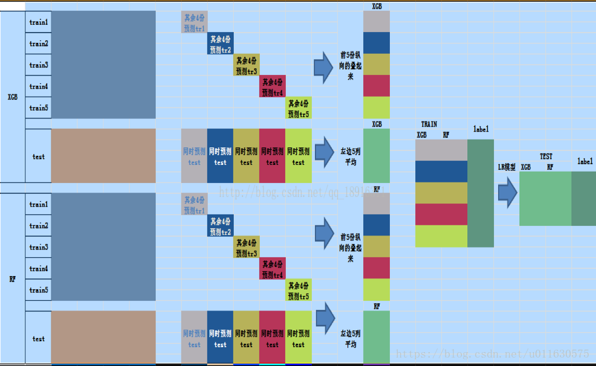
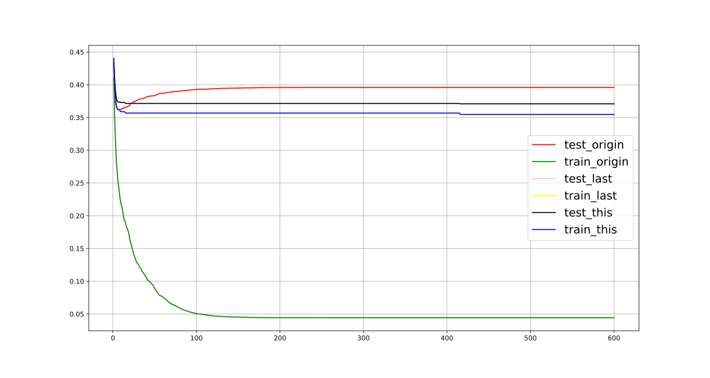

## Kaggle之泰坦尼克之灾

　　第一次参加kaggle比赛，在这里主要记录自己的一些心得，主要免得自己忘记了。话不多说，进入正题。:smiley:

### 难点一：年龄值缺失值？

​	　对于缺失值的处理，如果缺失值占总体样本比例不大，可以考虑删除缺失的样本，因为这些缺失的样本对最后的预测的影响较小，如果缺失值较多，则１）连续性数据，用均值进行填补。２）离散性数据，使用众数进行填补。当然，除此之外可以用算法进行的填补，但是进行算法填补的数据，不具有解释性。下面是对年龄数据进行算法填补:

```python
'''
	以前，接触过算法填补数据，但是使用的是一种算法进行填补，这次算法填补，使用了两种预测算法，
两种算法填补后，使用两种预测结果做平均来作为最终的预测结果，自己感觉这样会使得填补数据更加的稳
定，这也给自己提供了一种思路
'''
# 划分Train_x, Train_y, 和测试集
missing_age_x_train = missing_age_train.drop(["Age"], axis=1)
missing_age_y_train = missing_age_train.Age
missing_age_x_test = missing_age_test.drop("Age", axis=1)

## gbdt model
gb_reg = GradientBoostingRegressor(random_state=42)
gbm_reg_param_grid = {'n_estimators': [2000]
                         , 'max_depth': [4]
                         , 'learning_rate': [0.01]
                         , 'max_features': [3]}

gbm_reg_grid = model_selection.GridSearchCV(gb_reg
                             , param_grid= gbm_reg_param_grid
                             , n_jobs = -1
                             , scoring='neg_mean_squared_error'
                            )
gbm_reg_grid.fit(missing_age_x_train, missing_age_y_train)
missing_age_test.loc[:, "Age_GB"] = gbm_reg_grid.predict(missing_age_x_test)

### 随机森林 model 
rfg = RandomForestRegressor()
rf_reg_param_grid = {'n_estimators': [200], 'max_depth': [5], 'random_state': [0]}
rf_reg_grid = model_selection.GridSearchCV(rfg
                                           , rf_reg_param_grid
                                           , cv=10
                                           , n_jobs=-1
                                           , verbose=1
                                           , scoring='neg_mean_squared_error')
rf_reg_grid.fit(missing_age_x_train, missing_age_y_train)
missing_age_test.loc[:, 'Age_RF'] = rf_reg_grid.predict(missing_age_x_test)

## 使用两个模型对同一个未知年龄预测的平均值作为最后额预测结果，融合数据
missing_age_test.loc[:, "Age"] = np.mean([missing_age_test["Age_GB"] ,missing_age_test["Age_RF"]], axis=0)
```

### 难点二：模型融合之stacking

​		在模型预测阶段，这里主要使用了stacking集成的学习算法，当然还有bagging和boosting，这也是第一次接触stacking算法，此外，自己最后也是单独使用了Xgboost进行预测，发现效果比stacking的效果稍微好一点，可能是调参的缘故，现在主要说明stacking如何操作：


​		上图位一种基模型的生成第二次模型特征的过程，这里算法主要基于k_fold，首先，把训练集分做5折交叉验证，把训练数据的1/5用作**子测试集**，其余为**子训练集**，假设此时使用model1，模型对子训练集进行训练，完成后对对子测试集和测试集进行预测，完成k次之后的，通过子测试集填补的一个新的训练集，而测试集对k次测试结果进行求取平均值，作为新的测试集，此一轮完成单个基模型数据的构造，可以使用多个基模型进行构造。此处可能存在表述不清，请结合下述代码更舒适:slightly_smiling_face:

```python
from sklearn.model_selection import KFold
 
# Some useful parameters which will come in handy later on
ntrain = train_data_x.shape[0]
ntest = test_data_x.shape[0]
SEED = 0 #for reproducibility
NFOLDS = 5 # set folds for out-of-fold prediction
kf = KFold(n_splits = NFOLDS,random_state=SEED,shuffle=False)

def get_out_fold(clf,x_train,y_train,x_test):
    # 一维
    oof_train = np.zeros((ntrain,))
    oof_test = np.zeros((ntest,))
    # 存放K折结果
    oof_test_skf = np.empty((NFOLDS,ntest))
    
    for i, (train_index,test_index) in enumerate(kf.split(x_train)):
        x_tr = x_train[train_index]
        y_tr = y_train[train_index]
        x_te = x_train[test_index]
        
        clf.fit(x_tr,y_tr)
        
        # 填充所有的测试结果的值
        oof_train[test_index] = clf.predict(x_te)
        oof_test_skf[i,:] = clf.predict(x_test)
    
    # k折平均
    oof_test[:] = oof_test_skf.mean(axis=0)
    
    # 转回特征维度为二维
    return oof_train.reshape(-1,1),oof_test.reshape(-1,1)

## 基础模型
rf_oof_train,rf_oof_test = get_out_fold(rf,x_train,y_train,x_test)  # Random Forest
ada_oof_train,ada_oof_test = get_out_fold(ada,x_train,y_train,x_test)  # AdaBoost
et_oof_train,et_oof_test = get_out_fold(et,x_train,y_train,x_test)  # Extra Trees
gb_oof_train,gb_oof_test = get_out_fold(gb,x_train,y_train,x_test)  # Gradient Boost
dt_oof_train,dt_oof_test = get_out_fold(dt,x_train,y_train,x_test)  #Decision Tree
knn_oof_train,knn_oof_test = get_out_fold(knn,x_train,y_train,x_test)  # KNeighbors
svm_oof_train,svm_oof_test = get_out_fold(svm,x_train,y_train,x_test)  # Support Vector

##　每一个基模型的预测结果作为新的数据的一个维度特征
x_train = np.concatenate((rf_oof_train,ada_oof_train,et_oof_train,gb_oof_train,dt_oof_train,knn_oof_train,svm_oof_train),axis=1)
x_test =np.concatenate((rf_oof_test,ada_oof_test,et_oof_test,gb_oof_test,dt_oof_test,knn_oof_test,svm_oof_test),axis=1)
```

   	下图为整体融合的效果图：



### 难点三：Xgboost调参

​		在使用模型融合之后，自己由于最近在学习Xgboost算法，所以试着直接使用特征处理好的数据进行预测，发现不同的调参顺序会对模型的预测有影响，下面是用Xgboost自带的交差验证最后的效果，可见未调节参数之前模型处于严重过拟合，此时的泛化误差较大，预测结果较差，经过对Xgboost模型调参之后，模型的过拟合问题得到一定的解决，调参过程中要注意最好的结果是在每一次的调参后预测值准确率要上升，训练集的准确率要下降（牺牲），当两者处于最小的平衡点时，即此时参数恒定，查看预测效果。


		最后，stacking之后的的预测准确率为：0.77990，Xgboost： 0.79425，可见单纯使用Xgboost后提升了大约两个点的准确率，当然，自己在模型融合stacking最终也对模型进行了进一步的调参，可是预测效果还是上不去，后期等经验充分一点，在进行尝试。

​		作为第一次参加Kaggle，主要是积累经验，学以致用，文中有表述错误的地方，请私信我:smile:

### 参考

[数据挖掘竞赛利器-Stacking和Blending方式](https://blog.csdn.net/maqunfi/article/details/82220115?depth_1-utm_source=distribute.pc_relevant.none-task-blog-BlogCommendFromBaidu-1&utm_source=distribute.pc_relevant.none-task-blog-BlogCommendFromBaidu-1)

[stacking](https://rasbt.github.io/mlxtend/user_guide/classifier/StackingClassifier/#example-2-using-probabilities-as-meta-features)