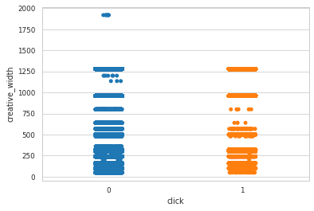

# 2018讯飞广告营销算法

　　	本次的最终是一个分类任务，评价指标选择为logloss,以前虽然做过一些分类性的任务，但任务本身难度不大，而本次第一个主要的问题就是数据量大，尤其是在最终的建模中，以前靠只靠cpu版本的XGBoost和Stacking就能得到一个不错的trade-off，而本次任务在Cpu的情况下，就需要花费更多的时间了,所以,重新编译安装了GPU版本的XGBoost，并首次尝试使用了LightGBM(GPU)，其性能多方面优先与XGBoost，所以，最后选择使用了LightGBM模型，**<font color=red>注：文中张贴非完整代码，完整代码及参考见文末</font>**。

## 赛题背景

　　讯飞AI营销云在高速发展的同时，积累了海量的广告数据和用户数据，如何有效利用这些数据去预测用户的广告点击概率，是大数据应用在精准营销中的关键问题，也是所有智能营销平台必须具备的核心技术。

​		本次大赛提供了讯飞AI营销云的海量广告投放数据，参赛选手通过人工智能技术构建预测模型预估用户的广告点击概率，**即给定广告点击相关的广告、媒体、用户、上下文内容等信息的条件下预测广告点击概率**。希望通过本次大赛挖掘AI营销算法领域的顶尖人才，共同推动AI营销的技术革新。

## EDA

### 查看时间与点击量的相关信息


```python
# 处理时间戳函数
def get_time(attr):
    """从时间戳获得具体的时间信息"""
    
    day = []
    hour = []
    for time in attr:
        t = datetime.datetime.fromtimestamp(time + 3600*24*5)  #加5天
        day.append(t.day)
        hour.append(t.hour)
    
    return day, hour
```


```python
train_df = train.copy()
train_df["day"], train_df["hour"] = get_time(train_df.time.values)
```


```python
# 绘制不同时刻的点击情况
hour_info = train_df.groupby(["hour", "click"])["hour"].count()
hour_info = hour_info.unstack()  #构成数映射表
hour_info[[0, 1]].plot(kind="bar", stacked=True, figsize=(12, 6))  # stacked堆叠显示
plt.show()
```


```python
hour_info.plot(figsize=(12,6))
plt.xticks(np.arange(0, 24, 6))
plt.title("The plot of click in different hour", fontsize=15)
plt.show()
```


结论: 具体每一个时间的点击率有所不同(将连续的时间离散化),可以将时间划分为四个不同的时间间隔,间隔六小时

### 不同时间段的点击情况


```python
def seg_hour(x):
    """划分时间间隔"""
    
    if x > 0 and x <= 6:
        return 1
    elif x > 6 and x <= 12:
        return 2
    elif x > 12 and x <= 18:
        return 3
    else:
        return 4
```


```python
train_df["hour_seg"] = train_df.hour.apply(lambda x:seg_hour(x))
seg_hour = train_df.groupby(["hour_seg", "click"]).hour_seg.count().unstack()
seg_hour[[0, 1]].plot(kind="bar")
plt.show()
```


结论:对用户的分时段之后可以看出用户时间分布情况。

### 查看样本的均衡情况


```python
plt.figure(figsize=(5, 5))
cnt_click = train_df.click.value_counts()
plt.pie(x=cnt_click
        , labels=[0, 1]
        , autopct="%1.1f%%"
        , explode=[0.1, 0]
        , startangle=90
       )

plt.title("Click")
plt.show()
```


结论:样布不均衡,正负样本1:4,少数类为点击，希望捕获少数类。

### 广告长宽与点击情况


```python
sns.stripplot(x="click", y="creative_height", data=train_df)
plt.show()
```


```python
sns.stripplot(train_df.click, train_df.creative_width)
plt.show()
```





结论:人们趋向于点击广告大小适中的广告，长宽在500以下比较集中

### 探索布尔型变量对结果的影响


```python
# 打印bool类型数据
bool_feture = []
cols = data.columns

for col in cols:
    if str(train_df[col].dtype) == 'bool':
        print(col)
        bool_feture.append(str(col))
```

    creative_is_jump
    creative_is_download
    creative_is_js
    creative_is_voicead
    creative_has_deeplink
    app_paid

```python
def plot_ratio(df, name1, name2):
    
    gropy_n = df.groupby([name1, name2])[name1].count().unstack()
    print(gropy_n)
    print() 
    gropy_n[[0, 1]].plot(kind="bar")
    plt.xlabel(name1)
    plt.ylabel(name2 + "_" + "counts")
    plt.show()
```


```python
#  是否是语音广告
plot_ratio(train_df, "creative_is_voicead", "click")
```

    click                      0       1
    creative_is_voicead                 
    False                2397237  595402


```python
#  是否是js素材
plot_ratio(train_df, "creative_is_js", "click") 
```

    click                 0       1
    creative_is_js                 
    False           2397237  595402


```python
#  app是否收费
plot_ratio(train_df, "app_paid", "click") 
```

    click           0       1
    app_paid                 
    False     2397237  595402


```python
#  是否落地页跳转
plot_ratio(train_df, "creative_is_jump", "click")
```

    click                   0       1
    creative_is_jump                 
    False               56805     690
    True              2340432  594712


```python
#  是否落地页下载
plot_ratio(train_df, "creative_is_download", "click")
```

    click                       0       1
    creative_is_download                 
    False                 2340432  594712
    True                    56805     690


```python
#  是否有deeplink
plot_ratio(train_df, "creative_has_deeplink", "click")
```

    click                        0       1
    creative_has_deeplink                 
    False                  2396401  595348
    True                       836      54


结论：从生成的结果来看，这三种(**creative_is_voicead、creative_is_js、 app_paid**)bool型特征的值为单个值，无法通过变化来影响是否点击，所以，理论上可以删除。而对于creative_is_jump和creative_is_download是互补关系，可以选择保留其中一个特征

## 数据预处理

### 删除冗余数据


```python
del data["instance_id"]

del data["creative_is_js"]
del data["app_paid"]
del data["creative_is_voicead"]

del train
del test
```

### 处理时间变量
将时间戳类型的输出抽取为更细的时间参数,并分区


```python
def seg_hour(x):
    """划分时间间隔"""
    
    if x > 0 and x <= 6:
        return 1
    elif x > 6 and x <= 12:
        return 2
    elif x > 12 and x <= 18:
        return 3
    else:
        return 4
```


```python
# 时间向下细分
data["day"], data["hour"] = get_time(data.time.values)
data["hour_part"] = data["hour"].apply(lambda x: seg_hour(x))  # 组合特征

# 删除时间列
del data["time"]
```

### 手机品牌处理
清洗手机品牌和机型字段，对同类型进行合并（redmi->xiaomi, honour->huawei）

```python
#  名称装换为小写

col = []
for va in data["make"].values:
    va = str(va)
    if "," in va:
        col.append(va.split(",")[0].lower())
    elif "-"in va:
        col.append(va.split("-")[0].lower())
    elif " " in va:
        col.append(va.split(" ")[0].lower())
    else:
        col.append(va.lower())
```


```python
# 修改同类品牌的下的子品牌
for index in range(len(col)):
    if "apple" in col[index]:
        col[index] = "apple"
    elif "redmi" in col[index]:
        col[index] = "xiaomi"
    elif "honor" == col[index]:
        col[index] = "huawei"
    elif col[index] == "mi":
        col[index] = "xiaomi"
    elif col[index] == "nan":
        col[index] == np.nan
    elif col[index] == "meitu":
        col[index] == "meizu"
    elif col[index] == "le" or col[index] == "letv" or col[index] == "lemobile" or col[index] == "blephone":
        col[index] == "leshi"
```

```python
data["new_make"] = col
```

### 手机机型处理

```python
# 机型数据统一化处理
lst = []

for va in data.model.values:
    va = str(va)
    
    if "-" in va:
        lst.append(va.replace('-', " "))
    elif "+" in va:
        lst.append(va.replace("+", " "))
    elif "," in va:
        lst.append(va.replace(",", " "))
    elif va == "nan":
        lst.append(np.nan)
    else:
        lst.append(va)
data["new_model"] = lst

```

### 广告主行业划分
形式：教育＿培训(划分)

```python
lst1 = []
lst2 = []

for va in data.advert_industry_inner.values:
    lst1.append(va.split("_")[0])
    lst2.append(va.split("_")[1])
data["advert_industry_inner1"] = lst1
data["advert_industry_inner2"] = lst2
```

### 媒体广告位置划分
如xf, iqy

```python
lst = []
for va in data.inner_slot_id.values:
    lst.append(va.split("_")[0])
data["inner_slot_id1"] = lst
```

### 操作系统


```python
# plt.pie(data.os.value_counts())
plt.figure(figsize=(5, 5))
percent = data.os.value_counts()
plt.pie(x=percent
        , labels=["Andiord", "iOS", "Other"]
        , autopct="%1.2f%%"
        , startangle=90
        , rotatelabels=True
       )
plt.show()
```


```python
# 其他类型操作系统比重极少，可将其归为安卓类
data.os.replace(0, 2, inplace=True)
```

----

.......

---

### 查看缺失值情况


```python
Total = data.isnull().sum().sort_values(ascending=False)
Percent = (data.isnull().sum()/data.isnull().count()).sort_values(ascending=False)*100
missing_data = pd.concat([Total, Percent], axis=1, keys=["Total", "Percent"])
```

```python
# 可视化缺失值
index = 10

fig, ax = plt.subplots(figsize=(12, 6))
sns.barplot(x=missing_data[:index].index, y=missing_data.Percent[:index], hue_order=True)
plt.xticks(rotation=90)
plt.xlabel("missing_features", fontsize=14)
plt.ylabel("Percent", fontsize=14)
plt.title("The percent of missing_feature", fontsize=16)
plt.show()
```


### 特征编码

#### 特征类型分析
use_tags表示唯一性,不要编码  
creative_width, creative_height :属于数值型特征变量不需要进行编码  
creative_is_jump, creative_is_download, creative_has_deeplink :0, 1  
day :一周  
click :目标 [0, 1]  
hour_part :[1, 2, 3, 4]   
osv1, osv2, osv3 :类别型数值变量  


```python
from sklearn.preprocessing import LabelEncoder
```


```python
# 打印object类型数据
bool_feture = []
cols = data.columns

for col in cols:
    if str(data[col].dtype) == 'object':
        print(col)
        bool_feture.append(str(col))
```


```python
type_feature = ['city', 'province', 'carrier', 'devtype', 'make', 'model',
       'nnt', 'os', 'osv', 'os_name', 'adid', 'advert_id', 'orderid',
       'advert_industry_inner', 'campaign_id', 'creative_id',
       'creative_tp_dnf', 'app_cate_id', 'f_channel', 'app_id',
       'inner_slot_id', 'creative_type', 
       'advert_name',  'hour',  'new_make',
       'advert_industry_inner1', 'advert_industry_inner2', 
        'inner_slot_id1', 'user_id', 'new_model', 'os_name1']
```


```python
# 标签编码
for feature in type_feature:
    try:
        data[feature] = LabelEncoder().fit_transform(data[feature].fillna(-1).apply(int))  # 字符型数值转为int类型
    except:
        data[feature] = LabelEncoder().fit_transform(data[feature].fillna("-1"))

```

### 处理数据


```python
# 取出训练集数据索引
train_index = data[data.click != -1].index
test_index = data[data.click == -1].index

train_y = pd.Series(data=data.loc[train_index, "click"])
train = data.iloc[train_index, :]
test = data.iloc[test_index, :]

del test["click"]
del train["click"]
```

## 建模

#### LightGBM
0. 确定任务类型(回归、分类、排序等)，以及基学习器的类型(dark, gbdt、RF)  
1. 首先选择较高的学习率，大概0.1附近，这样是为了加快收敛的速度。这对于调参是很有必要的。
2. 对决策树基本参数调参
3. 正则化参数调参
4. 最后降低学习率，这里是为了最后提高准确率


```python
data_train = lgb.Dataset(train_df, y)
```

#### 初始化状态(未调参)


```python
# 参数设定为默认状态

params1 = {
      "boosting_type": "gbdt"
    , "objective": "binary" # 二分类任务
    , "metric": {"binary_logloss", "auc"}
    
    , "nthread": 4
    , "device": "gpu"
    , "gpu_device_id": 1
    , "verbose": 1

    , "learning_rate": 0.1
    
    , "max_depth": 5
    , "num_leaves": 31  # 由于lightGBM是leaves_wise生长，官方说法是要小于2^max_depth
    , "subsample": 1.0  # 数据采样
    , "colsample_bytree": 1.0  # 特征采样
    
    , 'reg_alpha': 0.0  # L1
    , 'reg_lambda': 0.0  # L2
}
```


```python
t0 = time()
cv_result1 = lgb.cv(params=params1, train_set=data_train
       , nfold=5
       , stratified=True
       , shuffle=True
#        , metrics="binary_logloss"
       , seed=0
      )
print("参数处理时间：",datetime.datetime.fromtimestamp(time()-t0).strftime("%M:%S:%f"))
```

    参数处理时间： 01:06:799278


#### 调整好的参数状态


```python
num_boost_round = 3000
params2 = {
      "boosting_type": "gbdt"
    , "objective": "binary" # 二分类任务
    , "metric": {"binary_logloss", "auc"}
    
    , "nthread": 4
    , "device": "gpu"
    , "gpu_device_id": 1
    , "verbose": 1

    , "learning_rate": 0.01
    
    , "max_depth": 6
    , "num_leaves": 41  # 由于lightGBM是leaves_wise生长，官方说法是要小于2^max_depth
    , "subsample": 0.8  # 数据采样
    , "colsample_bytree": 0.8  # 特征采样
    
    , 'reg_alpha': 0.0  # L1
    , 'reg_lambda': 0.0  # L2
}
```


```python
t0 = time()
cv_result2 = lgb.cv(params=params2, train_set=data_train
       , num_boost_round=num_boost_round
       , nfold=5
       , stratified=True
       , shuffle=True
#        , metrics="binary_logloss"
#        , early_stopping_rounds=50
       , seed=0
      )
print("参数处理时间：",datetime.datetime.fromtimestamp(time()-t0).strftime("%M:%S:%f"))
```

    参数处理时间： 28:52:279001

```python
#  选择最佳的estimators
print("Best_n_estimators: %d\nBest_cv_score: %.4f" 
      % (np.array(list(cv_result2.values())).shape[1],
         min(np.array(list(cv_result2.values()))[0]))
     )  
```

    Best_n_estimators: 3000
    Best_cv_score: 0.4166


#### 调参数状态


```python
params3 = {
      "boosting_type": "gbdt"
    , "objective": "binary" # 二分类任务
    , "metric": {"binary_logloss", "auc"}
    
    , "nthread": 4
    , "device": "gpu"
    , "gpu_device_id": 1
    , "verbose": 1

    , "learning_rate": 0.01
    
    , "max_depth": 6
    , "num_leaves": 31  # 由于lightGBM是leaves_wise生长，官方说法是要小于2^max_depth
    , "subsample": 0.8  # 数据采样
    , "colsample_bytree": 0.8  # 特征采样
    
    , 'reg_alpha': 0.0  # L1
    , 'reg_lambda': 0.0  # L2
}
```


```python
t0 = time()
cv_result3 = lgb.cv(params=params3, train_set=data_train
       , num_boost_round=3000
       , nfold=5
       , stratified=True
       , shuffle=True
#        , metrics="binary_logloss"
#        , early_stopping_rounds=50
       , seed=0
      )
print("处理时间：",datetime.datetime.fromtimestamp(time()-t0).strftime("%M:%S:%f"))
```

    处理时间： 27:40:536119

#### 可视化指标

#### 1. logloss指标


```python
fig, ax = plt.subplots(1, 2, figsize = (14,5))

length1 = np.array(list(cv_result1.values())).shape[1]
length2 = np.array(list(cv_result2.values())).shape[1]
length3 = np.array(list(cv_result3.values())).shape[1]

ax[0].plot(range(length1), cv_result1[list(cv_result1.keys())[0]], label="param1", c="red")
ax[1].plot(range(length1), cv_result1[list(cv_result1.keys())[1]], label="param1", c="green")

ax[0].plot(range(length2), cv_result2[list(cv_result2.keys())[0]], label="param2", c="magenta")
ax[1].plot(range(length2), cv_result2[list(cv_result2.keys())[1]], label="param2", c="blue")

ax[0].plot(range(length3), cv_result3[list(cv_result3.keys())[0]], label="param3", c="yellow")
ax[1].plot(range(length3), cv_result3[list(cv_result3.keys())[1]], label="param3", c="c")

ax[0].set_xlabel("num_round", fontsize=12)
ax[1].set_xlabel("num_round", fontsize=12)
ax[0].set_ylabel(list(cv_result1.keys())[0], fontsize=12)
ax[1].set_ylabel(list(cv_result1.keys())[1], fontsize=12)
ax[0].set_ylim((0.37, 0.5))
ax[0].legend()
ax[1].legend()
plt.show()
```


#### 2. AUC指标


```python
fig, ax = plt.subplots(1, 2, figsize = (14,5))

length1 = np.array(list(cv_result1.values())).shape[1]
length2 = np.array(list(cv_result2.values())).shape[1]
length3 = np.array(list(cv_result3.values())).shape[1]

ax[0].plot(range(length1), cv_result1[list(cv_result1.keys())[2]], label="param1", c="red")
ax[1].plot(range(length1), cv_result1[list(cv_result1.keys())[3]], label="param1", c="green")

ax[0].plot(range(length2), cv_result2[list(cv_result2.keys())[2]], label="param2", c="magenta")
ax[1].plot(range(length2), cv_result2[list(cv_result2.keys())[3]], label="param2", c="blue")

ax[0].plot(range(length3), cv_result3[list(cv_result3.keys())[2]], label="param3", c="yellow")
ax[1].plot(range(length3), cv_result3[list(cv_result3.keys())[3]], label="param3", c="c")

ax[0].set_xlabel("num_round", fontsize=12)
ax[1].set_xlabel("num_round", fontsize=12)
ax[0].set_ylabel(list(cv_result1.keys())[2], fontsize=12)
ax[1].set_ylabel(list(cv_result1.keys())[3], fontsize=12)
ax[0].set_ylim((0.74, 0.78))
ax[0].legend()
ax[1].legend()
plt.show()
```


#### 最终预测结果


```python
#  最终预测
t0 = time()
lgb_c = lgb.train(params=params2, train_set=data_train
       , num_boost_round=8000
#        , nfold=5
#        , stratified=True
#        , shuffle=True
                  
#        , metrics="binary_logloss"
#        , early_stopping_rounds=50
#        , seed=0
      )
print("处理时间：",datetime.datetime.fromtimestamp(time()-t0).strftime("%M:%S:%f"))
```

    处理时间： 08:23:193281

## 探索性分析

### 特征重要性


```python
feature_importance = [*zip(lgbc.feature_name(),lgbc.feature_importance())]
df = pd.DataFrame(feature_impoetance, columns=["feature", "importance socre"])
df.plot(kind="bar",figsize = (14, 8))
plt.plot(np.arange(0, 38), [13000]*38, c="r", linestyle="--", label = "base_line")
plt.xticks(np.arange(0, 38), df.feature.tolist(),fontsize=12)
plt.legend()
plt.show()
```


## 总结

​		本次实现过程主要参考该算法比赛第一名的算法思路，在建模阶段由于对原作者的设计思路，自己仍处于研究阶段，所以，后续若更改会随时更新。

## 参考

[2018科大讯飞AI营销算法大赛总结及完整代码（冠军)](https://zhuanlan.zhihu.com/p/47807544)

[2018科大讯飞营销算法大赛（冠军方案)](https://github.com/bettenW/2018-iFLYTEK-Marketing-Algorithms-Competition-Finals-Rank1/blob/master/README.md)

[DC竞赛](https://www.dcjingsai.com/v2/cmptDetail.html?id=245)

[2018科大讯飞AI营销算法大赛(31名代码)](https://github.com/YunaQiu/kedaxunfei2018)

[pandas之 read_table函数读取txt文件](https://blog.csdn.net/u014453898/article/details/86601224)

[LightGBM 中文文档](https://lightgbm.apachecn.org/)

[XGBoost Documentation](https://xgboost.readthedocs.io/en/latest/index.html)