# Instacart Market Basket Analysis

[kaggle赛题链接](https://www.kaggle.com/c/instacart-market-basket-analysis)

### 数据理解

比赛使用的数据仅包含交易数据，不包含浏览数据。主要由以下几张表构成：

1. 订单表 orders（订单ID，用户ID，所属数据集，该用户的订单序号，订单下单在星期几，订单下单所在小时，距离上一次下单过去的天数）：数据粒度为一个订单事实。其中，所属数据集包含三类：a) 先验集：所有用户在历史一段时间内产生的所有订单；b) 训练集：从所有用户中抽出一部分训练用户，在考察周期内产生的所有订单；c) 测试集：除去训练用户外剩下的用户，在考察周期内产生的所有订单。先验集中，每个用户可能包含多个订单。而对于训练集和测试集，两者的用户无交集，且每个用户在各自集合内也只会有一个订单。
2. 商品表 products（商品ID，商品名称，通道ID，分类ID）：数据粒度为一件商品。
3. 通道表 aisles（通道ID，通道名称）：数据粒度为一个通道。这里的通道，就是超市里的通道/走道，每一个通道两侧的商品，通常是一个类别的，而走道上方，往往会有一个标识牌。
4. 分类表 departments（分类ID，分类名称）：数据粒度为一个分类。是比通道更大的分类概念，但二者相互没有确定的包含关系。
5. 先验集订单商品表 order_products_prior（订单ID，商品ID，加入购物车的次序，是否复购）：注意先验集包含所有的用户，这里的数据粒度是历史一段时期内，所有用户购买的所有商品记录。
6. 训练集订单商品表 order_products_train（订单ID，商品ID，加入购物车次序，是否复购）：这里是训练集用户，在考察期内，购买的所有商品记录。上面提过，这个数据集里的每个用户，只会有一个订单，其中包含若干个商品，可能包含也可能不包含复购的商品。

	如果不使用NLP的方法对名称类字段进行处理的话，商品名称、通道名称、分类名称这几个字段是没有用的。在实际项目中，也没有进行相关处理，所以后面这几个字段将略过不谈。

	最终产出的数据，是订单表的测试集中，每个订单所包含的复购商品，也即仅包含复购的测试集订单商品表。由于上面提到了，训练集和测试集实际上是按照用户划分的，所以最终提交的数据，也是测试用户在考察期间内，复购的所有商品。

.png)

### 数据加载


```python
prducts_df = pd.read_csv("./data/products.csv")
aisles_df = pd.read_csv("data/aisles.csv")
departments = pd.read_csv("data/departments.csv")
order_products_prior_df = pd.read_csv('data/order_products__prior.csv')
order_products_train_df = pd.read_csv("data/order_products__train.csv")
orders_df = pd.read_csv("data/orders.csv")
```

### 统计不同加购订单顺序下的复购率情况


```python
order_products_prior_df["add_to_cart_order_mod"] = order_products_prior_df.add_to_cart_order

# 设置加购件数到达70件以上，则表示为70件
order_products_prior_df.add_to_cart_order_mod[order_products_prior_df.add_to_cart_order_mod>70]=70

### 对加购顺序进行groupy并，计算复购率
groupby_df = order_products_prior_df.groupby(by="add_to_cart_order_mod")["reordered"]
groupby_df = groupby_df.aggregate("mean")
```


```python
# 可视化
plt.figure(figsize=(12, 6))
groupby_df.plot(c="r", linestyle="dashdot")
plt.ylabel("reordered ratio", fontsize=11)
plt.xlabel("add to cart order", fontsize=11)
plt.title("The recorder ratio of in different order numbers")
plt.grid()
plt.show()
```


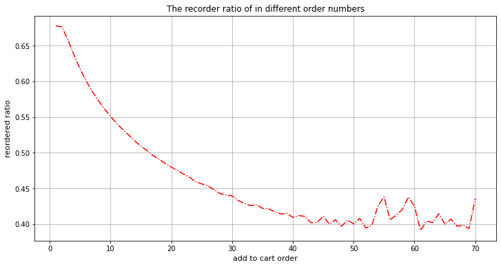


结论：首先放入加购的商品，再一次购买的可能较大（复购率高），越是后面加购的商品，其再一次购买的可能较少。

### 用户不同大小订单数量分布趋势


```python
#　在订单表中单个用户拥有不止一个订单
orders_df.head()
```

<table border="1" class="dataframe">
  <thead>
    <tr style="text-align: right;">
      <th></th>
      <th>order_id</th>
      <th>user_id</th>
      <th>eval_set</th>
      <th>order_number</th>
      <th>order_dow</th>
      <th>order_hour_of_day</th>
      <th>days_since_prior_order</th>
    </tr>
  </thead>
  <tbody>
    <tr>
      <th>0</th>
      <td>2539329</td>
      <td>1</td>
      <td>prior</td>
      <td>1</td>
      <td>2</td>
      <td>8</td>
      <td>NaN</td>
    </tr>
    <tr>
      <th>1</th>
      <td>2398795</td>
      <td>1</td>
      <td>prior</td>
      <td>2</td>
      <td>3</td>
      <td>7</td>
      <td>15.0</td>
    </tr>
    <tr>
      <th>2</th>
      <td>473747</td>
      <td>1</td>
      <td>prior</td>
      <td>3</td>
      <td>3</td>
      <td>12</td>
      <td>21.0</td>
    </tr>
    <tr>
      <th>3</th>
      <td>2254736</td>
      <td>1</td>
      <td>prior</td>
      <td>4</td>
      <td>4</td>
      <td>7</td>
      <td>29.0</td>
    </tr>
    <tr>
      <th>4</th>
      <td>431534</td>
      <td>1</td>
      <td>prior</td>
      <td>5</td>
      <td>4</td>
      <td>15</td>
      <td>28.0</td>
    </tr>
  </tbody>
</table>

```python
groupby_df = orders_df.groupby(by="user_id")["order_number"].aggregate(np.max)

# 统计不同订单次数下的购买次数
cnt_srs = cnt_srs.order_number.value_counts()

plt.figure(figsize=(18, 6))
sns.barplot(cnt_srs.index, cnt_srs.values
            , color='red'
            , alpha=0.6
           )

plt.xticks(rotation="90")
plt.ylabel("counts", fontsize=12)
plt.xlabel("order numbers", fontsize=12)
plt.title("The counts of different order numbers", fontsize=14)
plt.show()
```


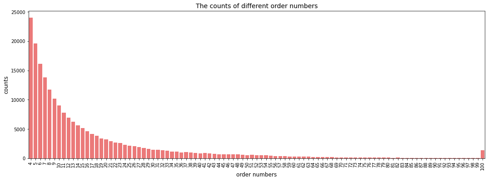


结论：大多数用户趋向较少的订单,集中处于区间[4, 8]

### 分析每一笔订单购买商品数据量的分布情况


```python
# 此张表中每一个用户只有一个订单,但订单内可以有很多种商品
order_products_train_df.head()

# 统计一个订单中的商品数量
group_df = order_products_train_df.groupby("order_id")["add_to_cart_order"].aggregate("max").reset_index()
cnt_srs = group_df.add_to_cart_order.value_counts()

plt.figure(figsize=(20, 10))
sns.barplot(cnt_srs.index, cnt_srs.values, color="green", alpha=0.5)
plt.xlabel("Number of products in given order", fontsize=12)
plt.ylabel("Frequency", fontsize= 12)
plt.show()
```


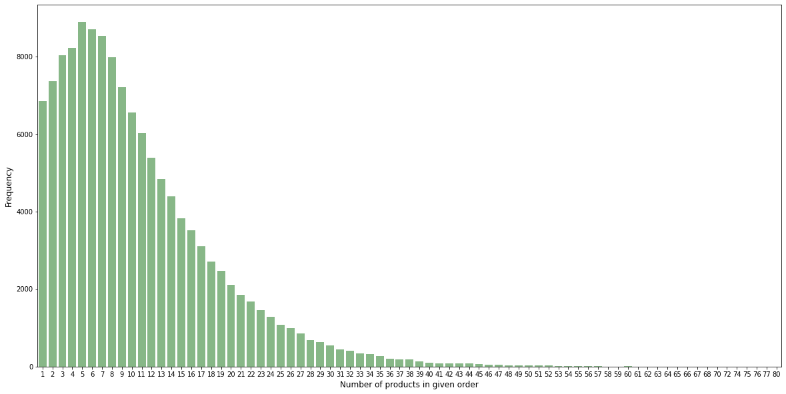


结论：从图中可以看出大多数用户的订单内的商品都集中在区间[4, 7], 且集中以一个订单5个商品居多.

### 统计用户在不同时间点(一周内)的购物习惯


```python
plt.figure(figsize=(12, 6))
sns.countplot(x="order_dow", data=orders_df)
plt.xlabel("Day of week")
plt.xticks([i for i in range(7)], ["Sat.", "Sun.", "Mons", "Tues.", "wed.", "Thur.", "Fri."])
plt.title("The frequency in differen day of week")
plt.show()
```


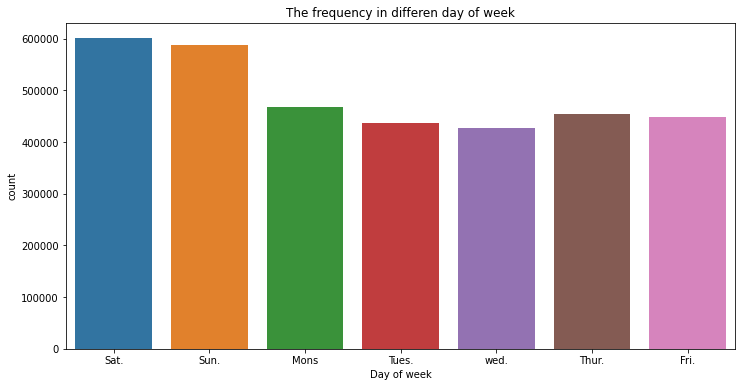


结论：用户一般习惯集中在周末进行购物，而在周三出现购物的低谷。

### 研究用户在不同时间点(一天内)的购物习惯


```python
plt.figure(figsize=(12, 6))
sns.countplot(x="order_hour_of_day", data=orders_df, color="blue", alpha=0.6)
plt.xlabel("hour of day")
plt.title("The frequency of order in differen hour of day")
plt.show()
```


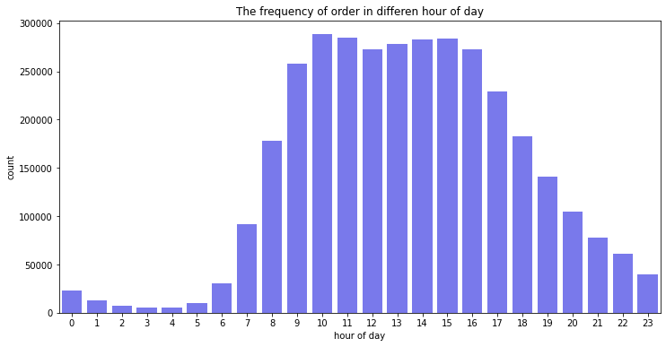


结论：大多数用户偏向与在中午和下午进行购物，也即主要是在白天进行购物

### 统计用户相隔多长时间加购订单的情况


```python
plt.figure(figsize=(18, 6))
sns.countplot(x="days_since_prior_order", data=orders_df, color="red", alpha=0.5)
plt.ylabel("Count", fontsize=12)
plt.xlabel("day", fontsize=12)
plt.show()
```


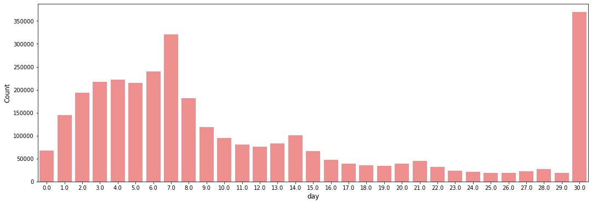


结论:大多数用户在上一次订单之后会在一周之后明显的增加浮动,而在一个月以后出现一个订单回购的小高峰.

### 不同商品的购买情况


```python
# 商品表
prducts_df.head()
```

<table border="1" class="dataframe">
  <thead>
    <tr style="text-align: right;">
      <th></th>
      <th>product_id</th>
      <th>product_name</th>
      <th>aisle_id</th>
      <th>department_id</th>
    </tr>
  </thead>
  <tbody>
    <tr>
      <th>0</th>
      <td>1</td>
      <td>Chocolate Sandwich Cookies</td>
      <td>61</td>
      <td>19</td>
    </tr>
    <tr>
      <th>1</th>
      <td>2</td>
      <td>All-Seasons Salt</td>
      <td>104</td>
      <td>13</td>
    </tr>
    <tr>
      <th>2</th>
      <td>3</td>
      <td>Robust Golden Unsweetened Oolong Tea</td>
      <td>94</td>
      <td>7</td>
    </tr>
    <tr>
      <th>3</th>
      <td>4</td>
      <td>Smart Ones Classic Favorites Mini Rigatoni Wit...</td>
      <td>38</td>
      <td>1</td>
    </tr>
    <tr>
      <th>4</th>
      <td>5</td>
      <td>Green Chile Anytime Sauce</td>
      <td>5</td>
      <td>13</td>
    </tr>
  </tbody>
</table>

```python
# 通道表
aisles_df.head()
```

<table border="1" class="dataframe">
  <thead>
    <tr style="text-align: right;">
      <th></th>
      <th>aisle_id</th>
      <th>aisle</th>
    </tr>
  </thead>
  <tbody>
    <tr>
      <th>0</th>
      <td>1</td>
      <td>prepared soups salads</td>
    </tr>
    <tr>
      <th>1</th>
      <td>2</td>
      <td>specialty cheeses</td>
    </tr>
    <tr>
      <th>2</th>
      <td>3</td>
      <td>energy granola bars</td>
    </tr>
    <tr>
      <th>3</th>
      <td>4</td>
      <td>instant foods</td>
    </tr>
    <tr>
      <th>4</th>
      <td>5</td>
      <td>marinades meat preparation</td>
    </tr>
  </tbody>
</table>

```python
# 分类表
departments.head()
```

<table border="1" class="dataframe">
  <thead>
    <tr style="text-align: right;">
      <th></th>
      <th>department_id</th>
      <th>department</th>
    </tr>
  </thead>
  <tbody>
    <tr>
      <th>0</th>
      <td>1</td>
      <td>frozen</td>
    </tr>
    <tr>
      <th>1</th>
      <td>2</td>
      <td>other</td>
    </tr>
    <tr>
      <th>2</th>
      <td>3</td>
      <td>bakery</td>
    </tr>
    <tr>
      <th>3</th>
      <td>4</td>
      <td>produce</td>
    </tr>
    <tr>
      <th>4</th>
      <td>5</td>
      <td>alcohol</td>
    </tr>
  </tbody>
</table>


```python
# 订单商品表
order_products_prior_df.head()
```

<table border="1" class="dataframe">
  <thead>
    <tr style="text-align: right;">
      <th></th>
      <th>order_id</th>
      <th>product_id</th>
      <th>add_to_cart_order</th>
      <th>reordered</th>
      <th>add_to_cart_order_mod</th>
    </tr>
  </thead>
  <tbody>
    <tr>
      <th>0</th>
      <td>2</td>
      <td>33120</td>
      <td>1</td>
      <td>1</td>
      <td>1</td>
    </tr>
    <tr>
      <th>1</th>
      <td>2</td>
      <td>28985</td>
      <td>2</td>
      <td>1</td>
      <td>2</td>
    </tr>
    <tr>
      <th>2</th>
      <td>2</td>
      <td>9327</td>
      <td>3</td>
      <td>0</td>
      <td>3</td>
    </tr>
    <tr>
      <th>3</th>
      <td>2</td>
      <td>45918</td>
      <td>4</td>
      <td>1</td>
      <td>4</td>
    </tr>
    <tr>
      <th>4</th>
      <td>2</td>
      <td>30035</td>
      <td>5</td>
      <td>0</td>
      <td>5</td>
    </tr>
  </tbody>
</table>


```python
order_products_prior_df = pd.merge(order_products_prior_df
                                   , prducts_df
                                   , on="product_id", how="left"
                                  )
order_products_prior_df = pd.merge(order_products_prior_df
                              , aisles_df
                              , on="aisle_id"
                              , how="left")
order_products_prior_df = pd.merge(order_products_prior_df
                                   , departments
                                   , on="department_id"
                                   , how = "left"
                                  )
```

### 查看不同的商品对于的销售量


```python
cnt_srs = order_products_prior_df.groupby(by="product_name").count()["add_to_cart_order_mod"].reset_index()
```


```python
cnt_srs.sort_values(by="add_to_cart_order_mod", ascending=False).head(20)
```

<table border="1" class="dataframe">
  <thead>
    <tr style="text-align: right;">
      <th></th>
      <th>product_name</th>
      <th>add_to_cart_order_mod</th>
    </tr>
  </thead>
  <tbody>
    <tr>
      <th>3676</th>
      <td>Banana</td>
      <td>472565</td>
    </tr>
    <tr>
      <th>3471</th>
      <td>Bag of Organic Bananas</td>
      <td>379450</td>
    </tr>
    <tr>
      <th>31920</th>
      <td>Organic Strawberries</td>
      <td>264683</td>
    </tr>
    <tr>
      <th>28840</th>
      <td>Organic Baby Spinach</td>
      <td>241921</td>
    </tr>
    <tr>
      <th>30297</th>
      <td>Organic Hass Avocado</td>
      <td>213584</td>
    </tr>
    <tr>
      <th>28804</th>
      <td>Organic Avocado</td>
      <td>176815</td>
    </tr>
    <tr>
      <th>22413</th>
      <td>Large Lemon</td>
      <td>152657</td>
    </tr>
    <tr>
      <th>42904</th>
      <td>Strawberries</td>
      <td>142951</td>
    </tr>
    <tr>
      <th>23420</th>
      <td>Limes</td>
      <td>140627</td>
    </tr>
    <tr>
      <th>32478</th>
      <td>Organic Whole Milk</td>
      <td>137905</td>
    </tr>
    <tr>
      <th>31363</th>
      <td>Organic Raspberries</td>
      <td>137057</td>
    </tr>
    <tr>
      <th>32565</th>
      <td>Organic Yellow Onion</td>
      <td>113426</td>
    </tr>
    <tr>
      <th>30000</th>
      <td>Organic Garlic</td>
      <td>109778</td>
    </tr>
    <tr>
      <th>32605</th>
      <td>Organic Zucchini</td>
      <td>104823</td>
    </tr>
    <tr>
      <th>29008</th>
      <td>Organic Blueberries</td>
      <td>100060</td>
    </tr>
    <tr>
      <th>11630</th>
      <td>Cucumber Kirby</td>
      <td>97315</td>
    </tr>
    <tr>
      <th>29980</th>
      <td>Organic Fuji Apple</td>
      <td>89632</td>
    </tr>
    <tr>
      <th>30577</th>
      <td>Organic Lemon</td>
      <td>87746</td>
    </tr>
    <tr>
      <th>2628</th>
      <td>Apple Honeycrisp Organic</td>
      <td>85020</td>
    </tr>
    <tr>
      <th>30139</th>
      <td>Organic Grape Tomatoes</td>
      <td>84255</td>
    </tr>
  </tbody>
</table>


```python
# 绘制不同通道下的品类的情况
cnt_srs = order_products_prior_df.aisle.value_counts()

plt.figure(figsize=(12, 6))
sns.barplot(cnt_srs.head(20).index, cnt_srs.head(20).values
            , alpha=0.5
            , color="blue"
           )

plt.xticks(rotation="90")
plt.ylabel("Count")
plt.xlabel("Aisle name")
plt.show()
```


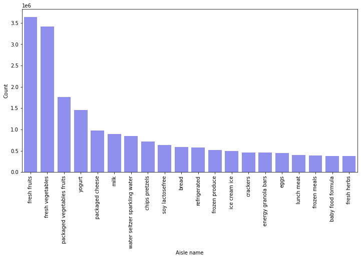


结论：从图中可以看出购买新鲜蔬菜和水果的订单量较大

### 绘制不同产品类别之间的所占分数


```python
temp = order_products_prior_df.department.value_counts()
temp.head()
```


    produce       9479291
    dairy eggs    5414016
    snacks        2887550
    beverages     2690129
    frozen        2236432
    Name: department, dtype: int64


```python
plt.figure(figsize=(8, 8))
plt.pie(temp
        , labels=temp.index
        , autopct="%1.1f%%"
        , startangle=200
       )
plt.show()
```


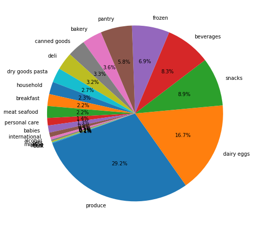


结论：通过观察可以看出产品和奶制品和鸡蛋类的所占比重较大，可以看出用户偏向与这类商品。

#### 查看不同的大类别下的复购率情况


```python
group_df = order_products_prior_df.groupby("department")["reordered"].mean()
group_df = group_df.reset_index()
group_df.head()
```

<table border="1" class="dataframe">
  <thead>
    <tr style="text-align: right;">
      <th></th>
      <th>department</th>
      <th>reordered</th>
    </tr>
  </thead>
  <tbody>
    <tr>
      <th>0</th>
      <td>alcohol</td>
      <td>0.569924</td>
    </tr>
    <tr>
      <th>1</th>
      <td>babies</td>
      <td>0.578971</td>
    </tr>
    <tr>
      <th>2</th>
      <td>bakery</td>
      <td>0.628141</td>
    </tr>
    <tr>
      <th>3</th>
      <td>beverages</td>
      <td>0.653460</td>
    </tr>
    <tr>
      <th>4</th>
      <td>breakfast</td>
      <td>0.560922</td>
    </tr>
  </tbody>
</table>

```python
plt.figure(figsize=(12, 5))
sns.barplot(group_df.department
            , group_df.reordered
            , alpha=0.8
            , color="blue")

plt.ylabel("reordered ratio", fontsize=12)
plt.title("The reordered ratio in differfent departments", fontsize=13)
plt.xlabel("department", fontsize=12)
plt.xticks(rotation=90)
plt.show()
```


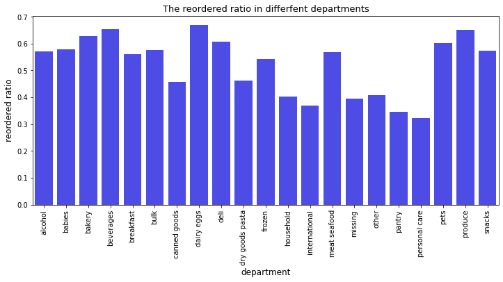


### 不同部门下不同通道的复购率情况


```python
group_df = order_products_prior_df.groupby(["department_id", "aisle"])["reordered"].mean()
group_df = group_df.reset_index()
group_df
```

<table border="1" class="dataframe">
  <thead>
    <tr style="text-align: right;">
      <th></th>
      <th>department_id</th>
      <th>aisle</th>
      <th>reordered</th>
    </tr>
  </thead>
  <tbody>
    <tr>
      <th>0</th>
      <td>1</td>
      <td>frozen appetizers sides</td>
      <td>0.525557</td>
    </tr>
    <tr>
      <th>1</th>
      <td>1</td>
      <td>frozen breads doughs</td>
      <td>0.539992</td>
    </tr>
    <tr>
      <th>2</th>
      <td>1</td>
      <td>frozen breakfast</td>
      <td>0.626221</td>
    </tr>
    <tr>
      <th>3</th>
      <td>1</td>
      <td>frozen dessert</td>
      <td>0.420777</td>
    </tr>
    <tr>
      <th>4</th>
      <td>1</td>
      <td>frozen juice</td>
      <td>0.450855</td>
    </tr>
    <tr>
      <th>...</th>
      <td>...</td>
      <td>...</td>
      <td>...</td>
    </tr>
    <tr>
      <th>129</th>
      <td>20</td>
      <td>lunch meat</td>
      <td>0.606517</td>
    </tr>
    <tr>
      <th>130</th>
      <td>20</td>
      <td>prepared meals</td>
      <td>0.619759</td>
    </tr>
    <tr>
      <th>131</th>
      <td>20</td>
      <td>prepared soups salads</td>
      <td>0.596597</td>
    </tr>
    <tr>
      <th>132</th>
      <td>20</td>
      <td>tofu meat alternatives</td>
      <td>0.607775</td>
    </tr>
    <tr>
      <th>133</th>
      <td>21</td>
      <td>missing</td>
      <td>0.395849</td>
    </tr>
  </tbody>
</table>
<p>134 rows × 3 columns</p>
```python
# 绘制词云
fig, ax = plt.subplots(figsize=(14, 14))
ax.scatter(group_df.reordered, group_df.department_id, alpha=0.8, color="red")
plt.plot([0.6]*23, np.arange(0, 23), color="red", linestyle="--")

for i, txt in enumerate(group_df.aisle.values):
    ax.annotate(txt, (group_df.reordered[i], group_df.department_id[i])
                , rotation=45
                , color="green"
               )
    plt.xlabel("reordered ratio", fontsize=14)

plt.ylabel("department", fontsize=14)
plt.title("Reorder ration of different aisles", fontsize=20)
plt.yticks(np.arange(1, 22), departments.department)
plt.ylim([0, 22])
# plt.xlim([0, 0.9])
plt.grid()
plt.show()
```


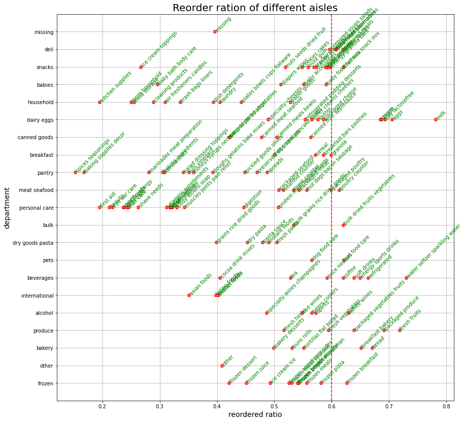


结论:通过设置最低的复购率准线,可以查看到每一个部门下的下分类别的复购率情况

#### 用户在不同时间(周内)的复购率情况


```python
order_products_prior_df = pd.merge(order_products_prior_df, orders_df, on="order_id", how="left")

group_df = order_products_prior_df.groupby(by="order_dow")["reordered"].mean()
sns.barplot(group_df.index, group_df.values, color="b", alpha=0.5)
plt.xticks([i for i in range(7)], ["Sat.", "Sun.", "Mons", "Tues.", "wed.", "Thur.", "Fri."])
plt.ylabel("reordered ratio")
plt.xlabel("week")
plt.title("The reordered ratio of different week")
plt.ylim([0.5, 0.7])
plt.show()
```


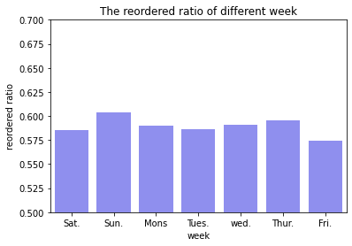


#### 用户在不同时间(周内)的复购率情况


```python
group_df = order_products_prior_df.groupby(by="order_hour_of_day")["reordered"].mean()
plt.figure(figsize=(12, 6))
sns.barplot(group_df.index, group_df.values, color="b", alpha=0.8)
plt.ylabel("reordered ratio")
plt.xlabel("hour")
plt.title("The reordered ratio of different hour")
plt.ylim([0.5, 0.7])
plt.show()
```


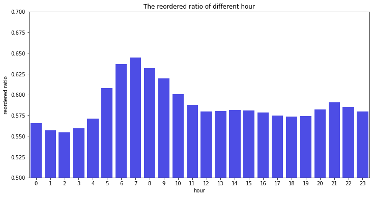

```python
group_df= order_products_prior_df.groupby(["order_dow", "order_hour_of_day"])["reordered"].mean().reset_index()
group_df = group_df.pivot("order_dow", "order_hour_of_day", "reordered")
plt.figure(figsize=(12, 6))
sns.heatmap(group_df)
plt.show()
```


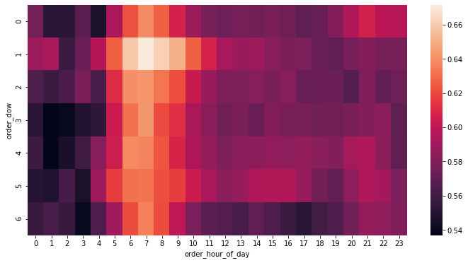
